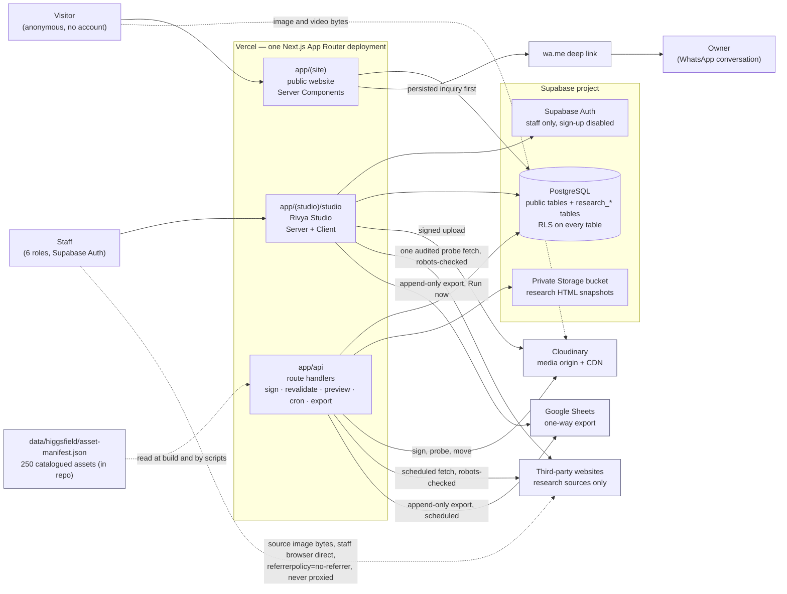
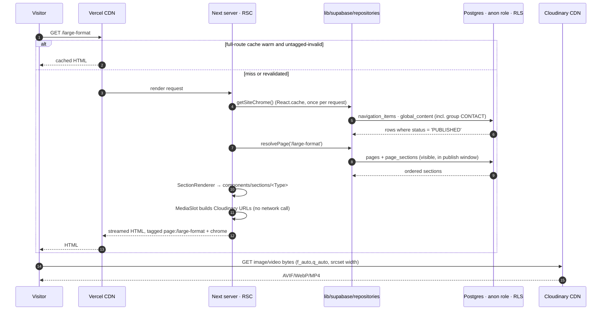
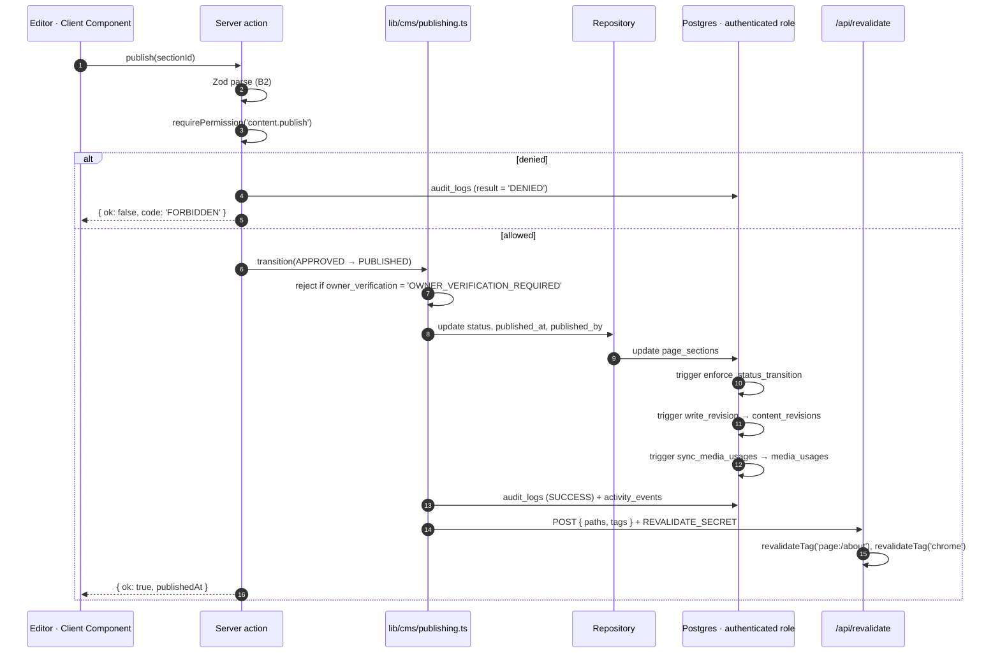
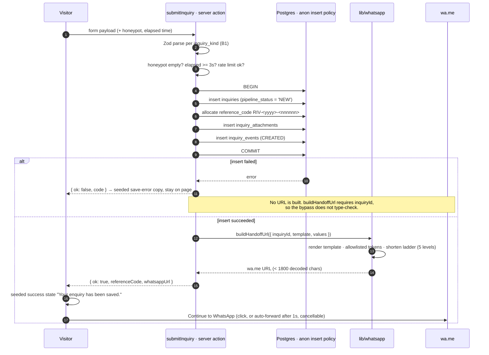

# ARCHITECTURE — how Rivya Living Art is put together

> Binding parent: `docs/architecture/CANONICAL-DECISIONS.md`. Where this document and the
> canonical decisions differ, the canonical decisions win and this document is wrong.
> Companion documents: `DATA_MODEL.md` (what the data means), `SCRAPER.md` (the research
> subsystem), `docs/project/BUSINESS_RULES.md` (what the business forbids).
> Source specifications: `docs/requirements/01-ADVANCED-FEATURE-EXPANSION.md` (*FEAT §n*) and
> `docs/requirements/02-INITIAL-CONTENT-SEED-SYSTEM.md` (*SEED §n*).

This document answers four questions and nothing else: what the parts are, where the boundaries
between them run, what happens on the three paths that matter, and where a future capability is
allowed to attach. It does not restate the stack (D1), the route maps (D3, D4), the table naming
rules (D5) or the phase plan (`docs/project/phases/`).

Three rules from the business shape almost every decision below, so they are stated once here and
then assumed everywhere: **no online checkout, no payment gateway, no customer accounts.**
Conversion terminates in a persisted inquiry followed by a WhatsApp handoff. The architecture is
built to make those three prohibitions structurally true, not merely policy.

---

## 1. System context



**What the diagram fixes.**

| Boundary | Rule |
|---|---|
| Visitor → Supabase | Never direct. The browser holds no Supabase client on a public page; every public read happens in a Server Component through the repository layer |
| Visitor → Cloudinary | Direct, for bytes only. The server builds URLs; it never proxies media |
| Staff → Supabase | Through the cookie-bound server client under RLS, plus a server-side `requirePermission()` on every route and every mutation |
| Anything → third-party websites | **Exactly two server-side paths exist, and a third is a defect.** (1) `app/api/cron/research` — the scheduled drain (`SCRAPER.md` §4, §7). (2) `probeUrl`, the audited single-URL probe in `app/(studio)/studio/research/sources/[id]/actions.ts` — one fetch, `research.write` required, one `audit_logs` row (`SCRAPER.md` §6). Both run only from `lib/scraper/**`, both pass the same robots → rate-limit → `circuit_open_until` gate, and both refuse a source that is not `policy_status = 'APPROVED'` **and** `is_enabled`. There is **no image proxy**: a competitor image is fetched by the staff member's own browser from the source URL with `referrerpolicy="no-referrer"`, never through a Rivya origin (`SCRAPER.md` §13.3) |
| Research → public | Nothing. Ever. Four independent guards; `SCRAPER.md` §12 |
| Payment / cart / account | No component, table, route, dependency or environment variable exists for any of them |

---

## 2. Runtime boundaries

Six runtimes exist. Every file in the repository belongs to exactly one, and the boundary between
them is enforced by a check in `npm run check`, not by convention.

| # | Runtime | Where it lives | May read | May write | Never |
|---|---|---|---|---|---|
| R1 | **Server Component render** | `app/(site)/**`, `app/(studio)/**` page and layout files, `components/sections/**`, server-side `components/patterns/**` | Repositories, `lib/cms`, `lib/media` (URL building), `lib/auth/session` | Nothing | No mutation, no `'use client'`, no secret sent to the client |
| R2 | **Client Component** | `components/patterns/**`, `components/studio/**`, `components/three/**` marked `'use client'` | Props, `searchParams`, browser APIs, its own `fetch` to R3 | Only by calling a server action | Never imports `lib/supabase/admin`, never holds a service key, never queries Postgres |
| R3 | **Server Action / Route handler** | `app/**/actions.ts`, `app/api/**/route.ts` | Everything a server may read | Repositories only | Never trusts its input; Zod parses first, permission check second, work third. Never reaches a third-party host except `probeUrl` (§1) |
| R4 | **Scheduled job** | `app/api/cron/**` invoked by Vercel cron | Repositories, `lib/scraper`, `lib/sheets`, `lib/logging` | Repositories and the private snapshot bucket | Never runs longer than its `maxDuration`; work is drained in bounded slices and is resumable |
| R5 | **PostgreSQL** | `supabase/migrations/**` | — | Its own tables | RLS is never disabled; a table without a policy is unreachable, which is the intended default |
| R6 | **Offline script** | `scripts/**` run by a human or CI | Files, the database over `DATABASE_URL` | Whatever the script's own guard permits | Recomputation scripts (`reextract`, `renormalize`, `reclassify-scale`) make **zero** network calls |

### R1/R2 — the Server-Component-by-default rule, made enforceable

- A file under `app/(site)/**` named `page.tsx` or `layout.tsx` may never carry `'use client'`.
  `scripts/site/check-client-boundary.mjs` fails the build otherwise.
- A Client Component may only live in `components/patterns/**`, `components/studio/**` or
  `components/three/**`, and its `'use client'` line must be justified by interaction: focus
  management, pointer/keyboard state, WebGL, an uncontrolled form, or a browser-only API.
- Data never crosses R1 → R2 as a fetch. The mega menu, the product gallery and every Studio table
  receive their data as props from a Server Component. A Playwright assertion proves the public
  homepage issues zero client requests for navigation or content data.
- `three`, `@react-three/fiber` and `drei` are reachable only through
  `components/patterns/ModelViewerMount.tsx`, which uses `next/dynamic` with `ssr: false` behind an
  explicit intent gate. A `three` chunk in the first document fails
  `tests/e2e/model-performance.spec.ts` (FEAT §14).

### Trust boundaries and where Zod sits

D1 says "Zod at every trust boundary". These are the boundaries, exhaustively.

| # | Boundary | Schema module | On failure |
|---|---|---|---|
| B1 | Visitor form → server action | `lib/supabase/schemas/inquiry.ts`, the block/form schema that produced the form | Field-mapped errors rendered from seeded copy; nothing persisted; no navigation |
| B2 | Studio form → server action | `content/blocks/<type>.ts`, `lib/supabase/schemas/*.ts` | `DrawerForm` field errors; no write |
| B3 | Route handler body → handler | Per-route Zod schema declared in the handler file | `400` with a fixed code, never an upstream message |
| B4 | Database row → application | `lib/supabase/schemas/*.ts`, derived from `lib/supabase/database.types.ts` | Throws `ValidationError`; the row is treated as corrupt, not coerced |
| B5 | Cloudinary response → application | `lib/media/providers/cloudinary.ts` response schemas | Throws; the upload or probe fails loudly |
| B6 | **Third-party HTML → application** | `lib/scraper/adapters/draft-schema.ts` (`RawProductDraft`) | The work item is marked `FAILED`; the run continues. This is the most hostile boundary in the system |
| B7 | Google Sheets response → application | `lib/sheets/errors.ts` fixed error classes | Sanitised code only; the credential never appears in an error |
| B8 | Seed module → database | The same row schemas as B4, plus the seed hash rule | The seed run reports the failure and continues; it never force-writes |
| B9 | Environment → application | Presence check only, in `lib/ops/env-checks/**` | Reports `NOT_CONFIGURED`. **Never** reads, logs or renders a value, prefix or length (D8) |

### Permission enforcement — two nets, on purpose

**RLS is the coarse net**: role-level, in the database, always on, applied to every table in
`public`. A leaked anon key reads published rows and nothing else. **`requirePermission()` is the
fine net**: permission-level, in the server, per action. `proxy.ts` matches `/studio/:path*`
and redirects an unauthenticated request — it *never authorises*; every Studio page and every
mutation re-checks server-side (D4). The role list is generated from `lib/auth/permissions.ts` into
SQL by `scripts/auth/gen-role-sql.ts` with a CI drift check, so the two nets cannot disagree about
which roles exist.

---

## 3. Module layout — D2, expanded

D2 fixes this tree, and every path below is a D2 path — **with one marked exception**: the
*Pending amendment* table at the end of the `lib/` subsection lists eight domains D2 does not
enumerate. Those eight are a proposal, not yet the contract; the rule and the blocking dependency are
stated there and in *Open questions*, item 2. The column that matters is **Responsibility**; the
boundary rules under the table are what keep the tree from rotting.

### `app/`

| Path | Responsibility |
|---|---|
| `app/layout.tsx` | Root document. `lang="en-GB"`, design tokens, font faces. Renders no chrome |
| `app/(site)/layout.tsx` | The public shell: skip link → announcement → header → `<main id="main">` → footer. Calls `getSiteChrome()` exactly once |
| `app/(site)/**/page.tsx` | One thin file per D3 path, each delegating to `renderCmsPage(path)` or a catalogue/portfolio/journal resolver. No marketing copy, no query |
| `app/(site)/_actions/**` | Public server actions. Today exactly one conversion path: `submit-inquiry.ts` |
| `app/(studio)/studio/**` | The D4 route map, one directory per leaf. Every page begins with `await requirePermission(...)` |
| `app/(studio)/studio/**/actions.ts` | Studio mutations. Zod → permission → repository → audit → revalidate. Exactly one of them reaches a third-party host: `research/sources/[id]/actions.ts` → `probeUrl` (`research.write`, one fetch, robots-checked, rate-limited, audited). Its sibling `testPatterns` makes **no** request |
| `app/api/media/sign` | Signed direct-to-Cloudinary upload. Session + `media.write` + folder allowlist + MIME allowlist + byte ceiling |
| `app/api/inquiries/upload-sign` | The same, narrowed to visitor reference images, rate-limited, no session |
| `app/api/revalidate` | The **only** cache-invalidation entry point. POST, `REVALIDATE_SECRET` |
| `app/api/preview` | Signed token → `draftMode().enable()` → redirect to the real public path |
| `app/api/cron/**` | Seven routes: `content-schedule`, `research`, `research-analytics`, `research-score`, `sheets-sync`, `analytics-snapshot`, `log-retention`. Each bounded, resumable, idempotent per period. Six authenticate on `REVALIDATE_SECRET`; `research` authenticates on Vercel's `x-vercel-cron` header alone and `404`s otherwise (`SCRAPER.md` §7). Two schemes, one deployment — *Open questions*, item 3 |
| `app/api/studio/**` | Studio-only JSON: `search`, `inquiries/export`, `models/inspect`. Permission-checked, never cached. **No media or competitor-image proxy route exists here or anywhere under `app/api/**`** — adding one is the change §1's boundary row forbids |
| `app/api/auth/sign-out` | POST only, clears the session, writes an audit row |
| `app/not-found.tsx`, `app/(site)/error.tsx`, `app/global-error.tsx` | Error surfaces. Token-only, **no media**, copy from `global_content` |
| `app/robots.ts`, `app/sitemap.ts` | Published paths only |

### `components/`

| Path | Responsibility | Import rule |
|---|---|---|
| `primitives/` | Design-system atoms: Button, Field, Surface, Drawer, Dialog, Tabs… Tokens only | Imports nothing from `lib/` except types |
| `patterns/` | Composed public UI: `SiteHeader`, `MegaMenu`, `MobileNav`, `MediaSlot`, `ProductCard`, `Lightbox`, `InquirySuccess` | May import `lib/media` (URL building) and `lib/whatsapp`. Never a repository |
| `sections/` | CMS block renderers, **1:1 with block types** (D2). Renders `section.heading`, never a literal | Receives a validated section as props. Fetches nothing |
| `studio/` | Studio-only UI: `DataTable`, `FilterBar`, `StatCard`, `StatusPill`, `EmptyState`, `ConfirmDialog`, `DrawerForm`, `CommandPalette`, and the research panels | May call server actions. Never queries |
| `three/` | The 3D viewer and its controls. Client-only, dynamically imported, never in the initial bundle | Loaded behind an intent gate |

### `content/`

| Path | Responsibility |
|---|---|
| `content/blocks/<type>.ts` | One file per block type: Zod `schema`, `defaults`, `mediaSlots`. The block's contract |
| `content/seed/*.ts` | The SEED §51 modules — `global`, `navigation`, `homepage`, `about`, `large-format`, `collections`, `commissions`, `process`, `portfolio`, `journal`, `contact`, `faq`, `seo`, `commerce-labels`, `studio-help`. Adding a module never edits the runner |
| `content/docs/index.generated.json` | The Phase 38 documentation-browser index. Build artefact, redacted, allowlist-derived |

### `lib/`

D2's list, verbatim, with responsibilities:

| Path | Responsibility |
|---|---|
| `lib/supabase/` | `server.ts` (cookie-bound, anon key), `browser.ts` (anon key), `admin.ts` (service role, first line `import 'server-only'`), `database.types.ts` (generated), `schemas/**` (Zod per entity), `repositories/**`, `errors.ts`. **The only files in the repository permitted to call `.from(...)` are under `repositories/`**, enforced by `scripts/db/check-data-layer.mjs` |
| `lib/media/` | The `MediaProvider` seam. `types.ts`, `index.ts` (`getMediaProvider()`), `providers/cloudinary.ts`, `folders.ts`, `transform.ts`, `poster.ts`, `model.ts`, `gaps.ts`, `duplicate-guard.ts`. The only place `cloudinary` may be imported |
| `lib/cms/` | `registry.ts` (block type → schema → renderer → editor → media slots), `resolve.ts` (`resolvePage(path, { draft })`), `render-page.tsx`, `publishing.ts` (transition guard, revision, revalidation), `revisions.ts` |
| `lib/auth/` | `permissions.ts` (the `Permission` union and `ROLE_PERMISSIONS`), `session.ts`, `require.ts`, `nav-visibility.ts`, `studio-nav.ts`, `audit.ts` |
| `lib/whatsapp/` | `templates.ts`, `render.ts`, `shorten.ts`, `number.ts`, `link.ts`. Two builders only: `buildHandoffUrl` (requires a persisted `inquiryId`) and `buildDirectContactUrl` (generic greeting, allowlisted call sites) |
| `lib/scraper/` | `core · adapters · normalization · validation · workflows · analytics`, exactly as D2 names them. See `SCRAPER.md` |
| `lib/analytics/` | First-party metric registry, dashboard-card registry, availability resolution, daily snapshots. Every number carries `n`, a denominator and an `as of` |
| `lib/seo/` | `metadata.ts`, structured data, canonical resolution, the SEED §41 fallbacks |
| `lib/logging/` | `activity.ts` (`logActivity`), `system-log.ts` (`logSystem`), `redact.ts`. The redactor is shared by logs, environment checks and the documentation browser |
| `lib/flags/` | `index.ts`, `flags.ts`. Typed flag union, evaluated server-side, default `false` |

#### `lib/` — pending amendment: eight domains D2 does not list

**This table is a proposal, not the contract.** D2 enumerates exactly ten `lib/` subdomains
(`supabase · media · cms · auth · whatsapp · scraper · analytics · seo · logging · flags`) and
CANONICAL-DECISIONS.md changes "by amendment (append a dated entry to *Amendments*), never by silent
divergence". The eight paths below are specified by three phase documents but are **not yet in D2**, so
this document records them as a divergence with a name rather than shipping them as settled fact.

| Path | Responsibility | Wanted by | Distinct dependency or trust boundary that justifies it |
|---|---|---|---|
| `lib/site/` | `chrome.ts` — `getSiteChrome()`, the one request-scoped chrome read | Phase 10 | Request-scoped read shared by both route groups; belongs above neither `cms` nor `supabase` |
| `lib/catalog/` | Product filtering, faceting, publication-readiness and the FEAT §21 validation predicates shared with the scraper's validator | Phase 14 | Predicates deliberately shared with `lib/scraper/validation`; a home under either would invert the dependency |
| `lib/search/` | Public and Studio search over `*_search_documents`, permission-scoped | Phase 23 | Spans public and research corpora under one permission-scoping rule |
| `lib/relations/` | The FEAT §10/§11 relationship engine over `product_relations` and `content_relations` | Phase 23 | Cross-entity graph; no single owning entity domain |
| `lib/bulk/` | One bulk engine: preview → typed confirmation → per-item snapshot → 24-hour undo | Phase 24 | Undo and snapshot semantics apply to every domain, so it may not live inside one |
| `lib/sheets/` | The one-way Google Sheets writer, sibling of `lib/whatsapp/` | Phase 36 | Distinct external dependency and credential (`GOOGLE_SERVICE_ACCOUNT_JSON`) |
| `lib/ops/` | Environment reachability checks, one module per integration | Phase 38 | Reads `process.env` by name for every integration; a distinct trust boundary (B9) |
| `lib/docs/` | Markdown rendering for the Studio documentation browser | Phase 38 | Renders repository files through an allowlist; a distinct trust boundary |

**The criterion this table proposes** — a new `lib/` domain is justified only by a *distinct external
dependency* or a *distinct trust boundary*, never by "this file felt tidier here". Every row above
names one.

**The rule until the amendment lands.** D2's ten remain the contract, so **Phase 10 must not create
`lib/site/` before a dated entry is appended to CANONICAL-DECISIONS.md *Amendments*** recording that
D2's `lib/` list is a floor rather than a ceiling and fixing the criterion above. A1 and A2 are
already taken; the next free label is **A3**. If the amendment is refused, the fallback is to fold
each module into the nearest of the ten — `lib/cms/site.ts`, `lib/supabase/repositories/catalog/`,
`lib/supabase/repositories/search/`, and so on — and to correct the three phase documents in the same
change. Either outcome is acceptable; the current state, in which three phase documents assume paths
D2 does not list, is not.

Every reference elsewhere in this document to one of these eight paths — R4 and B7/B9 in §2, import
rule 5 (`lib/catalog/**`) below, §5.3 and §11 — inherits the same pending status and resolves the
same way.

### Everything else

| Path | Responsibility |
|---|---|
| `supabase/migrations/` | Numbered, forward-only SQL. Structure only — a content-row `insert` here fails review and CI |
| `scripts/` | `seed/`, `media/`, `db/`, `auth/`, `site/`, `research/`, `docs/`, `build/`. The `check-*` scripts are wired into `npm run check` and are the enforcement arm of this document |
| `data/higgsfield/` | The 250-asset manifest and the raw generation history. Read-only input; rebuilt only by `scripts/media/build-higgsfield-manifest.py` |
| `tests/` | `unit/` (Vitest), `e2e/` (Playwright, including the FEAT §45 visual QA matrix), `fixtures/` |
| `docs/` | The D7 map. `docs/requirements/**` is read-only history |

### The import rules that hold the tree together

1. `.from(...)` only under `lib/supabase/repositories/**`.
2. `cloudinary` only inside `lib/media/providers/**`.
3. `lib/supabase/admin` only from an allowlist (cron routes, seed runner, service-role scripts) and
   never from anything under `app/(site)/**`.
4. `wa.me` / `api.whatsapp.com` literals only inside `lib/whatsapp/**`.
5. No `research_`, `researchProduct` or `scraper` identifier anywhere under `app/(site)/**`,
   `lib/cms/**`, `lib/catalog/**`, `lib/seo/**`, `components/sections/**` or `content/**`.
6. Public marketing copy appears in no `.tsx` file. Components render `section.heading`.

Each rule has a script. A rule without a script is a wish, not an architecture.

---

## 4. Data flow — the three critical paths

### 4.1 Public page render



Properties that are load-bearing:

- **No page row `PUBLISHED` at that path → `notFound()`.** Not an empty shell, not "Coming Soon"
  (SEED §55). The e2e test asserts a 404 status code, not a 200 with an empty `<main>`.
- **RLS is the second lock.** Even if a resolver forgot its status filter, the anon policy
  `using (status = 'PUBLISHED')` means the row does not exist for that connection.
- **Media never round-trips the server.** `lib/media/transform.ts` builds a URL string; the browser
  fetches the bytes. A Cloudinary outage degrades to `MediaSlot`'s reserved aspect box and the
  seeded "Image temporarily unavailable" surface — it never collapses the layout (SEED §47).
- **Draft mode bypasses every cache layer** and is reachable only through `/api/preview` with a
  signed token.

### 4.2 Studio publish



**The legal transitions, printed here because nothing else prints them.** D5 fixes the enum
(`DRAFT · REVIEW · APPROVED · PUBLISHED · ARCHIVED`) but not the edges between its values. These are the edges. Every pair not in this table is illegal, including `DRAFT → PUBLISHED`
and `REVIEW → PUBLISHED`: there is **no** direct-publish path for any role, `content.publish`
included.

| From | To | Permission | Notes |
|---|---|---|---|
| `DRAFT` | `REVIEW` | `content.write` | Submitting for review is the only way out of `DRAFT` |
| `REVIEW` | `APPROVED` | `content.review` | Approval. See *Open questions*, item 4 — this permission is not in the Phase 04 matrix |
| `REVIEW` | `DRAFT` | `content.review` | Sending it back, with a reason |
| `APPROVED` | `PUBLISHED` | `content.publish` | The transition the diagram above performs |
| `APPROVED` | `DRAFT` | `content.publish` | Withdrawing an approval |
| `PUBLISHED` | `ARCHIVED` | `content.publish` | Retire; the path stops resolving and returns `notFound()` |
| `PUBLISHED` | `DRAFT` | `content.publish` | Unpublish. Same revalidation as a publish |
| `ARCHIVED` | `DRAFT` | `content.write` | Revive for editing. Never straight back to `PUBLISHED` |

Properties that are load-bearing:

- **The transition table is enforced twice** — in `publishing.ts` and by the
  `enforce_status_transition` database trigger, from one shared declaration — so an API caller
  cannot skip `REVIEW`, and a direct `update … set status = 'PUBLISHED'` on a `DRAFT` row is rejected
  by the database even if the service role issues it.
- **Owner verification blocks publication.** A section carrying
  `owner_verification = 'OWNER_VERIFICATION_REQUIRED'` cannot be published until an owner or admin
  sets `VERIFIED` or the claim is removed. The refusal names the field (D10, SEED §2).
- **Revisions are a database trigger, not application code**, so no write path can forget them.
- **Revalidation is a consequence of publishing, not a separate chore.** `publishing.ts` is the only
  caller other than the schedule cron.
- **Scheduled publication uses the same path.** `app/api/cron/content-schedule` opens and closes
  publish windows and calls the same revalidation endpoint, so a scheduled change and a manual one
  behave identically.

### 4.3 Inquiry submission — the conversion path



Properties that are load-bearing:

- **Persist, then redirect. Never the reverse** (SEED §49). Three mechanisms enforce it rather than
  one: `buildHandoffUrl` takes a required non-optional `inquiryId`; `submitInquiry` returns a
  discriminated union the caller must narrow; and a unit test forces the insert to fail and asserts
  the returned object contains no URL.
- **The public may insert an inquiry and may never read one.** `anon` has `INSERT` only, with a
  `WITH CHECK` pinning `pipeline_status = 'NEW'`, `assigned_to is null`, `updated_by is null`, and
  no `SELECT` policy at all.
- **Minimal storage.** Salted `ip_hash`, never a raw IP. No fingerprinting, no third-party captcha,
  no cookie beyond the session. Spam control is a honeypot, a 3-second floor and a per-IP hourly cap.
- **The message never leaks internals.** Interpolation runs against the exact SEED §36/§37 token
  allowlist; an unknown token throws. `ip_hash`, `user_agent`, `utm`, `assigned_to` and internal
  notes are structurally unable to enter the message.
- **`Place Order` is a label, not a transaction** (SEED §31). It resolves to this same flow.

---

## 5. Provider abstractions

Two seams in this system are genuinely load-bearing. They exist for opposite reasons, and the
contrast is worth stating because it explains why one is an interface and the other is a registry.

### 5.1 `MediaProvider` — one implementation, swappable

D1 fixes Cloudinary "behind a `MediaProvider` abstraction". The contract:

```ts
// lib/media/types.ts
interface MediaProvider {
  signUpload(input: SignUploadInput): Promise<SignedUpload>;
  url(ref: MediaRef, spec?: TransformSpec): string;
  videoUrl(ref: MediaRef, spec?: VideoTransformSpec): string;
  posterUrl(ref: MediaRef, spec?: TransformSpec): string;
  probe(ref: MediaRef): Promise<ProviderMetadata>;   // bytes, width, height, duration, format
  move(ref: MediaRef, folder: string): Promise<MediaRef>;
  destroy(ref: MediaRef): Promise<void>;             // requires media.delete + ConfirmDialog
}
```

- `lib/media/index.ts` exports `getMediaProvider()` and is the **only** module other code imports.
  A provider swap touches one file.
- `lib/media/providers/cloudinary.ts` is the only file permitted to import `cloudinary`. ESLint
  `no-restricted-imports` plus a module-graph test enforce it.
- The abstraction's real job is not portability — it is **containment**. Provider-shaped strings
  (public IDs, transformation chains, signed URLs) never leak into components, and
  `CLOUDINARY_API_SECRET` never leaves the server: the browser uploads directly to Cloudinary with a
  short-lived signature issued by `app/api/media/sign`, constrained to a folder from
  `lib/media/folders.ts`, a MIME allowlist and a byte ceiling.
- The database, not the provider, is the record of truth. `media_assets` carries `alt_text`,
  `is_ai_generated` and `is_concept` on every row (D6), and `media_usages` is the reverse index that
  makes "Missing Media" computable rather than guessed.
- **Research HTML snapshots are not media** and deliberately do not go through this seam. They are
  evidence: gzipped, hashed, written to a private Supabase Storage bucket, never publicly
  deliverable, never in Cloudinary. See *Open questions*, item 5.

### 5.2 Why the scraper uses adapters instead of an interface swap

`MediaProvider` abstracts **one** dependency that Rivya chooses and trusts. The scraper faces **N**
dependencies that Rivya neither chooses nor trusts: third-party websites that change without notice,
break arbitrarily, and are read under a politeness and legal posture Rivya must be able to prove.
That is a different problem and it gets a different shape.

| Concern | `MediaProvider` | `SourceAdapter` |
|---|---|---|
| Cardinality | One active implementation | Many, one per source, plus `generic` |
| Selected by | A build-time decision in one file | A **database column** (`research_sources.adapter_key`), so a source is added without a deploy (FEAT §26) |
| Trust | Trusted; may perform I/O | Untrusted; receives no database handle, no `fetch`, no file-system access |
| Failure | An outage degrades one feature | A single bad adapter must not break other sources (FEAT §27), so failure is isolated at four levels with its own status record |
| Versioning | Implicit | Explicit `version`, stamped on every row it produces, so a parser change never silently rewrites history |
| Purity | Performs side effects | Pure function from bytes to a strings-only draft; every side effect belongs to the core |

The adapter contract, the registry, the failure-isolation layers and the "how to write an adapter"
procedure live in `SCRAPER.md` §4. This document only fixes the reason the two seams differ.

### 5.3 The other seams, briefly

| Seam | Module | Why it is a seam |
|---|---|---|
| Block registry | `lib/cms/registry.ts` | A new page section is one schema file, one renderer, one editor, one registry line — never a code change to a page |
| Permission matrix | `lib/auth/permissions.ts` | The single declaration of roles and permissions; SQL is generated from it with a CI drift check |
| Repository layer | `lib/supabase/repositories/**` | The only place a query exists, which is what makes RLS, Zod and caching uniformly applicable |
| Outbound integrations | `lib/whatsapp/`, `lib/sheets/` | Both render Rivya data into someone else's surface, both allowlist their fields, both are one-way. What the Sheets writer may carry out of the research subsystem — and the columns it may never carry — is fixed in `SCRAPER.md` §13.5 |
| Feature flags | `lib/flags/` | Lets an incomplete capability ship dark rather than living on a branch. Not a substitute for configuration (FEAT §32) |
| Logging redactor | `lib/logging/redact.ts` | One implementation shared by system logs, environment checks and the documentation browser, so "never show a secret" is one function to review |

---

## 6. Caching and revalidation

The strategy is: **cache the public site aggressively by tag, cache nothing authenticated, and make
publication the only thing that invalidates.**

### Layers

| Layer | Scope | Used for | Invalidated by |
|---|---|---|---|
| `React.cache` | One request | `getSiteChrome()`, `getStaffSession()`, per-request row lookups | End of request |
| Next Data Cache | Cross-request | Repository reads on public routes, wrapped with `unstable_cache` and explicit tags | `revalidateTag` |
| Full-route cache | Cross-request | Rendered RSC payload / HTML for `app/(site)/**` | `revalidatePath`, `revalidateTag`, or the route's `revalidate` window |
| CDN (Vercel) | Edge | The full-route cache's output | Same as above |
| Cloudinary CDN | Edge | Derived image and video bytes | Never — public IDs are immutable; a replacement is a new public ID |
| Browser | Client | Static assets under `/_next/static` | Content hash in the filename |

### Tag taxonomy

One vocabulary, used by both the writer (`lib/cms/publishing.ts`, catalogue and merchandising
actions) and the reader (`unstable_cache` call sites).

| Tag | Applied to | Invalidated when |
|---|---|---|
| `chrome` | Every route through the site layout | A `navigation_items` or `global_content` row changes — announcement, footer, CTA library, commerce labels, contact details |
| `page:<path>` | The CMS page at that path — for example `page:/`, `page:/large-format` | Any of that page's sections is published, unpublished, reordered or hidden |
| `seo:<path>` | Metadata for that path | The matching `seo_entries` row changes |
| `product:<slug>` · `category:<slug>` · `collection:<slug>` · `project:<slug>` · `article:<slug>` | The corresponding detail route | That entity is published, edited or unpublished |
| `list:products` · `list:collections` · `list:portfolio` · `list:journal` | Index and grid routes | Any member's publication state changes |
| `merchandising:homepage` · `merchandising:store` | Curated selections | A merchandising change or a schedule window opening or closing |
| `faqs` | `/faq` and any `faq-list` block | A FAQ row changes |
| `media:<mediaAssetId>` | Any route whose `media_usages` rows reference it | The asset's `alt_text`, folder or public ID changes |

Rule: **a mutation invalidates the narrowest tags that describe it, plus `chrome` only when chrome
actually changed.** Blanket `revalidatePath('/', 'layout')` is not used; it is the reason cache
strategies decay into "everything is dynamic".

### Route classes

| Route class | Rendering | `revalidate` | Notes |
|---|---|---|---|
| CMS pages (`/`, `/about`, `/process`, `/large-format`, …) | Static, tag-revalidated | `3600` | The window is a backstop; publication is the real trigger |
| Catalogue index and detail (`/collection/**`, `/product/[slug]`) | Static, tag-revalidated | `3600` | `generateStaticParams` over published slugs |
| Portfolio, journal, collections detail | Static, tag-revalidated | `3600` | Empty states are cached like any other content |
| `/search` | Dynamic | — | `searchParams` are the state; `/api/search/suggest` answers with `s-maxage=60, stale-while-revalidate=300` |
| `/privacy`, `/terms` | Static, tag-revalidated | `86400` | |
| `app/(studio)/**` | Dynamic, `no-store` | — | Authenticated. Cached output would be a data-leak class of bug |
| `app/api/**` | Dynamic, `no-store` | — | Including every cron route. No route here fetches or re-serves a competitor image; there is nothing to cache because there is nothing to proxy (§1, `SCRAPER.md` §13.3) |
| Draft mode (any path) | Dynamic | — | `draftMode()` bypasses the full-route and data caches entirely |

### The revalidation path

`app/api/revalidate` is the only cache-invalidation entry point. POST only, guarded by
`REVALIDATE_SECRET`, body Zod-validated to `{ paths?: string[], tags?: string[] }`, and it returns
`401` without the secret. Its callers are exactly two: `lib/cms/publishing.ts` and the schedule cron.
Nothing else — no client, no webhook from an external service, no Studio button — invalidates cache.

**Failure mode that is designed for, not hoped about:** if revalidation fails, publication has still
happened and the page is stale for at most its `revalidate` window. The failure is written to
`system_logs` at `WARNING` on channel `CONTENT` with the tags it could not clear, so a stuck cache is
visible rather than mysterious.

---

## 7. Error handling

### The taxonomy

```
RivyaError                      code · httpStatus · publicCopyKey · context (redacted)
├── ValidationError             a Zod failure at a trust boundary
├── NotFoundError               the row does not exist, or RLS says it does not exist for you
├── ConflictError               unique violation, stale write, invalid status transition
├── PermissionError             requirePermission() refused; always audited as DENIED
├── UpstreamError               Cloudinary, Sheets or a research source failed
└── ConfigurationError          a required environment variable name is absent
```

`publicCopyKey` names a `global_content` row, so the visitor-facing sentence is seeded copy an owner
can rewrite, not a string in a catch block.

### Rules

1. **Server actions return, they do not throw across the boundary.** Every action returns
   `{ ok: true, data } | { ok: false, code, fieldErrors? }`. A client cannot navigate on success
   without narrowing the union first.
2. **Route handlers return a fixed code, never an upstream message.** Upstream messages quote request
   URLs and occasionally credentials; they are logged (redacted) and never rendered.
3. **Error boundaries, four of them.** `app/(site)/error.tsx` (SEED §46 copy, no media),
   `app/not-found.tsx` (SEED §45 copy), `app/(studio)/studio/error.tsx`, and `app/global-error.tsx`
   as a last-resort static shell that depends on nothing.
4. **Degrade, do not collapse.** A failed image renders `MediaSlot`'s reserved aspect box with the
   seeded label (SEED §47). A section whose block type is unregistered renders nothing in production
   and a visible diagnostic in development. A dashboard card whose backing table does not exist yet
   renders an explicit unavailable state, never a fabricated zero (FEAT §17, D10).
5. **Never redirect on a failed write.** Stated once in §4.3 and enforced by type.
6. **Every denial is a record.** `PermissionError` writes an `audit_logs` row with
   `result = 'DENIED'` before the response is formed.

### Failure-mode matrix

| Failure | Public site | Studio | Recovery |
|---|---|---|---|
| Supabase unreachable | `app/(site)/error.tsx` with seeded copy; cached routes keep serving until their window expires | Error boundary; no partial writes because every mutation is one transaction | Automatic when the database returns |
| Cloudinary unreachable | Layout intact; `MediaSlot` fallback | Uploads fail with a named reason; existing rows still list | Automatic |
| Revalidation endpoint fails | Stale page for at most `revalidate` | Publish still succeeded; `WARNING` logged with the uncleared tags | Next window, or a manual re-publish |
| Cron invocation times out | None | Work resumes on the next tick; work items, not runs, are the unit of progress | Automatic |
| A research source errors | None — no public surface exists | That source's items fail; other sources complete; circuit breaker after five consecutive failures | Operator action after review |
| Google Sheets quota exhausted | None | Sync run marked failed with a sanitised code; staging tab untouched | Backoff and retry |
| Inquiry insert fails | Seeded save-error copy; visitor stays on the page; no WhatsApp URL exists | Nothing to see | Visitor retries |

---

## 8. Logging and observability

**Three logs, three jobs.** They are never merged, and the distinction is stated here so that a
later phase does not "simplify" them into one table.

| Log | Table | Written by | Read by | Answers |
|---|---|---|---|---|
| Audit | `audit_logs` | Every privileged mutation **and every denial** | owner, admin | Who was allowed or refused to do what |
| Activity | `activity_events` | Human Studio actions worth showing in a feed | Any staff member | What has been happening in the Studio |
| System | `system_logs` | Background jobs, integrations, cron, workflow runs | owner, admin | What the machine did and where it failed |

`system_logs` is two orthogonal columns, not one mixed list: `level`
(`INFO · WARNING · ERROR · SECURITY`) and `channel`
(`WORKFLOW · SCRAPER · MEDIA · CONTENT · AUTH · SHEETS · ANALYTICS · SYSTEM`). Every FEAT §31 type
is therefore representable and "SCRAPER errors in the last hour" is one query.

**Redaction is not optional and not per-call-site.** `lib/logging/redact.ts` removes, by name, every
D8 server-only variable and any key matching
`/(secret|token|key|password|credential|authorization|cookie)/i`,
and, by shape, JWT-like strings, PEM private-key blocks, credentialed Cloudinary URLs and
`postgres://user:pass@` connection strings. It substitutes a fixed `[redacted]` — never a prefix,
never a suffix, never a length, never a hash. D8's "never a value, prefix or length" is taken
literally. Every log write, environment check result and documentation render passes through it.

**Volume control.** Every log call carries a `dedupe_key`; identical events inside a five-minute
window increment `occurrence_count` instead of inserting. Retention: `INFO`/`WARNING` 90 days,
`ERROR`/`SECURITY` 400 days, purged by a daily cron that logs its own summary.

**Correlation.** `proxy.ts` assigns a `request_id` and it is threaded into `audit_logs`,
`system_logs` and every server-action error, so one incident is one query.

**What is never logged:** any secret value, any visitor's raw IP, any WhatsApp message body, any
inquiry free text, any competitor page body, and any upstream error message that has not been mapped
to a fixed code.

---

## 9. Security posture (summary — `docs/ops/SECURITY.md` owns the detail)

- **Staff only.** Supabase Auth with public sign-up disabled at the project level. Staff are invited
  from `/studio/system/users`. There is no self-registration path anywhere in the application, and
  no customer-account infrastructure exists to be repurposed.
- **RLS on every table in `public`.** A table with no policy is unreachable, which is the intended
  default for anything new. Public `select` is restricted to `status = 'PUBLISHED'`. `research_*`
  tables have **no `anon` policy of any kind**.
- **Server-side permission checks on every Studio route and every mutation**, in addition to RLS.
  `proxy.ts` redirects; it never authorises.
- **Secrets are server-only and never displayed.** The Environment page reports reachability only —
  never a value, prefix or length (D8, FEAT §29). The documentation browser serves a fixed
  ten-path allowlist, redacted at build time, and can never be pointed at `.env`, a migration or
  `docs/requirements/**`.
- **Uploads are constrained at the signing endpoint**: session, permission, folder allowlist, MIME
  allowlist, byte ceiling, per-user rate limit. The browser never sees `CLOUDINARY_API_SECRET`.
- **Destructive actions require `ConfirmDialog`, a typed row count for bulk, a per-item snapshot and
  a 24-hour undo** (FEAT §20).

---

## 10. Performance posture (summary — `docs/ops/PERFORMANCE.md` owns the detail)

Server Components by default; Client Components only where interaction demands. Responsive
Cloudinary transformations with `f_auto`/`q_auto` and a fixed width ladder; AVIF/WebP negotiated by
the CDN; video posters always present; 3D dynamically imported behind an intent gate and never in
the first document. The measured targets, the budget per route class and the QA matrix
(1920 · 1440 · 1280 · 1024 · 768 · 430 · 390 · 360) live in `PERFORMANCE.md` and
`docs/ops/TESTING.md`. The architectural commitment here is narrower and absolute: **a heavy visual
feature may never be on the critical path of a first render.**

---

## 11. Extension points — how the future arrives without dead tables now

FEAT §39 is precise, and the two halves of it are equally binding: architect cleanly enough that
conventional ecommerce could be added later, and **do not create unused production tables for it**.
Extensibility comes from clean seams, not from dead features.

**The rule.** A future capability arrives as a new migration block, new repositories, new permission
rows, new routes and new blocks — assembled at the seams that already exist. It never arrives by
"unfreezing" a table that was built early and left empty. An empty table is not preparation; it is a
schema that nobody has validated against a real requirement, plus an RLS surface nobody is
maintaining.

| Future capability | The seam that would carry it | What must **not** be built now |
|---|---|---|
| Online checkout | A new `lib/commerce/` domain, its own migration block, its own permission rows, and a new route group. `price_state` already models `FIXED · STARTING_FROM · REQUEST_QUOTE · PRICE_ON_REQUEST`, so the product schema needs no change to *describe* a purchasable item | `carts`, `orders`, `order_items`, `checkout_sessions`, any cart state in a cookie or `localStorage` |
| Payment provider | An outbound integration shaped like `lib/whatsapp/` and `lib/sheets/`: one client module, `import 'server-only'`, fixed error classes, no credential in any error | `payments`, `transactions`, `refunds`, a webhook route, a provider SDK dependency, a provider key in D8 |
| Customer accounts | Supabase Auth already exists but is **staff-only** by deliberate configuration. A customer identity would be a separate Supabase role plus its own RLS policy family, never a new value in `user_role` | `customers`, `customer_profiles`, `addresses`, `wishlists`, `saved_carts`; any `anon` `SELECT` policy on `inquiries` |
| Shipping and logistics | A new domain reading `products.dimensions` and the inquiry record. The `inquiries` table is already the conversion record a fulfilment system would hang from | `shipments`, `carriers`, `rates`, any dimension defaulted so a rate can be calculated |
| Reviews and ratings | A new content entity in the CMS block registry, with the same `status`, `owner_verification` and revision machinery every content table already has | `reviews`, `ratings`, aggregate columns on `products`. D10 forbids seeding testimonials, and an empty reviews table invites exactly that |
| Wishlist / saved items | Requires customer identity first. Until then it is not a schema question | Any per-visitor persistence beyond the inquiry |
| AR and room visualisation | `components/three/` and `media_assets.kind = 'MODEL'` already carry GLB/GLTF and their metadata. An AR viewer is another dynamically imported client component behind a flag | Model columns invented for a viewer nobody has specified |
| Advanced configurator | `customization_forms` already stores field definitions as data with enable/disable/require/reorder/rename, and the configurator renders from them. Additional capability is more field kinds, not a new system | Pricing arithmetic of any kind. Bespoke pricing is never calculated (FEAT §15) |
| CRM / quotation automation | `inquiries` + `inquiry_events` is already an append-only pipeline with status, assignment and notes. An export or a sync is an outbound integration | `quotes`, `deals`, `pipelines`, any automated outbound message |
| Localisation | The CMS is already field-per-row with a status workflow; localisation is a `locale` column plus a resolution rule in `lib/cms/resolve.ts` and a route segment | A translation table with no second locale to put in it |

**The seams that make all of the above cheap, listed once:** the repository layer (one place queries
live), the block registry (one place page sections are declared), the permission matrix (one place
roles are declared), `MediaProvider` (one place the media vendor lives), the flag registry (a
capability can ship dark), the bulk engine (one preview/confirm/undo implementation), and the
migration discipline (forward-only, numbered, one subject per file).

**And the standing prohibition:** nothing in this section may be built, stubbed, seeded or
schema-reserved until the business rule changes. If it changes, it changes by an amendment to
`CANONICAL-DECISIONS.md` — not by a pull request that quietly adds a table.

---

## 12. Documentation update contract

Reproduced here because Phase 01 requires it in this document and in the pull-request template. It
is enforced by `scripts/docs/check-doc-contract.mjs`.

| If the PR changes… | It must also change… |
|---|---|
| `supabase/migrations/**` | `docs/architecture/DATA_MODEL.md` |
| `app/(studio)/**`, `components/studio/**` | `docs/studio/STUDIO_GUIDE.md` |
| `lib/scraper/**` | `docs/architecture/SCRAPER.md` |
| `lib/media/**`, `scripts/media/**` | `docs/media/MEDIA_GUIDE.md` **or** `docs/media/CLOUDINARY.md` |
| `data/higgsfield/**` | `docs/media/HIGGSFIELD_ASSET_STATUS.md` |
| `components/primitives/**`, `components/patterns/**` | `docs/design/COMPONENT_REGISTRY.md` |
| `.env.example`, any `lib/**` reading `process.env` | `docs/ops/ENVIRONMENT.md` |
| `lib/auth/**`, any RLS migration | `docs/ops/SECURITY.md` |
| Any phase marked COMPLETE | `CHANGELOG.md`, `PROJECT_STATE.md`, `docs/SESSION-STATE.md`, `docs/project/ROADMAP.md` |
| Anything under `docs/requirements/**` | **Rejected** — requirements are specifications of record |

---

## 13. Open questions for the canonical decisions

Raised, not acted on. **One known divergence exists and is marked in place**: the eight `lib/`
domains in §3 that D2 does not enumerate, recorded there as a pending amendment and raised as item 2
below. Nothing else above diverges from `CANONICAL-DECISIONS.md`.

1. **Permission spelling.** D5 names the roles but not the permission format.
   `PHASE-00-04.md`, `PHASE-10-15.md` and `PHASE-31-38.md` use `<domain>.<action>` (`content.write`);
   `PHASE-05-09.md` and `PHASE-16-22.md` use `<resource>:<action>` (`content:write`). This document
   uses the **dot** form because Phase 04 owns `lib/auth/permissions.ts`, which declares the
   `Permission` union and is the artefact CI drift-checks. Suggested amendment: fix the spelling in
   D5 beside the role list and correct the disagreeing documents once.
2. **Is D2's `lib/` domain list closed? — the one open divergence, and it blocks Phase 10.**
   D2 enumerates ten `lib/` subdomains. `PHASE-10-15.md` adds `lib/site/` and `lib/catalog/`;
   `PHASE-23-30.md` adds `lib/search/`, `lib/relations/` and `lib/bulk/`; `PHASE-31-38.md` adds
   `lib/sheets/`, `lib/ops/` and `lib/docs/`. §3 records all eight as a **pending amendment**, with
   the justification for each and the fallback if it is refused, rather than presenting them as
   settled. Suggested amendment **A3** (A1 and A2 are taken): record in D2 that the list is a floor
   rather than a ceiling, and fix the criterion for a new domain — *a distinct external dependency
   or a distinct trust boundary*. **This must be decided before Phase 10 creates `lib/site/`**; it is
   the only item in this list that blocks an implementation phase.
3. **No cron secret in D8, and two cron authentication schemes in one deployment.** D8 lists
   `REVALIDATE_SECRET` but nothing for scheduled invocation. Six of the seven cron routes
   (`content-schedule`, `research-analytics`, `research-score`, `sheets-sync`, `analytics-snapshot`,
   `log-retention`) reuse `REVALIDATE_SECRET`, so one secret guards both cache invalidation and every
   scheduled job. The seventh, `app/api/cron/research`, authenticates on Vercel's `x-vercel-cron`
   header **only** and deliberately does not reuse `REVALIDATE_SECRET` — reuse was rejected as
   widening one secret's blast radius across two unrelated systems (`SCRAPER.md` §7 and §16 item 4).
   That leaves the route with the widest reach — the only one that contacts third-party hosts — on
   the scheme that cannot be tested outside Vercel. Suggested amendment: add `CRON_SECRET` to D8's
   server-only list and normalise all seven onto it. Both documents point at this same amendment and
   must move together.
4. **No `content.review` permission in the Phase 04 matrix.** The transition table now printed in
   §4.2 requires a permission for `REVIEW → APPROVED` and for `REVIEW → DRAFT`; `PHASE-05-09.md`
   names it `content.review`, and the Phase 04 matrix contains only `content.read`, `content.write`
   and `content.publish`. Either add `content.review` to the matrix (and to `lib/auth/permissions.ts`,
   which CI drift-checks), or state in D5 that `content.publish` covers approval — in which case
   §4.2's table takes `content.publish` on both `REVIEW` edges. The table is written the first way
   because that is what the owning phase document specifies.
5. **Where research snapshots live.** D1 fixes Cloudinary behind `MediaProvider`, and D6 governs
   media. Research HTML snapshots are evidence, not media, and must never be publicly deliverable,
   so §5.1 places them in a private Supabase Storage bucket outside the media seam. Confirm that
   store and record it in D6 so a later phase does not route them through Cloudinary.
6. **Retention is unspecified.** `system_logs` has a stated retention and research snapshots have
   180 days, but no canonical section fixes retention for `audit_logs`, `activity_events`,
   `content_revisions` or `inquiries`. Suggested amendment: a retention table in D5 or
   `docs/ops/SECURITY.md` so the four do not drift apart.
7. **No web-analytics provider exists in D1**, yet FEAT §28 lists Content Performance as a
   first-party dimension. Phase 37 redefines that metric as database-derived content health and
   states plainly that traffic is not measured. Either accept that definition in D1, or add a
   provider and its environment-variable names to D8 as an explicit owner decision.
