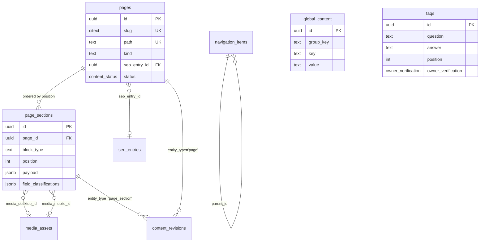
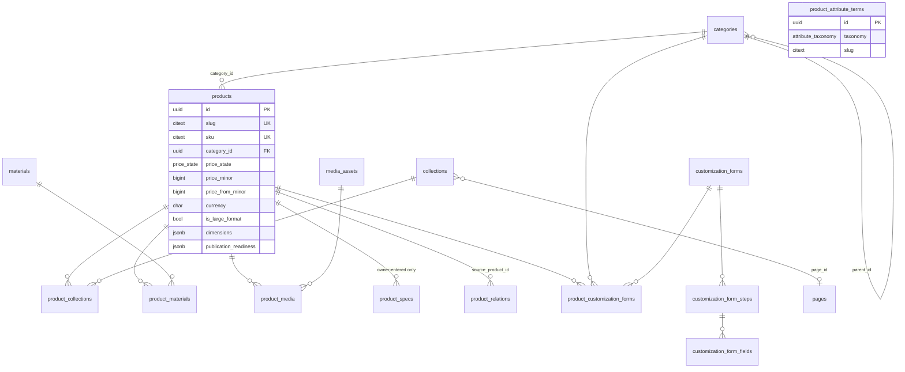
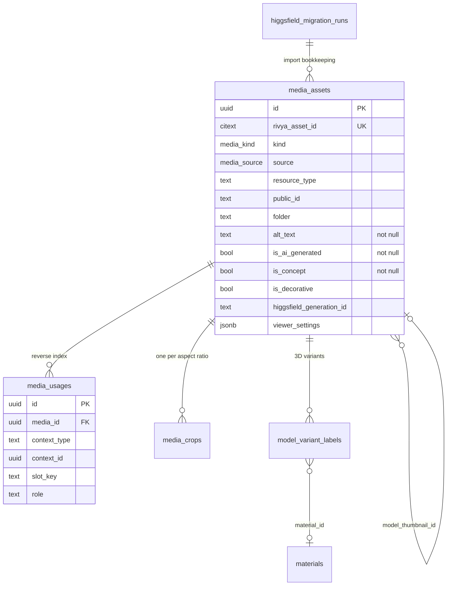
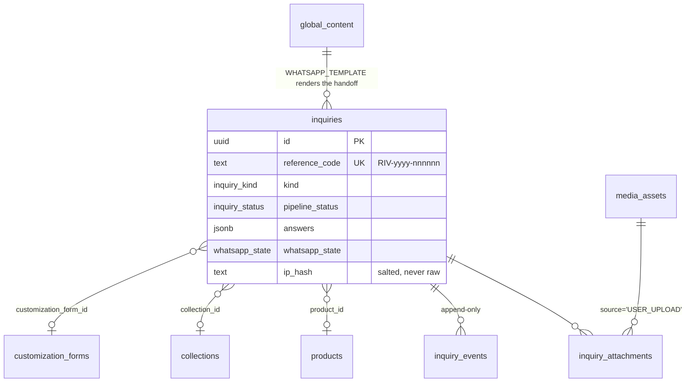
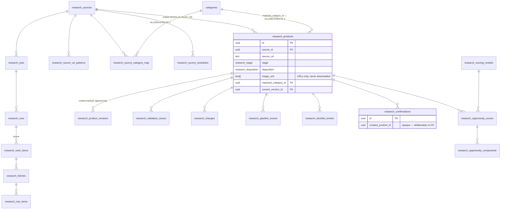
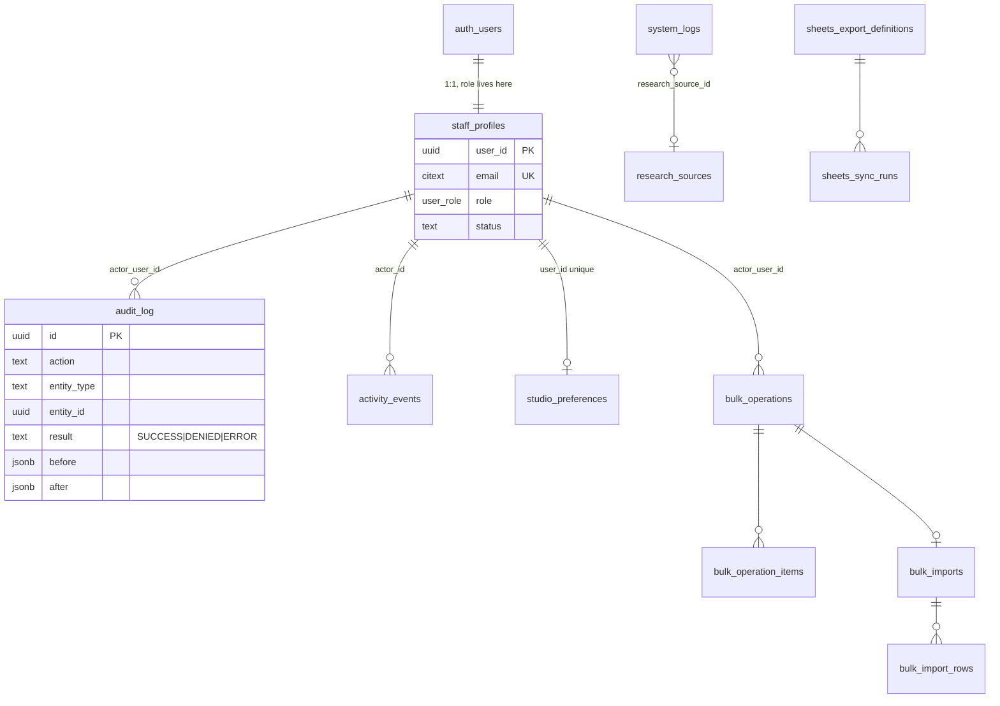

# DATA MODEL — what the data means

> Binding parent: `docs/architecture/CANONICAL-DECISIONS.md`. Where this document and the canonical
> decisions differ, the canonical decisions win and this document is wrong.
> Companion documents: `ARCHITECTURE.md` (how the parts fit), `SCRAPER.md` (the research subsystem
> in depth), `docs/project/BUSINESS_RULES.md` (what the business forbids).
> Source specifications: `docs/requirements/01-ADVANCED-FEATURE-EXPANSION.md` (*FEAT §n*) and
> `docs/requirements/02-INITIAL-CONTENT-SEED-SYSTEM.md` (*SEED §n*).
> Phase ownership: `docs/project/phases/PHASE-00-04.md` … `PHASE-39-46.md`.

This is the schema plan for every domain in the ecosystem: identity, content, catalogue, media,
portfolio, journal, conversion, merchandising, search, bulk operations, research and operations.
It is a *living* document — Phase 03 creates the spine and every later phase appends to it under the
documentation contract (`supabase/migrations/**` may not change without changing this file).

Three business rules constrain every table below and are stated once here:
**no online checkout, no payment gateway, no customer accounts.** Conversion terminates in a
persisted `inquiries` row followed by a WhatsApp handoff. §1.7 lists, exhaustively, the tables this
schema will not contain.

---

## 0. How to read this document

| Element | Meaning |
|---|---|
| **Phase** | The phase that creates the table. `03` is the spine; everything else arrives later (§12) |
| **RLS profile** | A named policy shape from §1.5. Every table has exactly one profile plus, where stated, an extra predicate |
| **Common set** | The columns from §1.2 that the table carries. Never repeated in a column list |
| `type` in a column list | PostgreSQL type as written in the migration |
| *(altered)* | The table already exists; this phase adds the listed columns |
| **D10** marker | The column or constraint exists to stop a fabricated business fact reaching a public surface |

Table names are `snake_case` and plural. Views end `_v`. Enum type names are `snake_case` singular.
Enum *values* are `SCREAMING_SNAKE_CASE` with one deliberate exception: `user_role`, whose values are
lower-case because D5 fixes the role names in lower case.

---

## 1. Governing rules

### 1.1 Naming (D5)

1. `snake_case` tables and columns; plural table names.
2. `id uuid primary key default gen_random_uuid()` on every table that is not a pure join table.
   Join tables use a composite primary key of their two foreign keys.
3. Foreign key columns are `<singular_referenced_table>_id` (`category_id`, `media_asset_id`).
   Where two columns reference the same table the role prefixes the name (`hero_media_id`,
   `model_media_id`, `media_desktop_id`, `media_mobile_id`).
4. Timestamps are `timestamptz`, never `timestamp`. Dates that genuinely have no time are `date`.
5. Money is `bigint` in **minor units** with a separate `currency char(3)`. There is no `numeric`
   money column anywhere, and no computed total, tax, discount or shipping column at all.
6. Slugs are `citext` and unique. Paths (`pages.path`) are `text` and unique, always leading-slash.
7. Scraped data lives under the `research_` prefix and never joins directly to public product
   tables. Exactly three foreign keys cross that line and every one points at *taxonomy*, never at
   `products` (§11).
8. **Reserved words are never used as identifiers.** This document renames one column the phase
   documents spell as `group` — see §1.8.

### 1.2 The common column sets

Three tiers exist. A table declares which tiers it carries; the columns are never repeated in a
per-table list.

**Tier A — audit columns.** Every table except pure join tables and append-only logs.

| Column | Type | Notes |
|---|---|---|
| `created_at` | `timestamptz not null default now()` | |
| `updated_at` | `timestamptz not null default now()` | maintained by the `set_updated_at()` trigger |
| `updated_by` | `uuid references auth.users(id)` | **null means the seed runner wrote it**; non-null means a human did (§1.6) |

**Tier B — content columns (D5).** Every content-bearing table. Adds to Tier A.

| Column | Type | Notes |
|---|---|---|
| `status` | `content_status not null default 'DRAFT'` | `DRAFT · REVIEW · APPROVED · PUBLISHED · ARCHIVED` |
| `owner_verification` | `owner_verification not null default 'NOT_REQUIRED'` | D10 gate; blocks publication |
| `fact_classification` | `fact_classification` | nullable; `page_sections` additionally carries per-field classification |
| `published_at` | `timestamptz` | set by the publish transition only |
| `published_by` | `uuid references auth.users(id)` | |

**Tier C — seed columns (SEED §4).** Every table a `content/seed/*.ts` module writes to.

| Column | Type | Notes |
|---|---|---|
| `seed_key` | `text unique` | stable identity, e.g. `category:furniture`, `home:section-01-hero` |
| `content_seed_version` | `text` | `rivya-v1` |
| `seed_content_hash` | `text` | `sha256` over the seedable field values as last written by the runner |
| `seed_last_applied_at` | `timestamptz` | |
| `owner_edited` | `boolean not null default false` | set by the `set_owner_edited` trigger |

> Phase 03 names this column `seed_version`; Phases 08–09 name it `content_seed_version`. This
> document fixes **`content_seed_version`** as the column name on every seedable table, matching
> SEED §4's `content_seed_version = "rivya-v1"`. `content_seed_runs.seed_version` keeps its own
> name because it records the run, not the row.

### 1.3 Content integrity, as columns (D10)

D10 is not a review convention here; it is a schema. Four mechanisms carry it:

| Mechanism | Where | Effect |
|---|---|---|
| `owner_verification` | Tier B, every content table | `OWNER_VERIFICATION_REQUIRED` makes `status = 'PUBLISHED'` unreachable — enforced by trigger (§8.2) |
| `fact_classification` + `field_classifications jsonb` | `page_sections`, content tables | Marketing language is never stored as a `PRODUCT_FACT` or `VERIFIED_BUSINESS_FACT` |
| `client_consent_state` | `portfolio_projects`, `testimonials` | A named person or client cannot be published without `GRANTED` consent |
| `is_ai_generated` / `is_concept` | `media_assets` (not null, both) | Concept media cannot be attached to a product at all — trigger, §8.4 |

Two tables ship with **zero rows, permanently, by seed policy** (SEED §32): `products` and
`product_specs`. Two more ship with zero rows and are filled only by owner entry:
`portfolio_projects` and `testimonials`. `product_attribute_terms` also ships empty — design
families, resin styles and wood species are the owner's vocabulary, not the seed's.

### 1.4 Documented exemptions from the D5 content-column rule

D5 requires `status`, `created_at`, `updated_at`, `updated_by` on content-bearing tables. The
following are **not content**: they are append-only operational records, and carrying a
`content_status` on them would imply a publication workflow that does not exist. Each exemption is
recorded here so a later phase does not "fix" it.

| Table | Why exempt | What it carries instead |
|---|---|---|
| `audit_log` | Immutable record of privileged mutations and denials | `result`, `occurred_at`; `revoke update, delete` |
| `activity_events` | Human-readable Studio feed | `occurred_at`; insert-only |
| `system_logs` | Machine log | `level`, `channel`, `occurred_at`, `occurrence_count` |
| `inquiries` | A customer record, not content | `pipeline_status inquiry_status` in place of `status` |
| `inquiry_events`, `content_revisions`, `research_pipeline_events`, `research_review_actions`, `research_pipeline_transitions` | Append-only histories | `occurred_at`, no update or delete policy |
| `bulk_operations`, `bulk_operation_items` | Record of what was done | Own lifecycle `status` vocabulary; `revoke delete` |
| `analytics_snapshots`, `research_analytics_snapshots`, `research_metric_coverage`, `web_vitals_samples`, `search_queries`, `rate_limit_buckets` | Measurements | `computed_at` / `occurred_at` |
| `content_seed_runs`, `higgsfield_migration_runs`, `sheets_sync_runs`, `research_runs`, `research_adapter_runs`, `research_similarity_runs` | Run records | Own `status` vocabulary and timing columns |
| `staff_profiles`, `studio_preferences`, `feature_flags`, `media_usages` | Configuration and derived indexes | Tier A only |

### 1.5 RLS profiles

RLS is on for every table in `public`. A table with no policy is unreachable, which is the intended
default for anything new (Phase 04). Six named profiles cover the whole schema; a table's entry
below names its profile and any extra predicate.

| Profile | `anon` | `authenticated` (active staff) | Writes | Used by |
|---|---|---|---|---|
| **RLS-PUBLIC** | `select using (status = 'PUBLISHED')` | `select using (current_staff_role() is not null)` | `insert`/`update` gated by `has_role(...)` per the permission named on the table; `delete` owner/admin only | Content and catalogue tables |
| **RLS-STAFF** | *no policy* | `select` gated by a named permission | `insert`/`update`/`delete` gated by a named permission | Studio-only configuration |
| **RLS-APPEND** | *no policy* | `select` gated by a named permission | `insert` by trigger or service role; `revoke update, delete on <table> from anon, authenticated` | Histories and audit |
| **RLS-SERVICE** | *no policy* | `select` gated by a named permission | every write is service-role only (the server action runs `requirePermission()` first, then the admin client) | Snapshots, indexes, counters |
| **RLS-RESEARCH** | *no policy, ever* | `select` requires `research.read` | `research.write`, or `research.confirm` for disposition-bearing writes | Every `research_*` table |
| **RLS-INQUIRY** | `insert` only, with a `with check` pinning `pipeline_status = 'NEW'`, `assigned_to is null`, `updated_by is null`; **no `select` policy at all** | `select` requires `inquiries.read` | `update` requires `inquiries.write` | `inquiries`, `inquiry_attachments` |

Two enforcement layers exist on purpose. RLS is the coarse net (role-level, in the database); the
per-action `requirePermission()` in `lib/auth/require.ts` is the fine net. Permission names use the
dot form `<domain>.<action>` (`content.publish`), owned by `lib/auth/permissions.ts` and generated
into SQL by `scripts/auth/gen-role-sql.ts`. Where a phase document spells a permission
`content:write`, read it as `content.write`.

`research_*` tables never receive the public `select` policy. `check-research-isolation.mjs` fails
the build if one is added.

### 1.6 Idempotent seeding (`content_seed_version = 'rivya-v1'`, SEED §4)

The seed rule is a data rule, so it is stated here rather than only in the phase document:

1. Each seed module exports records keyed by a stable `seed_key`.
2. The runner computes `sha256` over the seedable field values it is about to write.
3. Row absent → `insert`, store the hash, count `inserted`.
4. Row present and `sha256(current seedable fields) = seed_content_hash` → the row is untouched
   since the last seed; update it, store the new hash, count `updated`.
5. Row present and hashes differ → **an owner edited it. Skip**, count `skipped_owner_edited`, list
   the `seed_key` in the run report.
6. The runner never deletes a row and never changes `status` on an existing row.
7. `owner_edited` is set to `true` by the `set_owner_edited` trigger whenever `updated_by` is
   non-null, which is how a human write is distinguished from the runner's own.

### 1.7 What this schema deliberately does not contain

FEAT §39 is binding in both halves: architect cleanly for the future, and **do not create unused
production tables for it**. The following are prohibited until `CANONICAL-DECISIONS.md` is amended.
An empty table is not preparation; it is an unvalidated schema plus an unmaintained RLS surface.

| Forbidden | Why |
|---|---|
| `carts`, `cart_items`, `checkout_sessions`, `orders`, `order_items` | No online checkout |
| `payments`, `transactions`, `refunds`, any provider key in D8 | No payment gateway |
| `customers`, `customer_profiles`, `addresses`, `wishlists`, `saved_items`, `saved_carts` | No customer accounts. A customer identity would be a separate Supabase role with its own policy family, never a new value in `user_role` |
| `reviews`, `ratings`, aggregate rating columns on `products` | D10 forbids seeding testimonials; an empty reviews table invites exactly that |
| `shipments`, `carriers`, `rates` | No fulfilment domain, and no dimension may be defaulted so a rate can be calculated |
| `quotes`, `deals`, `pipelines` | `inquiries` + `inquiry_events` is already the append-only pipeline |
| Any price, cost, multiplier or surcharge column in `customization_form_fields` | Bespoke pricing is never calculated (FEAT §15). `tests/unit/no-pricing.test.ts` greps for price-shaped identifiers in that schema and fails on a hit |
| Any `anon` `select` policy on `inquiries` or on any `research_*` table | The two hardest boundaries in the system |

### 1.8 Corrections this document makes to the phase documents

Recorded here rather than applied silently. Each is also raised in §14.

| # | Phase doc says | This document fixes | Reason |
|---|---|---|---|
| C1 | `global_content.group` | **`global_content.group_key`** | `GROUP` is a PostgreSQL reserved word; the column would need quoting at every call site |
| C2 | `seed_version` (Phase 03) vs `content_seed_version` (Phases 08–09) on row tables | **`content_seed_version`** everywhere except `content_seed_runs.seed_version` | SEED §4 names the constant `content_seed_version` |
| C3 | `research_products.pipeline_state research_pipeline_state` (assumed by Phases 31–38) | **`research_products.stage research_stage`** plus `disposition research_disposition` | `PHASE-23-30.md` and `SCRAPER.md` own the names and declare rejection is not a stage |
| C4 | `research_product_images`, `research_product_snapshots` (assumed by Phases 31–38) | Neither exists. Images are `research_products.image_urls text[]`; versions are `research_product_versions` | `SCRAPER.md` §13.3 — no research image is ever downloaded or re-hosted |
| C5 | `research_image_hashes.research_image_id` → `research_product_images(id)` | `research_product_id uuid null` + `source_image_url text null` | Consequence of C4; the underlying tension is `SCRAPER.md` open question 3 |
| C6 | `global_content.group` value list omits brand and error copy | Adds `BRAND` and `ERROR_COPY` | SEED §6 requires Global Content → Brand; SEED §45/§46/§47 require 404, 500 and media-failure copy, and `ARCHITECTURE.md` §7 resolves `publicCopyKey` against `global_content` |

---

## 2. Enum catalogue

Every enum in the schema, in creation order. `alter type … add value if not exists` is used for
extensions, always in its own migration statement so no transaction uses a value it just created.

| Enum | Values | Created | Extended | Used by |
|---|---|---|---|---|
| `content_status` | `DRAFT · REVIEW · APPROVED · PUBLISHED · ARCHIVED` | 03 | — | every Tier-B table |
| `owner_verification` | `NOT_REQUIRED · OWNER_VERIFICATION_REQUIRED · VERIFIED` | 03 | — | every Tier-B table |
| `fact_classification` | `BRAND_COPY · EDITORIAL_COPY · VERIFIED_BUSINESS_FACT · PRODUCT_FACT · SEO_COPY · LEGAL_COPY` | 03 | — | every Tier-B table |
| `media_kind` | `IMAGE · VIDEO · MODEL_3D · DOCUMENT · BRAND` | 03 | — | `media_assets` |
| `price_state` | `STARTING_FROM · REQUEST_QUOTE · PRICE_ON_REQUEST` | 03 | 14 adds `FIXED` | `products` |
| `collection_concept_state` | `DRAFT_COLLECTION_CONCEPT` | 03 | 16 adds `OWNER_CONFIRMED`, `RETIRED` | `collections` |
| `user_role` | `owner · admin · editor · merchandiser · researcher · viewer` | 04 | — | `staff_profiles`, `audit_log`, RLS helpers |
| `media_source` | `REAL · USER_UPLOAD · HIGGSFIELD · RENDER · FALLBACK` (the D6 priority ladder) | 06 | — | `media_assets` |
| `availability_state` | `READY_STOCK · MADE_TO_ORDER` | 14 | — | `products` |
| `edition_state` | `ONE_OF_ONE · LIMITED_EDITION · OPEN_EDITION` | 14 | — | `products` |
| `relation_entity` | `PRODUCT · COLLECTION · CATEGORY · PORTFOLIO_PROJECT · JOURNAL_ARTICLE · MATERIAL` | 16 | — | `entity_relations`, `merchandising_*` |
| `relation_kind` | `RELATED · FEATURES · REFERENCES · USES_MATERIAL · PART_OF` | 16 | — | `entity_relations` |
| `client_consent_state` | `NOT_APPLICABLE · PENDING · GRANTED · WITHDRAWN` | 17 | — | `portfolio_projects`, `testimonials` |
| `form_kind` | `FURNITURE · PRESERVATION · THREE_D_RESIN · CUSTOM` | 19 | — | `customization_forms` |
| `form_field_type` | `TEXT · TEXTAREA · NUMBER · DIMENSION · SELECT · MULTISELECT · RADIO · CHECKBOX · COLOUR_DIRECTION · FILE · CITY · CONTACT_NAME · CONTACT_PHONE · CONTACT_EMAIL` | 19 | — | `customization_form_fields` |
| `inquiry_kind` | `PRODUCT · COMMISSION · CONSULTATION · QUOTE · GENERAL` | 20 | — | `inquiries` |
| `inquiry_status` | `NEW · READ · IN_CONVERSATION · QUOTED · WON · LOST · SPAM · ARCHIVED` | 20 | — | `inquiries.pipeline_status` |
| `whatsapp_state` | `NOT_SENT · REDIRECTED · SHORTENED · UNAVAILABLE` | 20 | — | `inquiries` |
| `inquiry_event_kind` | `CREATED · WHATSAPP_REDIRECT · VIEWED · STATUS_CHANGED · NOTE_ADDED · ASSIGNED · EXPORTED` | 20 | — | `inquiry_events` |
| `merch_fallback` | `EDITORIAL_BLOCK · HIDE_SECTION · SHOW_EMPTY_STATE` | 22 | — | `merchandising_slots` |
| `search_visibility` | `PUBLIC · STAFF` | 23 | — | `search_documents` |
| `relation_origin` | `EDITOR · RULE_ACCEPTED` | 23 | — | `content_relations`, `product_relations` |
| `attribute_taxonomy` | `DESIGN_FAMILY · RESIN_STYLE · WOOD_SPECIES` | 23 | — | `product_attribute_terms` |
| `research_stage` | `RAW · NORMALIZED · VALIDATED · MATCHED · REVIEW · SHORTLISTED · CONFIRMED` | 25 | 35 adds `ARCHIVED_DECISION` | `research_products.stage`, `research_pipeline_events`, `research_pipeline_transitions` |
| `research_disposition` | `NONE · IGNORED · REJECTED · DUPLICATE` | 25 | — | `research_products.disposition` |
| `research_run_status` | `QUEUED · RUNNING · SUCCEEDED · PARTIAL · FAILED · CANCELLED` | 25 | — | `research_runs` |
| `research_job_type` | `DISCOVERY · DETAIL · REFRESH` | 25 | — | `research_jobs`, `research_source_schedules` |
| `research_policy_status` | `UNREVIEWED · APPROVED · RESTRICTED · BLOCKED` | 25 | — | `research_sources` |
| `research_trigger` | `MANUAL · SCHEDULED` | 25 | — | `research_runs` |
| `research_source_type` | `BRAND · RETAILER · MARKETPLACE · GALLERY · ARTISAN · DIRECTORY` | 26 | — | `research_sources` |
| `research_analytics_league` | `PEER · ASPIRATIONAL · ADJACENT · MASS` | 26 | — | `research_sources` (grouping only; never a public label) |
| `research_collection_mode` | `SITEMAP · CATEGORY_CRAWL · SEED_URLS · FEED` | 26 | — | `research_sources` |
| `research_image_extraction_mode` | `NONE · URL_ONLY · URL_AND_DIMENSIONS` | 26 | — | `research_sources`. **No value downloads an image** |
| `similarity_band` | `NEAR_DUPLICATE · PROBABLE_VARIANT · WEAK · FORM_SIMILAR` | 33 | — | `research_similarity_pairs` |
| `log_level` | `INFO · WARNING · ERROR · SECURITY` | 38 | — | `system_logs` |
| `log_channel` | `WORKFLOW · SCRAPER · MEDIA · CONTENT · AUTH · SHEETS · ANALYTICS · SYSTEM` | 38 | — | `system_logs` |

### 2.1 Check-constrained text vocabularies (deliberately not enums)

A vocabulary is an enum when it is stable and shared; it is a `text` column with a `check` when it
is narrow, local and likely to gain a value inside one phase. Adding an enum value requires its own
migration transaction; a check constraint can be replaced in place, which is why these stay text.

| Column | Allowed values |
|---|---|
| `pages.kind` | `PAGE · CATEGORY · SYSTEM · COLLECTION · PROJECT · ARTICLE` (extended by Phases 16, 17, 18) |
| `navigation_items.menu` | `HEADER · FOOTER · MOBILE · CATEGORY` |
| `global_content.group_key` | `BRAND · CTA · COMMERCE_LABEL · ACTION_LABEL · EMPTY_STATE · ERROR_COPY · FORM_COPY · ANNOUNCEMENT · WHATSAPP_TEMPLATE · STUDIO_HELP · SEO_DEFAULT · SOCIAL · NEWSLETTER · CONTACT` (C1, C6) |
| `seo_entries.scope` | `GLOBAL · PATH · ENTITY` |
| `content_revisions.action` | `CREATE · UPDATE · STATUS_CHANGE · RESTORE · DELETE` |
| `media_usages.context_type` | `PAGE_SECTION · PRODUCT · CATEGORY · COLLECTION · PORTFOLIO · JOURNAL · GLOBAL · SEO` |
| `media_usages.role` | `DESKTOP · MOBILE · POSTER · THUMBNAIL · GALLERY · OG` |
| `media_assets.resource_type` | `image · video · raw` (Cloudinary's own vocabulary, kept verbatim) |
| `media_assets.model_format` | `GLB · GLTF` |
| `media_crops.aspect_ratio` | `21:9 · 16:9 · 4:3 · 3:2 · 1:1 · 4:5 · 3:4 · 9:16` — exactly D6's eight |
| `product_media.role`, `portfolio_project_media.role` | `hero · gallery · detail · lifestyle · process · video · model` |
| `materials.family` | `resin · timber · metal · stone · finish` |
| `staff_profiles.status` | `INVITED · ACTIVE · SUSPENDED` |
| `audit_log.result` | `SUCCESS · DENIED · ERROR` |
| `research_work_items.state` | `PENDING · LEASED · DONE · FAILED · SKIPPED` |
| `research_fetches.robots_decision` | `ALLOWED · DISALLOWED · NO_ROBOTS · ERROR` |
| `research_products.scale_band` | `DINING · CONSOLE · COFFEE · SEATING · SIDE · MONUMENTAL · WALL · UNKNOWN` |
| `research_source_health_v.health` | `HEALTHY · DEGRADED · FAILING · STALE · DISABLED` (derived, never stored) |
| `bulk_operations.status` | `PREVIEW · QUEUED · RUNNING · SUCCEEDED · PARTIAL · FAILED · UNDONE` |
| `analytics_snapshots.availability` | `AVAILABLE · UNAVAILABLE` |
| `seo_keyword_themes.research_status` | `UNRESEARCHED · RESEARCHED · TARGETED · REJECTED` |

---

## 3. Cluster overview

Six clusters. Each diagram shows structural edges only; audit, seed and status columns are omitted.

### 3.1 Content / CMS



`global_content` and `faqs` have no foreign key into `pages` on purpose: both are read by whichever
block type asks for them, so binding them to one page would prevent reuse.

### 3.2 Catalogue



### 3.3 Media



### 3.4 Conversion



### 3.5 Research (isolated — no edge crosses to `products`)



### 3.6 Identity and operations



---

## 4. Identity, RBAC and Studio state

### `staff_profiles` — Phase 04 · migration `0009` · RLS-STAFF (+ self-select)

The single source of a user's role and status, 1:1 with `auth.users`. There are no customer rows in
this table and no route that creates one; staff are invited from `/studio/system/users`.

| Column | Type | Notes |
|---|---|---|
| `user_id` | `uuid primary key references auth.users(id) on delete cascade` | not a separate `id` |
| `email` | `citext unique not null` | |
| `display_name` | `text` | |
| `role` | `user_role not null default 'viewer'` | exactly one role per user |
| `status` | `text not null check (status in ('INVITED','ACTIVE','SUSPENDED'))` | |
| `last_seen_at` | `timestamptz` | |
| `created_by` | `uuid references auth.users(id)` | the inviter |
| — | Tier A | |

**Keys / indexes** — PK `user_id`; unique `email`; index `(role) where status = 'ACTIVE'`.
**RLS** — a staff member may `select` and `update` their own row (display name only); `select` of
all rows and any role change requires `system.users.manage` (owner, admin). A trigger on
`auth.users` insert creates the profile as `INVITED`/`viewer`; elevation is an explicit audited
action. The last `owner` cannot be demoted or suspended — enforced in the server action and by a
statement trigger.
**Why it matters** — `current_staff_role()` reads this table, so every RLS policy in the schema
depends on it. Its own policies are deliberately non-recursive.

### `audit_log` — Phase 04 · migration `0012` · RLS-APPEND

Who was allowed or refused to do what. Written by **every** privileged mutation *and every denial*.

| Column | Type | Notes |
|---|---|---|
| `id` | `uuid pk` | |
| `occurred_at` | `timestamptz not null default now()` | |
| `actor_user_id` | `uuid references auth.users(id)` | null for service-role and cron actions |
| `actor_role` | `user_role` | snapshot at the time; a later role change does not rewrite history |
| `action` | `text not null` | e.g. `content.publish`, `system.users.role_change` |
| `entity_type` | `text` | |
| `entity_id` | `uuid` | |
| `summary` | `text` | |
| `before` / `after` | `jsonb` | passed through `lib/logging/redact.ts` before the write |
| `result` | `text not null check (result in ('SUCCESS','DENIED','ERROR'))` | |
| `request_id` | `text` | assigned in `middleware.ts`; correlates with `system_logs` |
| `ip` | `inet` | |
| `user_agent` | `text` | |

**Indexes** — `(occurred_at desc)`, `(entity_type, entity_id)`, `(actor_user_id, occurred_at desc)`,
`(result) where result <> 'SUCCESS'`.
**RLS** — `select` requires `operations.audit.read` (owner, admin).
`revoke update, delete on audit_log from authenticated, anon`.
**Never contains** — a secret value, a raw visitor IP for a public form, a WhatsApp message body, or
inquiry free text.

### `activity_events` — Phase 05 · migration `0020` · RLS-APPEND

The human-readable Studio feed. Distinct from `audit_log` (authorisation) and `system_logs`
(machine); the three are never merged.

| Column | Type |
|---|---|
| `id` | `uuid pk` |
| `actor_id` | `uuid references auth.users(id)` |
| `actor_role` | `text` |
| `action`, `entity_type`, `entity_label`, `summary` | `text` |
| `entity_id` | `uuid` |
| `metadata` | `jsonb not null default '{}'` |
| `occurred_at` | `timestamptz not null default now()` |

**Indexes** — `(occurred_at desc)`, `(entity_type, entity_id)`, `(actor_id, occurred_at desc)`.
**RLS** — `select` for any active staff role; `insert` service-role only; no update, no delete.

### `studio_preferences` — Phase 05 · migration `0020` · RLS-STAFF (self only)

Per-user Studio chrome state. Not content; carries Tier A only.

| Column | Type |
|---|---|
| `id` | `uuid pk` |
| `user_id` | `uuid unique not null references auth.users(id) on delete cascade` |
| `sidebar_collapsed` | `boolean not null default false` |
| `pinned_routes` | `text[] not null default '{}'` |
| `dashboard_card_order` | `text[] not null default '{}'` |

**RLS** — a staff member may `select`, `insert` and `update` only the row where
`user_id = auth.uid()`. No cross-user read.

---

## 5. Content / CMS

Every public sentence on the website is a row in this cluster. No marketing copy lives in a `.tsx`
file (D2). Phase 08 creates the tables; Phase 09 fills them from `content/seed/*.ts`.

### `pages` — Phase 08 · migration `0050` · RLS-PUBLIC (`content.write`)

One row per addressable CMS page. `path` is the D3 route the resolver matches.

| Column | Type | Notes |
|---|---|---|
| `id` | `uuid pk` | |
| `slug` | `citext unique not null` | |
| `path` | `text unique not null` | leading slash, e.g. `/large-format` |
| `kind` | `text not null check (...)` | §2.1 vocabulary |
| `title` | `text not null` | Studio-facing name, not the `<h1>` |
| `seo_entry_id` | `uuid references seo_entries(id) on delete set null` | |
| `is_system` | `boolean not null default false` | `/404`, `/error`, `/search` — cannot be deleted |
| `publish_at`, `unpublish_at` | `timestamptz` | the schedule window |
| — | Tier A + B + C | |

**Indexes** — unique `slug`, unique `path`; `(status, publish_at, unpublish_at)`; `(seed_key)`.
**RLS** — anon `select` where `status = 'PUBLISHED'` **and** the schedule window is open:
`(publish_at is null or publish_at <= now()) and (unpublish_at is null or unpublish_at > now())`.
**Note** — a path with no `PUBLISHED` page row resolves to `notFound()`. Not an empty shell, not
"Coming Soon" (SEED §55).

### `page_sections` — Phase 08 · migration `0050` · RLS-PUBLIC (`content.write`)

The block model. One row per rendered section; `block_type` selects a renderer from
`lib/cms/registry.ts` 1:1 with `components/sections/**`. The generic slots below cover the SEED §5
field list; anything block-specific lives in `payload` and is Zod-validated by
`content/blocks/<type>.ts`.

| Column | Type | Notes |
|---|---|---|
| `id` | `uuid pk` | |
| `page_id` | `uuid not null references pages(id) on delete cascade` | |
| `block_type` | `text not null` | must resolve in the block registry — checked in the action, not the database |
| `position` | `int not null` | `unique (page_id, position) deferrable initially deferred` |
| `is_visible` | `boolean not null default true` | hide without deleting (SEED §52) |
| `theme` | `text` | token-set name |
| `layout_variant` | `text` | |
| `eyebrow` | `text` | |
| `heading` | `text` | |
| `heading_highlight` | `text` | the emphasised fragment of the heading |
| `body` | `text` | |
| `supporting` | `text` | |
| `cta_label`, `cta_url` | `text` | |
| `cta_secondary_label`, `cta_secondary_url` | `text` | |
| `media_desktop_id` | `uuid references media_assets(id) on delete set null` | D6: desktop and mobile are separate slots |
| `media_mobile_id` | `uuid references media_assets(id) on delete set null` | |
| `media_alt_override` | `text` | falls back to `media_assets.alt_text` |
| `payload` | `jsonb not null default '{}'` | block-specific fields: card arrays, step lists, category tiles |
| `field_classifications` | `jsonb not null default '{}'` | `{ "<field>": "<fact_classification>" }` — per-field D10 marking |
| `publish_at`, `unpublish_at` | `timestamptz` | |
| — | Tier A + B + C | |

**Indexes** — `(page_id, position)`, `(page_id, status)`, `(block_type)`, `(seed_key)`,
GIN on `payload`.
**RLS** — as `pages`, plus the schedule-window predicate. Publication requires `content.publish`.
**Trigger set** — `set_updated_at`, `write_revision`, `set_owner_edited`,
`enforce_status_transition`, `enforce_owner_verification_gate`, `sync_media_usages` (§8).

### `content_revisions` — Phase 08 · migration `0050` · RLS-APPEND

Revision history for high-value content (SEED §53). Written by a **database trigger**, not by
application code, so no write path can forget it.

| Column | Type |
|---|---|
| `id` | `uuid pk` |
| `entity_type` | `text not null` (`page`, `page_section`, `navigation_item`, `global_content`, `faq`) |
| `entity_id` | `uuid not null` |
| `revision_no` | `int not null` |
| `action` | `text not null check (...)` — §2.1 |
| `snapshot` | `jsonb not null` — the full row after the change |
| `change_summary` | `text` |
| `created_at`, `created_by` | |

**Keys** — `unique (entity_type, entity_id, revision_no)`; index `(entity_type, entity_id,
revision_no desc)`.
**RLS** — `select` requires `content.read`; no `update` or `delete` policy for any application role.

### `navigation_items` — Phase 08 · migration `0050` · RLS-PUBLIC (`content.write`)

Header, footer, mobile and category menus (SEED §8, §24). Self-referencing for the mega menu.

| Column | Type |
|---|---|
| `id` | `uuid pk` |
| `menu` | `text not null check (...)` — §2.1 |
| `parent_id` | `uuid references navigation_items(id) on delete cascade` |
| `label` | `text not null` |
| `href` | `text not null` |
| `position` | `int not null` |
| `is_visible` | `boolean not null default true` |
| `target` | `text check (target in ('_self','_blank'))` |
| — | Tier A + B + C |

**Indexes** — `(menu, parent_id, position)`, `(seed_key)`.
**Note** — the seven D3 categories appear here as `menu = 'CATEGORY'` rows whose `href` matches
`/collection/<slug>`; the category *content* lives in `categories`, not here.

### `global_content` — Phase 08 · migration `0050` (+ `0182`) · RLS-PUBLIC (`content.write`)

Every reusable string in the product: CTA labels, commerce and action labels, empty states, error
copy, announcement bar, WhatsApp templates, Studio helper copy, SEO defaults, social copy,
newsletter copy, brand statements and contact details. This is why there is no `site_settings`
table (§14, open question 5).

| Column | Type | Notes |
|---|---|---|
| `id` | `uuid pk` | |
| `group_key` | `text not null check (...)` | §2.1. **Renamed from `group`** — C1 |
| `key` | `text not null` | e.g. `cta.explore_large_format`, `whatsapp.product_inquiry` |
| `label` | `text not null` | the Studio-facing field name |
| `value` | `text not null` | the string itself |
| `description` | `text` | helper copy shown beside the field |
| `is_enabled` | `boolean not null default true` | lets the announcement bar be switched off (SEED §9) |
| — | Tier A + B + C | |

**Keys** — `unique (group_key, key)`; index `(group_key, status)`, `(seed_key)`.
**RLS** — anon `select` where `status = 'PUBLISHED'` and `is_enabled`.

**Group contents, so an engineer knows where a string lives:**

| `group_key` | Holds | Spec |
|---|---|---|
| `BRAND` | brand name, descriptor, primary statement, long introduction | SEED §6 |
| `CTA` | the thirteen reusable CTA labels | SEED §7 |
| `COMMERCE_LABEL` | `Price`, `From`, `Starting from`, `Request a Quote`, `Price on Request`, `Made to Order`, `One of One`, `Limited Edition`, `Ready Stock`, `Customizable` | SEED §30 |
| `ACTION_LABEL` | `Customize This Piece`, `Place Order`, `Discuss on WhatsApp`, `Request a Quote`, `Ask About This Piece`, `View Details`, `Explore Similar Work` | SEED §31 |
| `EMPTY_STATE` | collection, portfolio, journal and search empty states | SEED §26–29 |
| `ERROR_COPY` | 404, 500, media-unavailable, form and save errors | SEED §45–47, §49 (C6) |
| `FORM_COPY` | field labels, help text and the inquiry success state | SEED §48–49 |
| `ANNOUNCEMENT` | announcement-bar text, CTA label, destination | SEED §9 |
| `WHATSAPP_TEMPLATE` | the product and commission templates, tokens included | SEED §36–37 |
| `STUDIO_HELP` | Studio editor helper messages | SEED §40 |
| `SEO_DEFAULT` | site name, title template, default description, social title and description | SEED §41, §44 |
| `SOCIAL` | social profile URLs | SEED §24 |
| `NEWSLETTER` | heading, body, CTA — only rendered if the flag is on | SEED §25 |
| `CONTACT` | phone, WhatsApp number, email, location link | SEED §21, Phase 20 |

`ACTION_LABEL` includes `Place Order` because SEED §31 does. **It is a label, not a transaction**:
it resolves to the inquiry flow like every other conversion control.

### `seo_entries` — Phase 08 · migration `0050`, altered Phase 39 · RLS-PUBLIC (`seo.write`)

| Column | Type | Notes |
|---|---|---|
| `id` | `uuid pk` | |
| `scope` | `text not null check (...)` | `GLOBAL` (exactly one row), `PATH`, `ENTITY` |
| `path` | `text` | set when `scope = 'PATH'` |
| `entity_type`, `entity_id` | `text`, `uuid` | set when `scope = 'ENTITY'` |
| `title`, `description` | `text` | |
| `social_title`, `social_description` | `text` | |
| `og_media_id` | `uuid references media_assets(id)` | |
| `canonical_url` | `text` | |
| `robots` | `text` | |
| `structured_data_type` | `text` | Phase 39 |
| `noindex`, `nofollow` | `boolean not null default false` | Phase 39 |
| `derived` | `boolean not null default false` | Phase 39 — the row was generated from page content, so an owner edit is distinguishable from a default |
| — | Tier A + B + C | |

**Keys** — `check (num_nonnulls(path, entity_id) <= 1)`; partial unique `(path) where path is not
null`; partial unique `(entity_type, entity_id) where entity_id is not null`; partial unique index
enforcing a single `scope = 'GLOBAL'` row.

### `faqs` — Phase 08 · migration `0050` · RLS-PUBLIC (`content.write`)

The ten seeded SEED §23 entries. The two the specification marks (§23 FAQ 01, custom sizing, and
FAQ 07, one-of-one work) are seeded `owner_verification = 'OWNER_VERIFICATION_REQUIRED'` and
therefore cannot be published until the owner confirms the capability.

| Column | Type |
|---|---|
| `id` | `uuid pk` |
| `question`, `answer` | `text not null` |
| `category` | `text` |
| `position` | `int not null default 0` |
| — | Tier A + B + C |

**Indexes** — `(status, position)`, `(seed_key)`.

### `content_seed_runs` — Phase 03 · migration `0007` · RLS-SERVICE (`operations.logs.read`)

One row per `npm run seed:content` invocation.

| Column | Type |
|---|---|
| `id` | `uuid pk` |
| `seed_version` | `text not null` (`rivya-v1`) |
| `started_at`, `finished_at` | `timestamptz` |
| `actor` | `text` — CLI user or CI job |
| `is_dry_run` | `boolean not null default false` |
| `inserted_count`, `updated_count`, `skipped_owner_edited_count`, `failed_count` | `int not null default 0` |
| `report` | `jsonb not null default '{}'` — the per-`seed_key` outcome list |

---

## 6. Catalogue

### `categories` — Phase 03 · migration `0004` · RLS-PUBLIC (`catalog.write`)

The seven D3 categories in priority order:
`furniture · collectible-design · 3d-resin · wall-statement-art · preservation · decor · gifts`.
Seeded with slug, name, order and the SEED §14 copy; `3d-resin` is seeded
`OWNER_VERIFICATION_REQUIRED`.

| Column | Type | Notes |
|---|---|---|
| `id` | `uuid pk` | |
| `slug` | `citext unique not null` | |
| `parent_id` | `uuid references categories(id) on delete set null` | sub-categories |
| `name` | `text not null` | |
| `subtitle` | `text` | |
| `description` | `text` | `EDITORIAL_COPY` |
| `sort_order` | `int not null default 0` | also the store order (Phase 22 reuses it; no second column) |
| `is_primary` | `boolean not null default true` | a primary category appears in the mega menu |
| `hero_media_id` | `uuid references media_assets(id) on delete set null` | |
| `seo_title`, `seo_description` | `text` | |
| — | Tier A + B + C | |

**Indexes** — unique `slug`; `(parent_id, sort_order)`; `(status, sort_order)`; `(seed_key)`.

### `collections` — Phase 03 · migration `0004`, extended Phase 16 · RLS-PUBLIC (`catalog.write`)

Exhibitions, not filtered grids (FEAT §8). The ten FEAT §9 concept names may be seeded **only** as
`concept_state = 'DRAFT_COLLECTION_CONCEPT'`.

| Column | Type | Phase | Notes |
|---|---|---|---|
| `id` | `uuid pk` | 03 | |
| `slug` | `citext unique not null` | 03 | |
| `name` | `text not null` | 03 | |
| `statement` | `text` | 03 | short exhibition statement |
| `concept_state` | `collection_concept_state not null default 'DRAFT_COLLECTION_CONCEPT'` | 03 | |
| `hero_media_id` | `uuid references media_assets(id)` | 03 | |
| `sort_order` | `int not null default 0` | 03 | |
| `page_id` | `uuid unique references pages(id) on delete set null` | 16 | gives a collection full block-model editing |
| `subtitle` | `text` | 16 | |
| `statement_long` | `text` | 16 | |
| `signature_media_id`, `video_media_id` | `uuid references media_assets(id)` | 16 | |
| `seo_entry_id` | `uuid references seo_entries(id)` | 16 | |
| `owner_confirmed_at`, `owner_confirmed_by` | `timestamptz`, `uuid` | 16 | |
| — | Tier A + B + C | | |

**Gate** — `enforce_collection_publish_gate()` refuses `status = 'PUBLISHED'` unless
`concept_state = 'OWNER_CONFIRMED'`. Only `owner` or `admin` may set `OWNER_CONFIRMED`.

### `materials` — Phase 03 · migration `0004` · RLS-PUBLIC (`catalog.write`)

| Column | Type | Notes |
|---|---|---|
| `id` | `uuid pk` | |
| `slug` | `citext unique not null` | |
| `name` | `text not null` | |
| `family` | `text not null check (family in ('resin','timber','metal','stone','finish'))` | |
| `description` | `text` | `EDITORIAL_COPY`. **No durability, certification or performance claim** (D10) |
| — | Tier A + B + C | |

### `products` — Phase 03 · migration `0006`, extended Phase 14 · RLS-PUBLIC (`catalog.write`)

**Zero rows are ever seeded** (SEED §32). A product exists because an owner typed it or because an
approved import created it; neither path reads a research table.

| Column | Type | Phase | Notes |
|---|---|---|---|
| `id` | `uuid pk` | 03 | |
| `slug` | `citext unique not null` | 03 | |
| `sku` | `citext unique` | 03 | |
| `title`, `subtitle`, `summary`, `description` | `text` | 03 | |
| `category_id` | `uuid references categories(id) on delete restrict` | 03 | |
| `price_state` | `price_state not null` | 03 | `FIXED` added in 14 |
| `price_from_minor` | `bigint` | 03 | `STARTING_FROM` only |
| `price_minor` | `bigint` | 14 | `FIXED` only |
| `currency` | `char(3)` | 03 | ISO-4217; null for quote-only states |
| `is_large_format` | `boolean not null default false` | 03 | drives `/large-format` |
| `dimensions` | `jsonb` | 03 | validated shape, §8.5. Owner-entered only |
| `availability_state` | `availability_state` | 14 | |
| `edition_state` | `edition_state` | 14 | |
| `edition_size` | `int` | 14 | required when `LIMITED_EDITION` |
| `is_customizable` | `boolean not null default false` | 14 | |
| `sort_order` | `int` | 14 | |
| `hero_media_id`, `model_media_id` | `uuid references media_assets(id) on delete set null` | 03 | |
| `seo_title`, `seo_description` | `text` | 03 | |
| `publication_readiness` | `jsonb not null default '{}'` | 03 | the FEAT §22 checklist — a transparent list of booleans, never an opaque score |
| — | Tier A + B + C (C for `seed_key` only, always null) | | |

**Indexes** — unique `slug`, unique `sku`;
`products_listing_idx (category_id, status, sort_order nulls last, published_at desc)`;
`products_facets_idx (status, is_large_format, price_state, availability_state, edition_state)`;
`products_published_idx (status) where status = 'PUBLISHED'`; `pg_trgm` GIN on `title` and `slug`.

**Constraints** — three, and each encodes a business rule:

```sql
-- a quote-only product can never carry a number, and a priced one must carry a currency
alter table products add constraint products_price_state_coherent check (
     (price_state = 'FIXED'         and price_minor      is not null and price_minor      > 0
                                    and currency is not null and price_from_minor is null)
  or (price_state = 'STARTING_FROM' and price_from_minor is not null and price_from_minor > 0
                                    and currency is not null and price_minor      is null)
  or (price_state in ('REQUEST_QUOTE','PRICE_ON_REQUEST')
                                    and price_minor is null and price_from_minor is null
                                    and currency is null)
);

alter table products add constraint products_edition_size_coherent check (
  edition_state <> 'LIMITED_EDITION' or edition_size is not null
);

-- an unverified capability claim can never be published (D10)
alter table products add constraint products_verified_before_publish check (
  status <> 'PUBLISHED' or owner_verification <> 'OWNER_VERIFICATION_REQUIRED'
);
```

### `product_specs` — Phase 15 · migration `0130` · RLS-PUBLIC (`catalog.write`)

Owner-entered specification rows. **Zero rows are seeded, ever.**

| Column | Type |
|---|---|
| `id` | `uuid pk` |
| `product_id` | `uuid not null references products(id) on delete cascade` |
| `sort_order` | `int not null default 0` |
| `label`, `value` | `text not null`, non-blank after `btrim` |
| `unit`, `group_label` | `text` |
| — | Tier A + B, `fact_classification default 'PRODUCT_FACT'` |

**Keys** — `unique (product_id, label)`; index `(product_id, sort_order)`.
**RLS** — anon `select` only where the parent product **and** the spec row are `PUBLISHED`.

### Catalogue join tables — Phase 03 · migration `0006`

| Table | Key | Extra columns | Notes |
|---|---|---|---|
| `product_collections` | `(product_id, collection_id)` PK | `sort_order int not null default 0` | index `(collection_id, sort_order)` |
| `product_materials` | `(product_id, material_id)` PK | `note text` | index `(material_id, product_id)` for the material facet (Phase 14) |
| `product_media` | `(product_id, media_asset_id)` PK | `role text check (...)`, `sort_order int` | §2.1 role list; a **concept asset cannot be attached at all** — trigger §8.4 |

All three carry `created_at` and `created_by` only. RLS: anon `select` where the parent product is
`PUBLISHED`; writes require `catalog.write`.

### `product_relations` — Phase 03 · migration `0006`, altered Phase 23 · RLS-PUBLIC (`catalog.write`)

The product-sourced half of the FEAT §10/§11 relationship engine.

| Column | Type | Phase |
|---|---|---|
| `id` | `uuid pk` | 03 |
| `source_product_id` | `uuid not null references products(id) on delete cascade` | 03 |
| `target_type` | `text not null` | 03 |
| `target_id` | `uuid not null` | 03 |
| `relation_type` | `text not null` | 03 |
| `sort_order` | `int not null default 0` | 03 |
| `origin` | `relation_origin not null default 'EDITOR'` | 23 |
| `rule_key` | `text` | 23 — which rule proposed it, when `origin = 'RULE_ACCEPTED'` |
| `note` | `text` | 23 |
| `paired_relation_id` | `uuid references product_relations(id) on delete set null` | 23 — the reciprocal edge |
| `created_at`, `created_by` | | 03 |

**Keys** — `unique (source_product_id, target_type, target_id, relation_type)`;
`product_relations_source_idx (source_product_id, relation_type, sort_order)`.
**Rule** — no edge is ever created automatically without a stated, named rule, and an editor can
always override (FEAT §11). A rejected suggestion is recorded in `relation_suppressions` and never
proposed again.

### `product_attribute_terms` — Phase 23 · migration `0213` · RLS-PUBLIC (`catalog.write`)

Design families, resin styles and wood species in one table under an `attribute_taxonomy` enum
rather than three near-identical tables. **Ships with zero rows** — this vocabulary is the owner's.

| Column | Type |
|---|---|
| `id` | `uuid pk` |
| `taxonomy` | `attribute_taxonomy not null` |
| `slug` | `citext not null` |
| `name` | `text not null` |
| `description` | `text` |
| `sort_order` | `int not null default 0` |
| — | Tier A + B |

**Keys** — `unique (taxonomy, slug)`; index `(taxonomy, sort_order)`.
Products link to terms through `product_relations` with `target_type = 'attribute_term'`.

### Customization forms — Phase 19 · migrations `0170`–`0172`

The bespoke configurator is data, not code (FEAT §15, SEED §33–35). Three seed templates ship:
`FURNITURE`, `PRESERVATION`, `THREE_D_RESIN` — the last `OWNER_VERIFICATION_REQUIRED`.

| Table | Key columns | Keys / notes |
|---|---|---|
| `customization_forms` | `id`, `slug citext unique`, `name`, `kind form_kind`, `description`, `intro_heading`, `intro_body`, `submit_label_key text` (resolves in `global_content`), `is_default bool`, Tier A+B+C | RLS-PUBLIC (`catalog.write`); anon `select` where `status = 'PUBLISHED'` |
| `customization_form_steps` | `id`, `form_id fk on delete cascade`, `key`, `title`, `description`, `position int`, `is_enabled bool default true`, `is_required bool default false`, Tier A | `unique (form_id, key)`; `unique (form_id, position) deferrable initially deferred` |
| `customization_form_fields` | `id`, `form_id fk`, `step_id fk on delete cascade`, `key`, `label`, `help_text`, `placeholder`, `field_type form_field_type`, `options jsonb default '[]'`, `validation jsonb default '{}'`, `is_enabled bool default true`, `is_required bool default false`, `position int`, `include_in_whatsapp bool default true`, Tier A | `unique (form_id, key)`; index `(form_id, position)` |
| `product_customization_forms` | `id`, `form_id fk`, `product_id uuid null`, `category_id uuid null`, `position int` | `check (num_nonnulls(product_id, category_id) = 1)`; a form attaches to one product or one category, never both |

Every field is enable/disable, require/optional, reorder and rename — exactly SEED §33's contract.
`validation` is Zod-shaped only: `min`, `max`, `maxLength`, `pattern`, `accept`, `maxFiles`,
`maxBytes`. **There is no price, currency, cost, multiplier or surcharge column anywhere in this
group**, and a unit test greps the migration and the schema builder to keep it that way.

---

## 7. Media

### `media_assets` — Phase 03 (`0005`), completed Phase 06 (`0030`), extended 07/21/41 · RLS-PUBLIC (`media.write`)

The record of truth for every image, video, 3D model, document and brand asset. Cloudinary is the
origin; this row is the meaning. D6 makes three columns mandatory on every row.

| Group | Columns |
|---|---|
| Identity | `id uuid pk`, `provider text not null default 'cloudinary'`, `resource_type text check (resource_type in ('image','video','raw'))`, `public_id text not null`, `folder text not null`, `filename text`, `rivya_asset_id citext unique`, `kind media_kind not null`, `source media_source not null` |
| Descriptive | `alt_text text not null`, `title text`, `caption text`, `tags text[] not null default '{}'`, `subject_tags text[] not null default '{}'` |
| Technical | `mime_type text`, `bytes bigint`, `width int`, `height int`, `aspect_ratio text`, `duration_s numeric`, `poster_public_id text`, `checksum text` |
| Governance | `is_ai_generated boolean not null`, `is_concept boolean not null`, `is_decorative boolean not null default false` (Phase 41), `uploaded_by uuid`, Tier A + B |
| 3D (FEAT §13) | `model_format text check (model_format in ('GLB','GLTF'))`, `file_size_bytes bigint`, `poly_count int`, `texture_count int`, `model_thumbnail_id uuid references media_assets(id)`, `model_poster_id uuid references media_assets(id)`, `associated_product_id uuid`, `associated_project_id uuid`, `viewer_settings jsonb not null default '{}'` (Phase 21) |
| Higgsfield provenance (Phase 07) | `higgsfield_generation_id text`, `higgsfield_model text`, `higgsfield_prompt text`, `manifest_version text`, `migrated_at timestamptz` |

**Keys and indexes**

- `unique (provider, resource_type, public_id)` — deliberately **not** `unique (public_id)`: six
  manifest `cloudinary_public_id` values are shared by an image/video pair (for example
  `rivya/collection/decor/decor-001-16x9`), which Cloudinary keeps apart by resource type.
- `unique (rivya_asset_id)`; `unique (higgsfield_generation_id) where higgsfield_generation_id is
  not null` — this is what makes regeneration detectable and therefore preventable.
- Indexes: `(kind, status)`, `(folder)`, `(source)`, GIN on `tags`, GIN on `subject_tags`,
  `(is_concept) where is_concept`, `pg_trgm` GIN on `filename`.

**Constraints**

```sql
-- SEED §43 / Phase 41: alt text is mandatory unless the asset is explicitly decorative
check (is_decorative or (alt_text is not null and length(btrim(alt_text)) > 0))
check (kind <> 'MODEL_3D' or model_format is not null)
check (kind <> 'VIDEO'    or duration_s   is not null)
```

**RLS** — anon `select` where `status = 'PUBLISHED'`; staff read requires `media.read`; write
`media.write`; `delete` requires `media.delete` **and** is blocked by trigger while any
`media_usages` row references the asset.

**The 250 Higgsfield rows.** Phase 06 imports `data/higgsfield/asset-manifest.json` verbatim: every
row lands with `source = 'HIGGSFIELD'`, `is_ai_generated = true`, `is_concept = true`,
`owner_verification = 'OWNER_VERIFICATION_REQUIRED'`, `alt_text` from `alt_text_draft`, and
`rivya_asset_id` as the authoritative identity (D6 — the filename is not). Nothing in the manifest
may be regenerated. The manifest's `status` value `AVAILABLE_UNMIGRATED` is manifest bookkeeping,
not `content_status`; it maps to `content_status = 'DRAFT'` on import.

### `media_usages` — Phase 06 · migration `0030` · RLS-SERVICE (`media.read`)

The reverse index that makes "Missing Media" computable rather than guessed, and makes deletion
safe. Maintained by the `sync_media_usages` trigger, never written by hand.

| Column | Type |
|---|---|
| `id` | `uuid pk` |
| `media_id` | `uuid not null references media_assets(id) on delete cascade` |
| `context_type` | `text not null check (...)` — §2.1 |
| `context_id` | `uuid not null` |
| `slot_key` | `text not null` |
| `role` | `text not null check (...)` — §2.1 |
| `position` | `int not null default 0` |
| `created_at`, `created_by` | |

**Keys** — `unique (context_type, context_id, slot_key, role)`; index `(media_id)`.

### `media_crops` — Phase 43 · migration `0410` · RLS-PUBLIC (`media.write`)

Per-ratio crop boxes so one asset serves several CMS slots without a second upload.

| Column | Type |
|---|---|
| `id` | `uuid pk` |
| `media_asset_id` | `uuid not null references media_assets(id) on delete cascade` |
| `aspect_ratio` | `text not null check (...)` — exactly D6's eight ratios |
| `x`, `y`, `width`, `height` | `int` |
| `gravity` | `text` |
| `note` | `text` |
| — | Tier A + B |

**Keys** — `unique (media_asset_id, aspect_ratio)`;
`check (gravity is not null or num_nonnulls(x, y, width, height) = 4)` — either a full box or a
gravity, never a half-specified crop.

### `model_variant_labels` — Phase 21 · migration `0190` · RLS-PUBLIC (`media.write`)

Human labels for the variants a GLB exposes, so the 3D viewer's variant switcher shows words rather
than mesh names.

| Column | Type |
|---|---|
| `id` | `uuid pk` |
| `media_asset_id` | `uuid not null references media_assets(id) on delete cascade` |
| `variant_key` | `text not null` |
| `label` | `text not null` |
| `material_id` | `uuid references materials(id) on delete set null` |
| `position` | `int not null default 0` |

**Keys** — `unique (media_asset_id, variant_key)`.
Labels are `EDITORIAL_COPY`. Attaching a `material_id` links to an existing `materials` row; it
never invents a specification.

### `higgsfield_migration_runs` — Phase 07 · migration `0040` · RLS-SERVICE (`media.read`)

Bookkeeping for manifest → Cloudinary → `media_assets` imports.

| Column | Type |
|---|---|
| `id` | `uuid pk` |
| `started_at`, `finished_at` | `timestamptz` |
| `manifest_version` | `text not null` (`rivya-hf-v1`) |
| `requested_scope` | `text` — family, page or `ALL` |
| `attempted`, `migrated`, `skipped`, `failed` | `int not null default 0` |
| `dry_run` | `boolean not null default false` |
| `run_by` | `uuid references auth.users(id)` |
| `log` | `jsonb not null default '{}'` |

**Note on what is *not* here.** There is no `media_folders` table and no `media_tags` table. A
folder is a string column mirroring the manifest's `cloudinary_folder`, and the writable folder
allowlist is code (`lib/media/folders.ts`) because it is a security control, not content. Tags are
`text[]` with a GIN index; a controlled tag vocabulary would be a new requirement, not a schema
detail.

---

## 8. Triggers and constraints that carry business rules

Application code can forget. These cannot.

### 8.1 `set_updated_at()` — Phase 03 `0003`
`before update` on every Tier-A table: `new.updated_at = now()`.

### 8.2 `enforce_status_transition()` and the owner-verification gate — Phase 08 `0050`
The transition table is enforced twice: in `lib/cms/publishing.ts` and here, so an API caller cannot
skip `REVIEW`. Allowed transitions:

| From | To |
|---|---|
| `DRAFT` | `REVIEW`, `ARCHIVED` |
| `REVIEW` | `APPROVED`, `DRAFT`, `ARCHIVED` |
| `APPROVED` | `PUBLISHED`, `REVIEW`, `ARCHIVED` |
| `PUBLISHED` | `ARCHIVED`, `DRAFT` (unpublish) |
| `ARCHIVED` | `DRAFT` |

The same trigger refuses `PUBLISHED` while
`owner_verification = 'OWNER_VERIFICATION_REQUIRED'`, and the exception names the offending row so
the Studio refusal can name the field (D10, SEED §2).

### 8.3 `write_revision()` — Phase 08 `0050`
`after insert or update` on `pages`, `page_sections`, `navigation_items`, `global_content`, `faqs`:
allocates the next `revision_no` and inserts the full row snapshot into `content_revisions`.

### 8.4 `reject_concept_product_media()` — Phase 14 `0122`
`before insert or update` on `product_media`: raises if the referenced asset has `is_concept = true`.
Concept media may illustrate a material or a process; it may never be presented as a product (D6,
D10).

### 8.5 `products.dimensions` shape constraint — Phase 15 `0130`
`dimensions` must be an object whose keys are a subset of
`{length_mm, width_mm, height_mm, depth_mm, diameter_mm, weight_g, seats}` with positive numeric
values. A malformed blob is rejected at the database, so it can never reach a renderer.

### 8.6 `enforce_evidence_gate()` — Phase 17 `0150`
On `portfolio_projects` and `testimonials`: `PUBLISHED` requires `owner_verification = 'VERIFIED'`,
and any row naming a person or client requires `client_consent = 'GRANTED'`. `WITHDRAWN` consent
forces `status` back to `ARCHIVED`.

### 8.7 `enforce_collection_publish_gate()` — Phase 16 `0140`
`PUBLISHED` requires `concept_state = 'OWNER_CONFIRMED'` (FEAT §9).

### 8.8 `set_owner_edited()` — Phase 08 `0050`, tightened Phase 09 `0070`
Sets `owner_edited = true` whenever `updated_by is not null`. This is how the seed runner tells its
own writes from a human's, and it cannot be bypassed by a direct SQL update.

### 8.9 `sync_media_usages()` — Phase 06/08
Maintains `media_usages` from `media_desktop_id`, `media_mobile_id` and any media reference inside
`payload`. A delete of a referenced asset is refused by a companion trigger.

### 8.10 `guard_stage_transition()` — Phase 25/35
`research_products.stage` may only be changed by `lib/scraper/core/stage.ts`, which sets
`rivya.pipeline_transition = 'on'` for the statement. Every transition appends a
`research_pipeline_events` row with from-stage, to-stage, actor, `actor_kind` and reason. A direct
`update … set stage = …` is rejected.

### 8.11 `freeze_active_scoring_model()` — Phase 32 `0300`
Once a `research_scoring_models` row leaves `DRAFT`, its `signals`, `weights_total` and
`min_confidence` are immutable. Changing a formula means publishing a new version, so a historical
score always remains reproducible.

---

## 9. Portfolio, journal and conversion

### `portfolio_projects` — Phase 17 · migration `0150` · RLS-PUBLIC (`content.write`)

**Zero rows are ever seeded.** SEED §17 and §28 are explicit: an empty portfolio shows the seeded
empty state, never a fabricated client project.

| Column | Type | Notes |
|---|---|---|
| `id` | `uuid pk` | |
| `slug` | `citext unique not null` | |
| `page_id` | `uuid unique references pages(id) on delete set null` | block-model body |
| `title`, `subtitle`, `summary` | `text` | |
| `project_type` | `text` | |
| `location_label` | `text` | a label, never an address |
| `completed_on` | `date` | |
| `is_client_project` | `boolean not null default false` | |
| `client_display_name` | `text` | requires `GRANTED` consent to publish |
| `client_consent` | `client_consent_state not null default 'NOT_APPLICABLE'` | |
| `client_consent_reference` | `text` | where the consent is recorded |
| `client_consent_recorded_at`, `client_consent_recorded_by` | `timestamptz`, `uuid` | |
| `evidence_note` | `text` | what proves this project happened |
| `hero_media_id`, `seo_entry_id` | `uuid` | |
| `sort_order` | `int` | |
| — | Tier A + B, `owner_verification not null default 'OWNER_VERIFICATION_REQUIRED'` | the default is inverted here, deliberately |

**Indexes** — unique `slug`; `(status, sort_order)`; `(project_type)`.

| Table | Key columns |
|---|---|
| `portfolio_project_media` | `(project_id, media_asset_id)` PK, `role text check (...)`, `caption`, `alt_override`, `sort_order` |
| `testimonials` | `id`, `attributed_to`, `attribution_role`, `quote`, `project_id uuid null`, `consent client_consent_state not null default 'PENDING'`, `consent_reference`, `sort_order`, Tier A + B |

`testimonials` also ships with zero rows. D10 forbids seeding one, and the evidence gate (§8.6)
makes publishing an unconsented quote impossible.

### Journal — Phase 18 · migrations `0160`–`0161`

| Table | Key columns | Keys / indexes |
|---|---|---|
| `journal_categories` | `id`, `slug citext unique`, `name`, `description`, `intro_heading`, `position int`, Tier A+B+C | The nine SEED §19 categories are seeded here |
| `journal_articles` | `id`, `slug citext unique`, `page_id uuid unique references pages(id)`, `title`, `standfirst`, `excerpt`, `angle_note`, `primary_category_id fk`, `cover_media_id`, `cover_mobile_media_id`, `byline text not null default 'Rivya Living Art'`, `reading_minutes int`, `seo_entry_id`, Tier A+B+C | `(status, published_at desc)`, `(primary_category_id, published_at desc)`, `pg_trgm` on `title` |
| `journal_article_categories` | `(article_id, category_id)` PK, `position int` | secondary categories |

The ten SEED §20 article ideas are seeded as `status = 'DRAFT'` with `angle_note` holding the
editorial angle and **no body**. Articles 04 and 08 carry
`owner_verification = 'OWNER_VERIFICATION_REQUIRED'` because they touch fabrication capability and
preservation performance.
`reading_minutes` is computed on save from the block text at 200 words per minute — derived, never
typed.
**RLS** — anon `select` where `status = 'PUBLISHED'` **and** `published_at <= now()`.

### `inquiries` — Phase 20 · migrations `0180`–`0181` · RLS-INQUIRY

The conversion record. This is where the funnel ends; there is no next table.

| Column | Type | Notes |
|---|---|---|
| `id` | `uuid pk` | |
| `reference_code` | `text unique not null` | `RIV-<yyyy>-<6-digit sequence>`, allocated in the same transaction as the insert |
| `kind` | `inquiry_kind not null` | the four D4 views plus `GENERAL` |
| `pipeline_status` | `inquiry_status not null default 'NEW'` | **not** `content_status` — §1.4 |
| `source_path` | `text` | which D3 route produced it |
| `product_id`, `collection_id`, `customization_form_id` | `uuid` null, `on delete set null` | |
| `name`, `phone` | `text not null` | |
| `email` | `citext` | optional (SEED §22) |
| `city` | `text` | |
| `message` | `text` | |
| `answers` | `jsonb not null default '{}'` | the configurator's field-key → value map |
| `enquiry_type` | `text` | the SEED §22 vocabulary |
| `whatsapp_state` | `whatsapp_state not null default 'NOT_SENT'` | |
| `whatsapp_shortened_at_level` | `int` | which rung of the five-level shorten ladder was used |
| `consent_contact` | `boolean not null default true` | |
| `referrer` | `text` | |
| `utm` | `jsonb` | |
| `ip_hash` | `text` | **salted hash, never a raw IP** |
| `user_agent` | `text` | |
| `assigned_to` | `uuid references auth.users(id)` | |
| — | Tier A | no `status`, no `owner_verification` — it is not content |

**Indexes** — unique `reference_code`; `(pipeline_status, created_at desc)`;
`(kind, created_at desc)`; `(assigned_to, pipeline_status)`; `(product_id)`;
`(ip_hash, created_at)` for the rate limiter.
**RLS** — the RLS-INQUIRY profile. `anon` may `insert` and may **never** `select`. The `with check`
pins `pipeline_status = 'NEW'`, `assigned_to is null` and `updated_by is null`, so a crafted payload
cannot open a triaged inquiry or assign itself to a staff member.
**Storage minimisation is a design constraint, not a nicety:** no raw IP, no cookie beyond the
session, no fingerprinting, no third-party captcha. Spam control is a honeypot field, a 3-second
minimum time-to-submit and a per-IP cap of 5 submissions per hour.
**The invariant** — persist, then redirect, never the reverse (SEED §49). `buildHandoffUrl` takes a
required non-optional `inquiryId`, so the bypass does not type-check.

| Table | Key columns | Notes |
|---|---|---|
| `inquiry_attachments` | `(inquiry_id, media_asset_id)` PK, `position int`, `created_at` | The asset row is `source = 'USER_UPLOAD'`, `status = 'DRAFT'`, never returned by a public read path. Orphans are purged at 30 days |
| `inquiry_events` | `id`, `inquiry_id fk`, `event inquiry_event_kind`, `actor_id uuid null`, `from_status`, `to_status`, `note text`, `metadata jsonb`, `occurred_at` | RLS-APPEND. Insert by trigger and service role; never updatable |

### Merchandising — Phase 22 · migrations `0200`–`0201`

Curation of what appears where, without touching the entities themselves (FEAT §17, SEED §10/§13).

| Table | Key columns | Keys / notes |
|---|---|---|
| `merchandising_slots` | `id`, `key citext unique`, `name`, `description`, `surface text` (the D3 path), `allowed_entity_types relation_entity[]`, `min_items int not null default 3`, `max_items int not null default 12`, `auto_fill bool not null default false`, `auto_fill_rule text`, `fallback_mode merch_fallback not null`, `fallback_section_id uuid references page_sections(id)`, Tier A+B+C | `fallback_mode` is what stops an empty Selected Works from rendering fake product cards |
| `merchandising_entries` | `id`, `slot_id fk on delete cascade`, `entity_type relation_entity`, `entity_id uuid`, `position int not null`, `is_pinned bool default false`, `publish_at`, `unpublish_at`, `note text`, Tier A+B | `unique (slot_id, entity_type, entity_id)`; `check (unpublish_at is null or publish_at is null or unpublish_at > publish_at)`; indexes `(slot_id, position)`, `(publish_at)`, `(unpublish_at)` |

`categories.sort_order` is reused for store ordering; no second ordering column exists.
**RLS** — anon `select` for published slots and in-window entries; the resolver still re-filters
targets to published rows, because an entry pointing at an unpublished product must render nothing
rather than a broken card. Writes require `merchandising.write`.

---

## 10. Search, relations, bulk and operations

### Search — Phase 23 · migrations `0210`–`0212`

| Table | Key columns | Keys / RLS |
|---|---|---|
| `search_documents` | `id`, `entity_type text check (entity_type in ('product','category','collection','portfolio_project','journal_article','material','media_asset','inquiry'))`, `entity_id uuid`, `visibility search_visibility`, `status content_status`, `url_path`, `title text not null`, `subtitle`, `body`, `keywords text[]`, `image_media_id`, `category_slug citext`, `search_vector tsvector generated always as (…) stored`, `indexed_at` | `unique (entity_type, entity_id)`; GIN on `search_vector`; GIN `gin_trgm_ops` on `title`. RLS-SERVICE: anon `select using (visibility = 'PUBLIC' and status = 'PUBLISHED')`; staff `select` for any active role; writes by `security definer` triggers only |
| `research_search_documents` | Same shape; `entity_type check (entity_type in ('research_product','research_source','research_run'))` | Created **empty** in Phase 23 so the separation is visible in the schema from day one. RLS-RESEARCH. **No `anon` policy, ever** |
| `search_queries` | `id`, `query_text`, `normalized_query`, `scope text check (scope in ('PUBLIC','STUDIO'))`, `result_count int`, `staff_user_id uuid null`, `occurred_at` | No IP, no user agent, no visitor identifier. 90-day retention. `select` requires `analytics.read` |

Two indexes, two audiences, one boundary: public search covers products, categories, collections,
portfolio and journal; Studio search additionally covers media, inquiries and the research corpus.
Nothing under `app/(site)/**` may reference a `research_` identifier — enforced by
`check-data-layer.mjs`.

### Relations — Phases 16 and 23

Three relationship tables currently exist across the phase plan and they overlap. Documented as
their owning phases define them, with a consolidation proposal in §14 (open question 1).

| Table | Phase | Source side | Purpose |
|---|---|---|---|
| `product_relations` | 03, altered 23 | `products` only | Product → anything (§6) |
| `entity_relations` | 16 | any `relation_entity` | The general edge introduced for collection exhibitions: `id`, `source_type relation_entity`, `source_id`, `target_type relation_entity`, `target_id`, `relation_type relation_kind`, `note`, `sort_order`, `created_at`, `created_by`; `unique (source_type, source_id, target_type, target_id, relation_type)`; `check (not (source_type = target_type and source_id = target_id))` |
| `content_relations` | 23 | `portfolio_project`, `journal_article`, `collection` | `id`, `source_type text check (...)`, `source_id`, `target_type`, `target_id`, `relation_type`, `sort_order`, `origin relation_origin not null default 'EDITOR'`, `rule_key`, `note`, `paired_relation_id`, plus Tier A+B; `unique (source_type, source_id, target_type, target_id, relation_type)` |
| `relation_suppressions` | 23 | — | `id`, `source_type`, `source_id`, `target_type`, `target_id`, `rule_key text not null`, `reason`, `suppressed_by`, `suppressed_at`. A dismissed suggestion never returns |

**RLS** — none of these is publicly readable *by itself*. The public reads them only through
repository functions that re-filter targets to `PUBLISHED` rows, because an edge to an unpublished
entity must resolve to nothing rather than to a 404 link.

### Bulk operations — Phase 24 · migration `0220` · RLS-SERVICE (`bulk.execute`)

One engine, one audit trail, one undo window (FEAT §20).

| Table | Key columns | Notes |
|---|---|---|
| `bulk_operations` | `id`, `kind text`, `target_entity text check (target_entity in ('product','media_asset','inquiry','research_product'))`, `status text check (...)` (§2.1), `is_destructive bool not null`, `selection jsonb not null`, `params jsonb not null`, `counts jsonb not null default '{}'`, `confirmation_token text`, `confirmed_at`, `actor_user_id`, `actor_role user_role`, `requested_at`, `started_at`, `finished_at`, `undo_deadline_at`, `undone_at`, `undone_by`, `undo_of_operation_id uuid references bulk_operations(id)` | `selection` stores the exact id list that was previewed, so Apply cannot widen it. `revoke delete` |
| `bulk_operation_items` | `id`, `operation_id fk on delete cascade`, `entity_id`, `result text check (result in ('APPLIED','SKIPPED','FAILED','UNDONE'))`, `reason`, `before jsonb`, `after jsonb`, `row_version_before timestamptz`, `error text` | `unique (operation_id, entity_id)`; index `(operation_id, result)`. The per-item `before` snapshot is what makes the 24-hour undo real. `revoke delete` |
| `bulk_imports` | `id`, `operation_id`, `filename`, `checksum`, `delimiter`, `column_map jsonb`, `row_count`, `valid_count`, `invalid_count`, `status` | The uploaded file itself is not retained after apply |
| `bulk_import_rows` | `id`, `import_id`, `row_number int`, `raw jsonb`, `mapped jsonb`, `issues jsonb default '[]'`, `action text check (action in ('INSERT','UPDATE','SKIP'))`, `target_entity_id uuid`, `applied bool default false` | Retained 30 days for post-hoc review, then pruned |

### `system_logs` — Phase 38 · migration `0360` · RLS-APPEND (`operations.logs.read`)

What the machine did and where it failed. Two orthogonal columns — `level` and `channel` — cover
every FEAT §31 type, so "SCRAPER errors in the last hour" is one query.

| Column | Type |
|---|---|
| `id` | `uuid pk` |
| `level` | `log_level not null` |
| `channel` | `log_channel not null` |
| `event`, `message` | `text not null` |
| `context` | `jsonb not null default '{}'` — passed through `redact.ts` |
| `actor_id`, `actor_role` | `uuid`, `user_role` |
| `request_id` | `text` — correlates with `audit_log` |
| `workflow_run_id` | `uuid` — the run this line belongs to, whichever run table owns it |
| `research_source_id` | `uuid` |
| `entity_type`, `entity_id` | `text`, `uuid` |
| `dedupe_key` | `text not null` |
| `occurrence_count` | `int not null default 1` |
| `first_occurred_at`, `occurred_at` | `timestamptz not null default now()` |

**Indexes** — `(occurred_at desc)`, `(level, occurred_at desc)`, `(channel, occurred_at desc)`,
`(actor_id, occurred_at desc)`, `(workflow_run_id)`,
`unique (dedupe_key, date_trunc('minute', first_occurred_at))` — identical events inside the window
increment `occurrence_count` instead of inserting.
**Never contains** — a secret value, a raw visitor IP, a WhatsApp message body, inquiry free text, a
competitor page body, or an unmapped upstream error message.

### `feature_flags` — Phase 19 · migration `0171` · RLS-STAFF (`system.flags.write`)

| Column | Type |
|---|---|
| `key` | `text primary key` |
| `description` | `text` |
| `is_enabled` | `boolean not null default false` |
| `updated_at`, `updated_by` | |

Readable by any active staff member; writable by `owner` and `admin`. Every flag defaults to
`false` in every environment and is evaluated server-side. Registered flags include
`three_d_viewer`, `experimental_webgl_hero`, `advanced_similarity`, `higgsfield_tracker`,
`google_sheets`, `advanced_analytics`, `research.enabled`, `newsletter` (FEAT §32). A flag is not a
substitute for configuration.

### `analytics_snapshots` — Phase 37 · migration `0350` · RLS-SERVICE (`analytics.read`)

| Column | Type |
|---|---|
| `id` | `uuid pk` |
| `metric_id` | `text not null` |
| `dimension` | `text not null check (dimension in ('FIRST_PARTY','COMPETITIVE'))` |
| `as_of` | `date not null` |
| `value` | `jsonb not null` |
| `n`, `denominator` | `int` |
| `availability` | `text not null check (availability in ('AVAILABLE','UNAVAILABLE'))` |
| `unavailable_reason` | `text` |
| `computed_at`, `computed_by` | |

**Keys** — `unique (metric_id, as_of)`;
`check ((availability = 'UNAVAILABLE') = (unavailable_reason is not null))`. That one line is the
phase's whole invariant: an unavailable metric must carry a reason, and an available one must not
pretend otherwise. **No metric is ever estimated, interpolated or filled** (FEAT §28).
**RLS** — `select` requires `analytics.read`; rows with `dimension = 'COMPETITIVE'` additionally
require `research.read`, enforced by a policy predicate rather than filtered in application code.

### Integrations, SEO and performance

| Table | Phase | Purpose | Notes |
|---|---|---|---|
| `sheets_export_definitions` | 36 · `0340` | One row per Google Sheets export: `id`, `slug citext unique`, `name`, `entity text check (entity in ('RESEARCH_PRODUCTS','COMPARISON_SET','OPPORTUNITY_SCORES','SHORTLIST','CONFIRMED','DIRECTION_BRIEFS','INQUIRIES'))`, `scope_id`, `columns text[] not null`, `filter jsonb`, `spreadsheet_id text`, `tab_name text not null`, `schedule text not null default 'MANUAL'`, `includes_pii bool not null default false`, `is_enabled bool`, `paused_at`, `paused_reason`, `consecutive_failures int`, `last_run_at`, `last_status`, Tier A | `check (array_length(columns, 1) between 1 and 40)`. `spreadsheet_id` and the service-account **email** are identifiers and are displayed; the private key inside `GOOGLE_SERVICE_ACCOUNT_JSON` never reaches a column, log, error or response |
| `sheets_sync_runs` | 36 · `0340` | `id`, `definition_id fk on delete cascade`, `status text check (status in ('RUNNING','SUCCEEDED','FAILED','SKIPPED'))`, `trigger text check (trigger in ('MANUAL','CRON','CLI'))`, `row_count`, `cell_count`, `attempts`, `error_code`, `duration_ms`, `started_at`, `finished_at`, `actor_id` | RLS-SERVICE. The integration is one-way: Rivya writes, the Sheet reads |
| `seo_keyword_themes` | 39 · `0370` | `id`, `theme text not null`, `normalized_theme citext`, `mapped_path`, `research_status text check (...)`, `notes`, `evidence_url`, `researched_by`, `researched_at`, Tier A+B+C | `unique (normalized_theme)`. **No numeric metric column exists** — there is deliberately nowhere to store a fabricated search volume or difficulty (D10) |
| `seo_redirects` | 39 · `0370` | `id`, `from_path text not null`, `to_path text not null`, `status_code int not null default 308 check (status_code in (301,308))`, `reason`, `hit_count int default 0`, `last_hit_at`, Tier A+B | `unique (from_path)`; `check (from_path <> to_path)`; write-time chain detection. The only Phase 39 table with an `anon` `select`, restricted to `status = 'PUBLISHED'`, because the 404 path resolves it for anonymous visitors |
| `web_vitals_samples` | 40 · `0380` | `id`, `route_pattern text not null`, `metric text check (metric in ('LCP','CLS','INP','TTFB','FCP'))`, `value numeric not null`, `rating text check (rating in ('good','needs-improvement','poor'))`, `nav_type`, `effective_type`, `device_memory_bucket`, `viewport_bucket`, `occurred_at` | **No** IP, user agent, session id, user id, referrer, slug or query string. `route_pattern`, never a resolved path. Index `(route_pattern, metric, occurred_at)`; 90-day retention; RLS-SERVICE, `select` requires `analytics.read` |
| `rate_limit_buckets` | 41 · `0390` | `bucket_key text not null`, `window_start timestamptz not null`, `count int not null default 0`, `primary key (bucket_key, window_start)` | Fixed window. **No policy for `anon` or `authenticated` at all** — only the service role touches it. Pruned by the Phase 38 cron |

**`/studio/operations/workflows` creates no table.** A workflow run already exists in five places —
`research_runs`, `sheets_sync_runs`, `content_seed_runs`, `higgsfield_migration_runs` and
`bulk_operations` — and a sixth table would be a copy that drifts. Phase 38 adds a read-only view:

```sql
create view workflow_runs_v as
  select 'RESEARCH'::text   as kind, id, source_id::text as scope, status::text,
         started_at, finished_at from research_runs
  union all
  select 'SHEETS',   id, definition_id::text, status, started_at, finished_at from sheets_sync_runs
  union all
  select 'SEED',     id, seed_version, case when finished_at is null then 'RUNNING' else 'SUCCEEDED' end,
         started_at, finished_at from content_seed_runs
  union all
  select 'HIGGSFIELD', id, manifest_version,
         case when finished_at is null then 'RUNNING' else 'SUCCEEDED' end,
         started_at, finished_at from higgsfield_migration_runs
  union all
  select 'BULK',     id, target_entity, status, started_at, finished_at from bulk_operations;
```

Each row joins to its log lines through `system_logs.workflow_run_id`. `select` requires
`operations.logs.read`. The view is `security invoker`, so each underlying table's RLS still
applies.

**`/studio/operations/data-quality` creates no table either.** First-party product quality is
*computed*, not stored: the FEAT §21 rules live in `lib/catalog/validation.ts`, and the FEAT §22
readiness checklist is `products.publication_readiness jsonb` — a transparent list of booleans, not
an opaque score. A stored issues table would go stale the moment a product was edited. The research
half of the page reads `research_validation_issues`, which *is* stored because it is attached to an
immutable version.

**`/studio/system/integrations` creates no table.** It renders `sheets_export_definitions`,
`feature_flags` and the Phase 38 reachability checks. Those checks hold no state at all — the
Environment page reports reachability only, never a value, prefix or length (D8).

---

## 11. Research (`research_*`)

`SCRAPER.md` is the authoritative document for this subsystem; this section is the schema register.
Three rules govern all of it:

1. **Every table carries the `research_` prefix, and no `anon` policy is ever created on any of
   them.** Nothing from research reaches a public route, sitemap, feed, JSON-LD block, OpenGraph
   image or public search result.
2. **Rejection is not a stage.** `stage research_stage` records how far a row got;
   `disposition research_disposition` records what was decided about it. A row rejected at
   `SHORTLISTED` keeps `stage = 'SHORTLISTED'` and gains `disposition = 'REJECTED'` with a reason.
3. **`CONFIRMED` means "confirmed as a research reference".** It creates no product, no draft
   product, no media row and no obligation. The bridge to the catalogue is a human typing a product.

| Table | Phase | Purpose | Key columns and constraints |
|---|---|---|---|
| `research_sources` | 25 · 26 | One row per approved third-party site; the twenty-three FEAT §26 fields | `id`, `slug citext unique`, `name`, `base_url`, `region`, `currency char(3)`, `source_type research_source_type`, `analytics_league research_analytics_league`, `collection_mode research_collection_mode`, `image_extraction_mode research_image_extraction_mode`, `is_enabled bool default false`, `adapter_key text not null default 'generic'`, `price_extraction jsonb`, `sku_extraction jsonb`, `attribute_extraction jsonb`, `rate_limit_rpm int default 20`, `request_delay_ms int default 3000`, `concurrency int default 1`, `next_fetch_not_before`, `in_flight_count int default 0`, `consecutive_failures int default 0`, `circuit_open_until`, `policy_status research_policy_status default 'UNREVIEWED'`, `policy_reviewed_by/at`, `policy_notes`, `notes`, `readiness text check (...)`, Tier A+B. **`check (is_enabled = false or policy_status = 'APPROVED')`** |
| `research_source_url_patterns` | 26 | `PRODUCT · CATEGORY · EXCLUDE · PAGINATION` patterns; `EXCLUDE` always wins | `unique (source_id, kind, pattern)`; a regex is compiled and length-capped on save |
| `research_source_category_map` | 26 | Source label → Rivya `categories.id`, or explicit ignore | `category_id uuid references categories(id) on delete set null` — **allowlisted FK 1**; `check (category_id is not null or is_ignored)`; `unique (source_id, source_label)` |
| `research_source_schedules` | 26 | Per-source cron | `check` rejecting an interval shorter than 6 hours |
| `research_source_health_v` | 26 | View: last run, status, 7-day success rate, queue depth, health | Derived only; health is never a stored column that can go stale |
| `research_jobs` | 25 | Standing job definitions | `job_type research_job_type`, `scope jsonb`, `cron_expression`, `next_run_at`, `max_urls` |
| `research_runs` | 25 | One execution | `status research_run_status`, `trigger research_trigger`, `requested_by`, `queued_at`, `started_at`, `finished_at`, `stats jsonb`, `is_dry_run bool`; index `(source_id, started_at desc)` |
| `research_work_items` | 25 | The URL queue, leased with `for update skip locked` | `unique (run_id, url)`; partial index `(source_id, not_before_at) where state = 'PENDING'` |
| `research_fetches` | 25 | One row per fetch attempt | `robots_decision text check (...)`; a `DISALLOWED` row records the decision and performs **no** request; `storage_key` points at the private snapshot bucket |
| `research_robots_cache` | 25 | Per-host robots.txt, 24-hour TTL | `host text unique`, `crawl_delay_s numeric` |
| `research_raw_items` | 25 · 27 | Exactly what came back, uninterpreted | `raw jsonb not null`, `adapter_key`, `adapter_version` |
| `research_products` | 25 · 28 · 30 | One row per discovered product per source | `unique (source_id, source_url)`; `stage research_stage`, `disposition research_disposition`, `title_normalized`, `brand_text`, `currency char(3)`, `price_state text`, `price_min_minor bigint`, `price_max_minor bigint`, `dimensions_mm jsonb`, `dimension_parse_state`, `material_tokens text[]`, `availability`, `lead_time_days_min/max`, `variant_count`, **`image_urls text[]` (URLs only — never downloaded)**, `category_labels text[]`, `matched_category_id uuid references categories(id) on delete set null` — **allowlisted FK 2**, `match_confidence numeric(4,3)`, `match_method`, `duplicate_of_id uuid references research_products(id)`, `normalized_overrides jsonb`, `override_by/at`, `scale_band text check (...)`, `is_large_format boolean` (nullable — three-valued), `longest_axis_mm int`, `large_format_source text check (...)`, `classified_at`, `classified_rule_id`, `current_version_id uuid references research_product_versions(id) on delete set null`; index `(stage, disposition, last_seen_at desc)`, `(is_large_format, scale_band, source_id)` |
| `research_product_versions` | 27 · 28 | Append-only content-hashed versions — the substrate change detection diffs | `unique (research_product_id, content_hash)`; `raw jsonb`, `normalized jsonb`, `normalizer_version`, `storage_key`, `adapter_key`, `adapter_version`, `observed_at`; index `(research_product_id, observed_at desc)` |
| `research_adapter_runs` | 27 | Per-(run, source, adapter) accounting — the unit of blast radius | `unique (run_id, source_id, adapter_key)`; `status text check (status in ('OK','PARTIAL','ABORTED','FAILED'))` |
| `research_pipeline_events` | 25 | Append-only stage transitions | `from_stage`, `to_stage`, `actor_user_id`, `actor_kind text check (actor_kind in ('STAFF','SYSTEM'))`, `reason`; `revoke update, delete` |
| `research_validation_issues` | 28 | One row per failed FEAT §21 rule | `unique (research_product_id, version_id, rule, field)`; `severity text check (severity in ('ERROR','WARNING','INFO'))`; dismissible only with a reason; index `(severity, is_dismissed)` |
| `research_match_candidates` | 28 | Sub-threshold duplicate candidates awaiting a human | `decided text check (decided in ('PENDING','ACCEPTED','REJECTED'))` |
| `research_material_lexicon` | 28 | Material keyword → token. **Data, not code**; Studio-editable | `token text unique`, `patterns text[] not null`, `family` |
| `research_changes` | 29 | One row per changed field per version pair | `unique (research_product_id, field, version_after_id)`; `change_kind text check (...)`, `materiality text check (materiality in ('MATERIAL','MINOR','NOISE'))`, both snapshot keys; index `(materiality, decided_action, detected_at desc)`. Written by the service role only — a person decides, the system detects |
| `research_change_rules` | 29 | Per-source (or global) materiality thresholds | `unique (source_id, field)`; `source_id null` means the global default |
| `research_review_actions` | 29 | The nine FEAT §25 actions, append-only | `action text check (action in ('REVIEW','IGNORE','SHORTLIST','REJECT','MARK_DUPLICATE','CONFIRM','NOTE','TAG','COMPARE'))`; reversal is a new row, never an edit |
| `research_notes` | 29 | Never deleted, only superseded | `superseded_by uuid` |
| `research_tags` · `research_product_tags` | 29 | Controlled vocabulary; free text rejected | `slug citext unique` · composite PK |
| `research_change_digests` | 29 | One idempotent row per day | `digest_date date unique` |
| `research_large_format_rules` | 30 | Ordered, editable scale rules; first match wins | `unique (priority)`; five default rows seeded as **configuration**, not content |
| `research_saved_views` | 30 | Named, shareable filter sets per surface | `unique (owner_user_id, surface, name)` |
| `research_comparison_sets` · `research_comparison_members` | 31 | Named comparison scopes | `band_rule text check (band_rule in ('QUANTILE','FIXED'))`; member checks pin exactly one of `source_id` / `research_product_id` |
| `research_analytics_snapshots` · `research_metric_coverage` | 31 | Dated metric snapshots with `n` and denominator | `coverage_pct` is a generated stored column; `excluded_reasons jsonb` names why rows were dropped |
| `research_scoring_models` | 32 | The formula, versioned | `version text unique`; `check (weights_total = 100)`; partial unique index `where lifecycle = 'ACTIVE'`; immutable once out of `DRAFT` (§8.11) |
| `research_opportunity_scores` · `research_opportunity_components` | 32 | Reproducible scores and every component that produced them | `score int check (score between 0 and 100)`; `state text check (state in ('SCORED','INSUFFICIENT_DATA'))`; `check (included = (normalised is not null))`. A missing signal is excluded with a reason, never imputed |
| `research_image_hashes` | 33 | Perceptual hashes | `checksum text unique`, `phash bit(64)`, `dhash bit(64)`; `research_product_id uuid null` + `source_image_url text null` **or** `media_asset_id uuid null` (C5); `check (num_nonnulls(research_product_id, media_asset_id) = 1)`; index on `substring(phash from 1 for 16)` |
| `research_similarity_runs` · `research_similarity_pairs` · `research_similarity_suppressions` | 33 | Pair bands and dismissals | `check (left_hash_id < right_hash_id)`; `unique (run_id, left_hash_id, right_hash_id)`; `band similarity_band` |
| `research_image_embeddings` | 33, optional | Behind the `advanced_similarity` flag | `hash_id uuid unique`, `model_name`, `dim int`, `embedding vector` (`pgvector`) |
| `research_direction_briefs` and its `_evidence` / `_revisions` children | 34 | Human-written design direction with evidence attached | `status` restricted to `DRAFT · REVIEW · APPROVED · ARCHIVED` — `PUBLISHED` is unreachable by check constraint; `target_category_id uuid references categories(id)` (the third and last taxonomy reference, filing only); evidence rows require a non-empty `rationale` |
| `research_shortlist_entries` · `research_confirmations` | 35 | The two decision records | Non-empty `reason` / `decision_note` enforced by check; partial unique index `(research_product_id) where closed_at is null` / `where archived_at is null`; **`created_product_id` carries no foreign key** — see below |
| `research_pipeline_transitions` | 35 | Append-only decision transitions | `from_state`/`to_state research_stage` (C3), `actor_id`, `actor_role user_role`; insert-only from the transition function |

**Why `research_confirmations.created_product_id` has no foreign key.** D5 states that research
tables never join directly to public product tables. A foreign key would create exactly that
coupling, would cascade a product deletion into research history, and would let a careless query
join the two. The column is an opaque identifier; the research repository resolves it with a second
query when a Studio screen asks, and `check-data-layer.mjs` forbids any file outside
`lib/supabase/repositories/research-*.ts` from resolving it.

**The three allowlisted references to public taxonomy**, each written or configured by a member of
staff rather than scraped, each named individually in `check-research-isolation.mjs`, which fails on
any fourth:

| Column | References | Why permitted |
|---|---|---|
| `research_source_category_map.category_id` | `categories` | A category mapping is configuration typed by staff |
| `research_products.matched_category_id` | `categories` | The result of applying that human-authored map |
| `research_direction_briefs.target_category_id` | `categories` | Files a brief under one of the seven D3 categories so direction coverage can be reported per category |

Snapshots are **not media**: gzipped response bodies go to a private Supabase Storage bucket keyed
`research/<source_slug>/<yyyy>/<mm>/<dd>/<sha256>.html.gz`, never to Cloudinary, never through
`MediaProvider`, never to a public route. Pruned at 180 days.

---

## 12. Table register — Phase 03 versus later

The spine an engineer builds in Phase 03 is small on purpose. Everything else is additive.

### Phase 03 — the spine (migrations `0001`–`0008`)

`categories` · `collections` · `materials` · `media_assets` (minimal) · `products` ·
`product_collections` · `product_materials` · `product_media` · `product_relations` ·
`content_seed_runs`

Plus: four extensions (`pgcrypto`, `citext`, `pg_trgm`, `unaccent`), six enums, two shared
functions (`set_updated_at()`, `rivya_slugify(text)`). RLS is **enabled with no permissive policy**
— nothing is reachable from an anon or authenticated key until Phase 04 grants it deliberately.

### Everything else, by arrival

| Phase | Migrations | Tables created (T) / altered (A) |
|---|---|---|
| 04 | `0009`–`0012` | T `staff_profiles`, `audit_log`; enum `user_role`; RLS helper functions; the four-policy pattern on every Phase 03 table |
| 05 | `0020` | T `activity_events`, `studio_preferences` |
| 06 | `0030` | A `media_assets` (full column set); T `media_usages`; enums `media_kind` (fixed), `media_source` |
| 07 | `0040` | T `higgsfield_migration_runs`; populates the 250 manifest rows |
| 08 | `0050` | T `pages`, `page_sections`, `content_revisions`, `navigation_items`, `global_content`, `seo_entries`, `faqs`; the CMS trigger set |
| 09 | `0070` | A seed indexes; tightens `set_owner_edited`. **No new tables** — Phase 09 is copy |
| 10–13 | — | **None.** These phases render what Phases 06–09 created |
| 14 | `0120`–`0122` | A `products` (`price_minor`, `availability_state`, `edition_state`, `edition_size`, `is_customizable`, `sort_order`); enums `availability_state`, `edition_state`, `price_state += FIXED`; the three coherence constraints; concept-media trigger |
| 15 | `0130` | T `product_specs`; A `products.dimensions` constraint |
| 16 | `0140`–`0141` | T `entity_relations`; A `collections`, `pages.kind`; enums `relation_entity`, `relation_kind`; `collection_concept_state += OWNER_CONFIRMED, RETIRED` |
| 17 | `0150`–`0151` | T `portfolio_projects`, `portfolio_project_media`, `testimonials`; enum `client_consent_state` |
| 18 | `0160`–`0161` | T `journal_categories`, `journal_articles`, `journal_article_categories` |
| 19 | `0170`–`0172` | T `customization_forms`, `customization_form_steps`, `customization_form_fields`, `product_customization_forms`, `feature_flags`; enums `form_kind`, `form_field_type` |
| 20 | `0180`–`0182` | T `inquiries`, `inquiry_attachments`, `inquiry_events`; enums `inquiry_kind`, `inquiry_status`, `whatsapp_state`, `inquiry_event_kind`; `global_content.group_key += CONTACT` |
| 21 | `0190` | T `model_variant_labels`; A `media_assets.viewer_settings` and the model size/triangle/poster checks |
| 22 | `0200`–`0201` | T `merchandising_slots`, `merchandising_entries`; enum `merch_fallback` |
| 23 | `0210`–`0213` | T `search_documents`, `research_search_documents` (empty), `search_queries`, `content_relations`, `relation_suppressions`, `product_attribute_terms`; A `product_relations`; enums `search_visibility`, `relation_origin`, `attribute_taxonomy` |
| 24 | `0220` | T `bulk_operations`, `bulk_operation_items`, `bulk_imports`, `bulk_import_rows` |
| 25 | `0230`–`0233` | T `research_sources`, `research_jobs`, `research_runs`, `research_work_items`, `research_fetches`, `research_raw_items`, `research_products`, `research_pipeline_events`, `research_robots_cache`; six research enums |
| 26 | `0240` | A `research_sources`; T `research_source_url_patterns`, `research_source_category_map`, `research_source_schedules`, view `research_source_health_v`; four source enums |
| 27 | `0250` | T `research_product_versions`, `research_adapter_runs`; A `research_products.current_version_id` |
| 28 | `0260` | A `research_products`, `research_product_versions`; T `research_validation_issues`, `research_match_candidates`, `research_material_lexicon` |
| 29 | `0270` | T `research_changes`, `research_change_rules`, `research_review_actions`, `research_notes`, `research_tags`, `research_product_tags`, `research_change_digests` |
| 30 | `0280` | A `research_products` (scale); T `research_large_format_rules`, `research_saved_views` |
| 31 | `0290`–`0292` | T `research_comparison_sets`, `research_comparison_members`, `research_analytics_snapshots`, `research_metric_coverage` |
| 32 | `0300`–`0302` | T `research_scoring_models`, `research_opportunity_scores`, `research_opportunity_components` |
| 33 | `0310`–`0312` | T `research_image_hashes`, `research_similarity_runs`, `research_similarity_pairs`, `research_similarity_suppressions`, `research_image_embeddings`; enum `similarity_band` |
| 34 | `0320`–`0321` | T `research_direction_briefs`, `research_direction_brief_evidence`, `research_direction_brief_revisions` |
| 35 | `0330`–`0332` | `research_stage += ARCHIVED_DECISION`; T `research_shortlist_entries`, `research_confirmations`, `research_pipeline_transitions` |
| 36 | `0340`–`0342` | T `sheets_export_definitions`, `sheets_sync_runs` |
| 37 | `0350`–`0351` | T `analytics_snapshots` |
| 38 | `0360`–`0361` | T `system_logs`; view `workflow_runs_v`; enums `log_level`, `log_channel` |
| 39 | `0370` | T `seo_keyword_themes`, `seo_redirects`; A `seo_entries` |
| 40 | `0380` | T `web_vitals_samples` |
| 41 | `0390`–`0391` | T `rate_limit_buckets`; A `media_assets.is_decorative` and the alt-text constraint |
| 42 | — | **None.** `tests/integration/migrations-replay.test.ts` asserts every migration replays from empty, in order, with no error |
| 43 | `0410` | T `media_crops` |
| 44–46 | — | **None.** A `deployments` table would duplicate Vercel and immediately drift |

**Migration discipline.** Forward-only, numbered, one subject per file, `snake_case` description. A
migration that has been applied to a shared environment is never edited; CI applies every migration
to a fresh database and fails on a checksum change. `supabase/migrations/**` contains **no**
content-row inserts — structure only. Enum extensions and reference-value inserts are the sole
exceptions, and each lives in its own statement so a transaction never uses a value it just created.

---

## 13. Retention

D5 fixes no retention policy, so the table below consolidates what the phase documents state and
proposes the rest. It is raised for confirmation as open question 6.

| Data | Retention | Enforced by |
|---|---|---|
| `system_logs` `INFO` / `WARNING` | 90 days | Phase 38 daily cron, which logs its own summary |
| `system_logs` `ERROR` / `SECURITY` | 400 days | same |
| Research HTML snapshots (private bucket) | 180 days | `app/api/cron/research` prune step |
| `search_queries` | 90 days | Phase 38 cron |
| `web_vitals_samples` | 90 days | Phase 38 cron |
| `bulk_import_rows` | 30 days after apply | Phase 38 cron |
| Unreferenced visitor uploads (`media_assets` where `source = 'USER_UPLOAD'` with no `inquiry_attachments` row) | 30 days | Phase 38 cron |
| `rate_limit_buckets` | 7 days | Phase 38 cron |
| `audit_log` | **Proposed: indefinite** | It is the record of authorisation; deleting it defeats its purpose |
| `activity_events` | **Proposed: 400 days** | A feed, not a record of authorisation |
| `content_revisions` | **Proposed: indefinite, capped at 200 revisions per entity** | Beyond that, the oldest are pruned in blocks |
| `inquiries` | **Proposed: indefinite until an owner decision** | It is customer data; a deletion policy is an owner decision, not an engineering default. `OWNER_VERIFICATION_REQUIRED` |

---

## 14. Open questions for the canonical decisions

Raised, not acted on. Nothing above knowingly diverges from `CANONICAL-DECISIONS.md`.

1. **Three relationship tables.** Phase 03 fixed `product_relations` on `source_product_id`;
   Phase 16 introduced the general `entity_relations`; Phase 23 introduced `content_relations` for
   portfolio-, journal- and collection-sourced edges. `entity_relations` is a structural superset of
   the other two. This document records all three because each has a phase that depends on it, but
   the recommendation is explicit: **adopt `entity_relations` as the single edge table**, extend it
   with `origin`, `rule_key`, `paired_relation_id` and the Tier-A columns, and retire
   `content_relations` before Phase 23 is implemented, keeping `product_relations` only if a
   migration cost makes retiring it unattractive. The decision must be made before Phase 16 ships,
   because after that it is a data migration rather than a naming choice.

2. **`global_content.group` is a reserved word.** Correction C1 renames it `group_key`. Confirm the
   rename, or accept quoting `"group"` at every call site including generated TypeScript types.

3. **`research_stage` versus `research_pipeline_state`.** `PHASE-23-30.md` and `SCRAPER.md` define
   `research_products.stage research_stage` plus a separate `disposition`; `PHASE-31-38.md` assumes
   `pipeline_state research_pipeline_state` with rejection values *inside* the stage enum.
   `PHASE-31-38.md` itself declares `PHASE-23-30.md` authoritative, so C3 resolves it in favour of
   `stage` + `disposition`. Confirm, and correct `PHASE-31-38.md`'s assumed-surface table in the
   same amendment.

4. **`research_product_images` and `research_product_snapshots` do not exist.** Phases 31–38 assume
   both. Images are `research_products.image_urls text[]` because `SCRAPER.md` §13.3 forbids
   downloading or re-hosting a competitor image at all; snapshots are `research_product_versions`
   plus the private storage bucket. C4/C5 re-point `research_image_hashes` accordingly. This leaves
   the Phase 33 tension unresolved — perceptual similarity needs pixels the posture does not supply
   — which is `SCRAPER.md` open question 3 and needs an owner decision, not a schema decision.

5. **No `site_settings` table.** Contact details, brand strings and WhatsApp templates all live in
   `global_content` under their own `group_key` values, so SEED §21's "do not hardcode these values"
   holds with no new table. Confirm that a settings table is never introduced, or state which
   values would justify one.

6. **Retention is unspecified in the canonical decisions.** §13 proposes values for `audit_log`,
   `activity_events`, `content_revisions` and `inquiries`. `inquiries` in particular is customer
   data and its retention is an owner decision — the row is marked
   `OWNER_VERIFICATION_REQUIRED` in the table above rather than defaulted. Suggested amendment: a
   retention table in D5 or in `docs/ops/SECURITY.md`.

7. **Permission spelling.** D5 names the six roles but not the permission format. Phase documents
   disagree between `content.write` and `content:write`. This document uses the dot form because
   `lib/auth/permissions.ts` declares the `Permission` union and is the artefact CI drift-checks.
   Suggested amendment: fix the spelling in D5 beside the role list.

8. **`collection_concept_state` has one value at Phase 03.** The enum is created with only
   `DRAFT_COLLECTION_CONCEPT` and gains `OWNER_CONFIRMED` and `RETIRED` in Phase 16. A single-value
   enum is legal but odd; either create all three values in `0002` (Phase 16 then adds only the
   gate), or accept the staged creation. This document documents the staged creation because that
   is what the phase documents say.

9. **`CONFIRMED` as a stage name.** FEAT §23's final research stage reads, to a newcomer, as
   "approved for the catalogue" when it means "confirmed as a research reference". The name is kept
   because the requirement fixes it. A note in D5 defining the seven stage values — and stating that
   none of them creates a Rivya product — would remove a standing misreading risk.

10. **Where `/studio/operations/data-quality` and `/studio/operations/workflows` are owned.** Both
    are D4 routes that no phase document claims in full. §10 settles the *data* question (neither
    creates a table; workflows gets a view) but not the *ownership* question. Suggested amendment:
    assign both pages to Phase 38 in `ROADMAP.md`.
