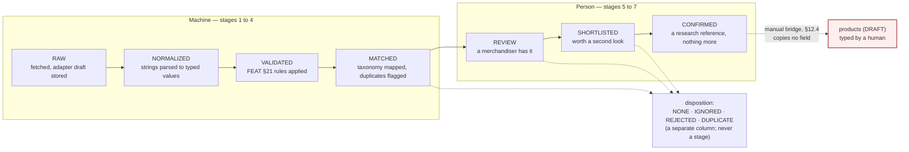
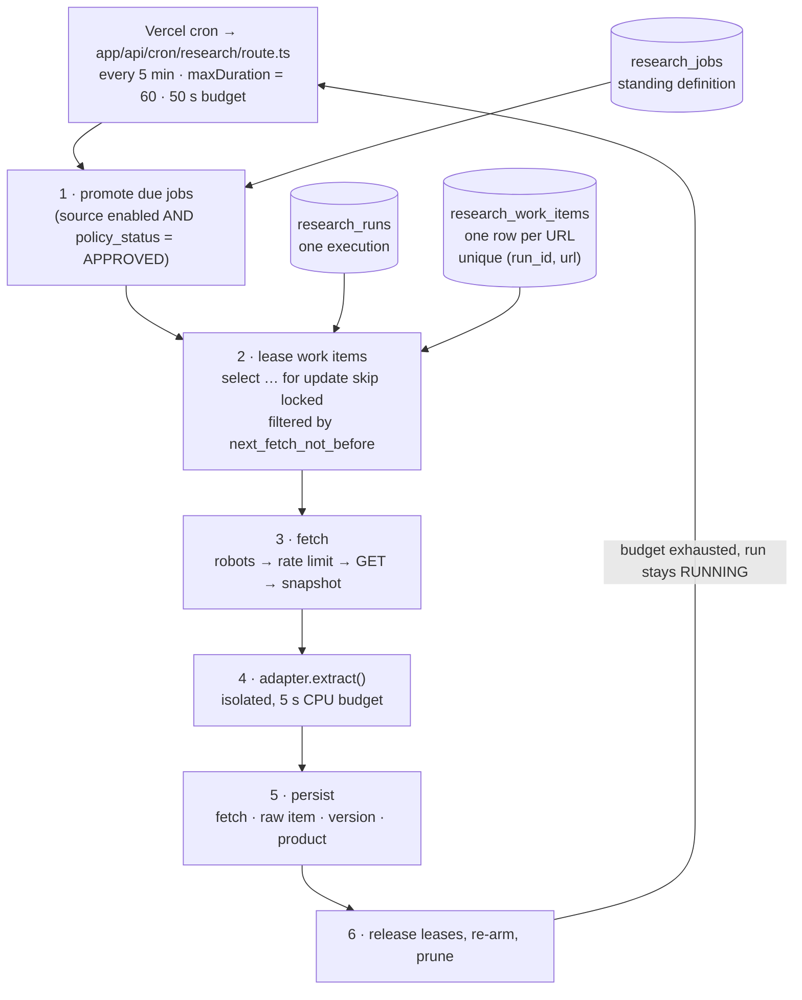

# SCRAPER — the Rivya research subsystem

> Binding parent: `docs/architecture/CANONICAL-DECISIONS.md`. Where this document and the
> canonical decisions differ, the canonical decisions win and this document is wrong.
> Companion documents: `ARCHITECTURE.md` (runtime boundaries), `DATA_MODEL.md` (every column),
> `docs/project/BUSINESS_RULES.md` (the never-auto-import rule), `docs/ops/SECURITY.md`.
> Implemented by Phases 25–30 and extended by Phases 31–36
> (`docs/project/phases/PHASE-23-30.md`, `PHASE-31-38.md`).
> **Owner verification.** Whether any given third-party website may lawfully be read at the
> configured rate is a legal and commercial judgement this repository cannot make. Every source
> ships `policy_status = 'UNREVIEWED'` and every approval control is marked
> `OWNER_VERIFICATION_REQUIRED`. Approval is the owner's assertion, not the engineering team's.

---

## 0. As built — what Phase 25 actually shipped

> Added when the foundation landed. Everything below §1 is the design for the whole subsystem
> (Phases 25–36) and is unchanged; this section says which of it exists today, and names the four
> places where the implementation and this document should be read together.

**Shipped**: migrations `0230`–`0234`; nine tables (`research_sources`, `research_jobs`,
`research_runs`, `research_work_items`, `research_fetches`, `research_raw_items`,
`research_products`, `research_pipeline_events`, `research_robots_cache`); the seven-stage machine
with disposition as a separate column; the whole of §8's politeness posture; §9.2's snapshot store;
the drain loop and the five-minute cron; six Studio surfaces; and the isolation guard.

**Not yet**: normalisation and validation (§10, Phase 28), change detection (§11, Phase 29), and the
review workflow (§12, Phase 29–30). `research_raw_items.raw` still accepts **only**
`{ title, canonicalUrl, links }` under a `.strict()` Zod schema, and Phase 27 did not widen it — a
draft is an observation of a product and lives in `research_product_versions.raw` instead (§18), so
the rule that kept a "temporary" parser out of that column still holds and still fails at the write
rather than at review.

**Since shipped**: the remaining FEAT §26 source fields, which §6 designs and **§17 records as
built** — three child tables, four enums, the derived health view and the policy-review workflow,
in migrations `0240`–`0241` (Phase 26); and the adapter architecture, which §5 designs and **§18
records as built** — the contract, the `generic` adapter's six strategies, the four isolation layers,
the draft content hash and the two extraction tables, in migrations `0250`–`0251` (Phase 27). Where
§6 and §17, or §5 and §18, disagree about a fact, the as-built chapter is the built system.

### 0.1 Four notes where the code and this document meet

1. **The politeness controls are enforced in the LEASE QUERY, and §7 is right that they are.**
   Worth restating because a reader expecting `await sleep(delay)` will not find one: on a runtime
   that kills a function at sixty seconds, sleeping spends the invocation doing nothing and loses
   the delay entirely when the function is terminated mid-wait. `not_before_at` on the item and
   `next_fetch_not_before` on the source are filtered in the statement that hands out work, so the
   delay survives the process. `for update skip locked` is not expressible through PostgREST, so
   leasing is `research_lease_work_items()` — SECURITY DEFINER, granted to the service role alone —
   which also re-applies every source-level gate in the same statement.

2. **`Crawl-delay` is a floor and can only slow Rivya down.** §8.1 records the directive; the
   implementation is `Math.max`, never `Math.min`, and `tests/unit/robots-parse.test.ts` asserts it
   in those words. It is not in RFC 9309, and honouring an unstandardised directive in a way that
   could make Rivya *faster* would put a third party's file in charge of our request rate upward.

3. **A `DISALLOWED` fetch row is evidence, and the row enforces it.**
   `research_fetches_disallowed_has_no_response` refuses a `DISALLOWED` row carrying an HTTP
   status, a content hash or a storage key. A row saying "we did not fetch this" cannot also say
   what came back — which is what makes the robots log something to be believed rather than
   something the application asserts about itself.

4. **`research_sources` has no `owner_verification` column.** §6 and the front matter both mark
   source approval `OWNER_VERIFICATION_REQUIRED`, and that is exactly what `policy_status` is:
   starts `UNREVIEWED`, owner or admin only to approve, an approval that names nobody is refused,
   and `check (is_enabled = false or policy_status = 'APPROVED')` makes an enabled-but-unapproved
   source unstorable. Adding the generic D5 flag beside it would have been two columns answering
   one question with only one of them enforced. See amendment **A25**.

### 0.2 The prohibitions in §8.2 are enforced by a build gate

`scripts/research/check-research-isolation.mjs` fails on an import of any browser-automation,
proxy-rotation or CAPTCHA-solving package anywhere under `lib/scraper/**`, alongside the four
isolation invariants of §2 and §13. Each was proved to fail on a real planted violation and to pass
once restored. It runs in `npm run check` and in CI — after `db:reset`, because two of its four
checks read the live schema and would otherwise report a pass having looked at an empty one.

---

## 1. What this subsystem is, and what it is not

**It is** a research instrument. It reads publicly published product pages from third-party
websites that an owner has explicitly approved, stores what it read as evidence, turns strings into
comparable data, notices when something changes, and presents all of it to a merchandiser inside
Studio so that a **person** can form a judgement.

**It is not** an import pipeline. Nothing it produces is a Rivya product, nothing it produces is
publishable, and nothing it produces may ever reach a visitor. There is no threshold, no flag and no
"advanced" mode under which a research row becomes catalogue content. The only bridge between the
two worlds is a person with `catalog.write` typing a slug and a category into an empty product form
(§12.4), and that bridge copies no competitor field of any kind.

Three requirement lines govern everything below and are quoted rather than paraphrased:

- D5 — "Scraped data lives in the `research_` prefix and never joins directly to public product
  tables."
- FEAT §19 — "Do not expose internal scraper data publicly."
- FEAT §25 — "Never automatically import changes into Rivya products."

### Zero seeded sources

No competitor name, domain, region or currency appears anywhere in this repository. The sources list
ships empty with an honest empty state. The two adapter folders the requirement names —
`lib/scraper/adapters/source-a/` and `source-b/` — are **placeholders whose `supports()` returns
false**, and a CI grep fails on any hard-coded external host under `lib/scraper/adapters/**`. A real
source is added by the owner, through Studio, after policy review.

---

## 2. The isolation invariant

Four rules hold for the whole subsystem. A change that breaks any of them is a defect, not a
trade-off. Each is enforced mechanically, in a different place, so that no single mistake can undo
the separation.

| # | Invariant | Enforced by |
|---|---|---|
| **I1** | No `research_*` table has a foreign key to, or is referenced by, any public content table (`products`, `categories`, `collections`, `materials`, `media_assets`, `portfolio_projects`, `journal_articles`, `pages`, `page_sections`, `product_relations`, `content_relations`) — except the two allowlisted taxonomy references in §13.2 | Migration review plus `scripts/research/check-research-isolation.mjs` reading `information_schema.referential_constraints` |
| **I2** | No `research_*` table has an `anon` policy of any kind. Staff `select` requires `research.read` | The Phase 04 policy pattern (research tables never receive the public-select policy) plus `scripts/auth/check-rls.ts` |
| **I3** | No identifier matching `/research_\|researchProduct\|scraper/i` appears anywhere under `app/(site)/**`, `lib/cms/**`, `lib/catalog/**`, `lib/seo/**`, `components/sections/**` or `content/**` | `check-research-isolation.mjs`, wired into `npm run check` |
| **I4** | A row in `research_*` can only ever become a Rivya product by a person typing one. No server action, script, SQL function or trigger writes to `products` from a `research_*` read | `scripts/research/check-no-autoimport.mjs` plus `tests/unit/research-isolation.test.ts` and `tests/unit/confirmation-no-import.test.ts` |

A reviewer verifying the boundary runs exactly four things, all of which are wired into
`npm run check` and none of which is optional:

```
node scripts/research/check-research-isolation.mjs
node scripts/research/check-no-autoimport.mjs
node scripts/search/check-search-scope.mjs
npm run test:unit -- research-isolation search-scope research-no-autoimport
```

**Competitor imagery and text are never re-hosted, and never proxied.** Extracted image URLs are
stored as text. Nothing from a research row is uploaded to Cloudinary, written to `media_assets`,
cached, thumbnailed, transformed, or served from — or fetched by — a Rivya origin. Where the
source's `image_extraction_mode` permits an image to be shown at all, Studio renders it as a plain
external `` whose `src` is the stored URL, sized in CSS, with
`referrerpolicy="no-referrer"` and `loading="lazy"`: the staff member's own browser fetches the
bytes from the source, Rivya's servers see none of them, and no Rivya route exists that would.
The full statement is §13.3; §8.2 forbids the alternatives.

---

## 3. The seven-stage pipeline

FEAT §23 fixes the vocabulary. It is reproduced exactly, with one structural decision: **rejection is
not a stage.** A rejected row keeps the stage it reached, and its judgement is carried by a separate
`disposition` column — so the pipeline vocabulary stays literally the requirement's, and "how far did
this row get" and "what did we decide about it" remain two different questions.



### Stage semantics

| Stage | Reached when | Set by | A row can stop here because |
|---|---|---|---|
| `RAW` | An adapter produced a `RawProductDraft` from a fetched page | `lib/scraper/workflows/extract.ts` | — |
| `NORMALIZED` | Every extracted string has a typed value or an explicit non-value | `workflows/promote.ts` | — |
| `VALIDATED` | The eleven §10.3 rules ran; no `ERROR` blocks promotion | `workflows/promote.ts` | An `ERROR` issue is attached, or its category is unmapped |
| `MATCHED` | Mapped to a Rivya category through the source's map; duplicates flagged | `workflows/match.ts` | — |
| `REVIEW` | A merchandiser acknowledged it | `workflows/review-actions.ts` | It is waiting for a person |
| `SHORTLISTED` | A merchandiser marked it worth a second look | `workflows/review-actions.ts` | — |
| `CONFIRMED` | A merchandiser confirmed it **as a research reference** | `workflows/review-actions.ts` | This is the last stage. It is not a catalogue state |

`research_disposition` is `NONE · IGNORED · REJECTED · DUPLICATE`. Rejecting a row at `SHORTLISTED`
leaves its stage at `SHORTLISTED` and sets `disposition = 'REJECTED'` with a required reason.

### Two rules about the stage column

1. **One writer.** `lib/scraper/core/stage.ts` is the only code that writes
   `research_products.stage`. Every transition appends a `research_pipeline_events` row carrying
   from-stage, to-stage, actor, `actor_kind` (`STAFF` or `SYSTEM`) and reason. A direct
   `update … set stage = …` is rejected by a database trigger.
2. **Change detection never moves a stage.** A row at `SHORTLISTED` whose price moves stays at
   `SHORTLISTED`; the change is attached and appears in the review queue. Only a person moves a row
   between `REVIEW`, `SHORTLISTED` and `CONFIRMED`.

### `CONFIRMED` means one thing

It means *"confirmed as a research reference."* It creates no product, no draft product, no media
row, no CMS content and no obligation. The Studio confirm dialog says so in seeded copy, and
`tests/unit/research-no-autoimport.test.ts` runs a full pipeline pass over a `CONFIRMED` row and
asserts `select count(*) from products` is unchanged and that no `audit_logs` row with
`entity_type = 'product'` was written. The name is kept because FEAT §23 fixes it; the misreading
risk is raised in *Open questions*.

---

## 4. Runtime shape — job, run, work item

Vercel functions are short-lived, so a crawl cannot be a long-running process. It is a queue drained
in bounded slices, and the unit of progress is a **work item**, not a run.



| Record | Is | Lifetime |
|---|---|---|
| `research_jobs` | The standing definition: source, type (`DISCOVERY · DETAIL · REFRESH`), scope, schedule | Until deleted |
| `research_runs` | One execution: `QUEUED · RUNNING · SUCCEEDED · PARTIAL · FAILED · CANCELLED` | Minutes to hours, across many cron ticks |
| `research_work_items` | One URL: `PENDING · LEASED · DONE · FAILED · SKIPPED`, with `attempts`, `not_before_at`, `lease_until` | One run |

Consequences that make this shape worth its complexity:

- A function timeout loses nothing. Leases expire and are re-claimed; the run resumes on the next
  tick and is marked `PARTIAL` rather than `FAILED` if some items never succeeded.
- Two overlapping cron invocations cannot double-fetch: `for update skip locked` plus
  `unique (run_id, url)`, and `workflows/schedule.ts` refuses to create a second run for a job whose
  previous run is still `RUNNING`.
- Cancellation is immediate in effect: the drain loop checks `status` between items.
- A dry run walks the whole path and writes work items and fetch decisions but performs no request
  that would not otherwise have been permitted, and stores no snapshot.

---

## 5. The adapter contract

> **Built in Phase 27. §18 is the as-built account** — what `AdapterContext` grants and what each of
> its six absences prevents, the fifteen draft fields as they shipped, the `generic` adapter's six
> strategies with the eight readings inside them, what each isolation layer writes down, why the
> content hash excludes `confidence` and `provenance`, and the procedure for writing an adapter.
> This section is the design it was built from and is kept at this number because §6–§17 are cited
> by number from four other documents.

### 5.1 Why adapters rather than one parser

FEAT §26 requires that a new source be addable without rewriting the engine, and FEAT §27 requires
that a broken source adapter must not break other sources. Both are satisfied by the same shape:
**every behavioural difference between sources is a database column, a child row, or an adapter — and
never a branch inside `lib/scraper/core/**`.** The `AdapterPicker` in Studio reads the registry;
`research_sources.adapter_key` selects one; adding a source is a Studio task.

### 5.2 The contract, deliberately small

```ts
// lib/scraper/adapters/types.ts

export type AdapterCapability = 'DISCOVER' | 'EXTRACT' | 'PAGINATE';

export interface SourceAdapter {
  readonly key: string;                        // 'generic' | a vendor key
  readonly version: string;                    // semver; stamped on every row it produces
  readonly capabilities: AdapterCapability[];

  supports(source: ResearchSource): boolean;   // pure; no I/O
  discover(ctx: AdapterContext, page: FetchedPage): Promise<DiscoveredUrl[]>;
  extract(ctx: AdapterContext, page: FetchedPage): Promise<RawProductDraft>;
}

export interface AdapterContext {
  readonly source: ResearchSourceConfig;       // the row, read-only
  readonly patterns: UrlPatternMatcher;        // match(url) → { kind, pattern, priority } | null
  readonly log: AdapterLogger;                 // level + message + safe context, redacted
  // Deliberately absent: any database handle, any fetch, any file-system access,
  // any Cloudinary client, any environment access, any clock beyond Date.now().
}

export interface FetchedPage {
  readonly url: string;
  readonly finalUrl: string;
  readonly status: number;
  readonly contentType: string | null;
  readonly html: string;                       // already size-capped by the core fetcher
  readonly fetchedAt: string;                  // ISO-8601
  readonly contentHash: string;                // sha256 of the body
}

export interface DiscoveredUrl {
  readonly url: string;
  readonly kind: 'PRODUCT' | 'CATEGORY' | 'PAGINATION';
  readonly depth: number;
}
```

`AdapterContext` grants no side effects, and that is the point: an adapter is a **pure function from
bytes to a draft**. It is therefore safe to accept from anyone, cheap to test against a fixture, and
impossible to misuse. `tests/unit/adapter-contract.test.ts` fails any adapter that imports
`lib/supabase/**`, `node:fs`, `undici`, `axios`, `node-fetch` or any browser-automation package.

### 5.3 `RawProductDraft` is raw on purpose

```ts
// lib/scraper/adapters/draft-schema.ts  (Zod; every field optional, every value a string)

export interface RawProductDraft {
  title?: string;
  priceText?: string;
  currencyText?: string;
  skuText?: string;
  availabilityText?: string;
  leadTimeText?: string;
  descriptionHtml?: string;
  dimensionTexts?: string[];
  materialTexts?: string[];
  variantTexts?: string[];
  customizationTexts?: string[];
  imageUrls?: string[];          // strings. Nothing is downloaded, ever. §13.3
  categoryLabels?: string[];
  externalId?: string;
  canonicalUrl?: string;
  confidence: Record<keyof RawProductDraft, 0 | 1>;   // was it found, or defaulted?
  provenance: Record<string, ExtractionStrategy>;      // which rule produced each field
}
```

**An adapter never parses a number, converts a unit, resolves a currency or maps a category.**
Normalization does all four (§10), and keeping them out of adapters is what makes a vendor adapter
reviewable in ten minutes. A numeric field in a draft fails the Zod schema.

### 5.4 The `generic` adapter

Extraction order, first hit wins per field, with the winning strategy recorded in
`raw.provenance` so a wrong value can be traced to a rule rather than guessed at:

| Order | Strategy | Notes |
|---|---|---|
| 1 | JSON-LD `Product` | Including `@graph` and arrays |
| 2 | Microdata `itemtype="…/Product"` | |
| 3 | RDFa | |
| 4 | OpenGraph | `og:title`, `product:price:amount`, `og:image` |
| 5 | Configured selectors | The source's `price_extraction`, `sku_extraction`, `attribute_extraction` |
| 6 | `<title>` and `<h1>` | Last resort; low confidence |

Parsing uses a real HTML parser, never a regular expression over markup.

### 5.5 Failure isolation, four layers

| Layer | Behaviour |
|---|---|
| Per item | `extract()` runs inside try/catch with a 5-second CPU budget. A throw, a timeout or a Zod failure marks that work item `FAILED` with the error; the drain loop continues |
| Per source, per run | `research_adapter_runs` records one row per (run, source, adapter). Ten consecutive item failures for one source stop **that source's** items for the rest of the run and set `status = 'ABORTED'` |
| Per source, across runs | Three consecutive `ABORTED` adapter runs open the source's `circuit_open_until` and raise a `WARNING` system log naming the adapter and version |
| Cross-source | Every source's items are leased and executed independently. `tests/unit/adapter-isolation.test.ts` runs two sources with adapter A throwing on every item and asserts source B reaches `SUCCEEDED` with its full count, and the overall run is `PARTIAL`, not `FAILED` |

### 5.6 Versioning and provenance

`adapter_key` and `adapter_version` are written on every `research_raw_items` and
`research_product_versions` row. A change to an adapter's output shape is a minor version bump.
Re-extracting stored snapshots under a new version is an explicit `REFRESH` job or the offline
script (§14) — **never automatic** — so a version change cannot silently rewrite history.

### 5.7 How to write an adapter

1. Create `lib/scraper/adapters/<key>/index.ts` exporting a `SourceAdapter`.
2. Implement `supports(source)` as a pure predicate over the source row (usually a host check).
3. Implement `extract()` returning strings only. Set `confidence[field] = 1` only for a field you
   actually found; record the strategy in `provenance`.
4. Add at least three golden fixtures under `tests/fixtures/scraper/<key>/`, one of which is a
   malformed page. `extract()` must not throw on it — it returns a low-confidence draft.
5. Register the adapter **twice, in two files**: the descriptor in `lib/scraper/adapters/registry.ts`
   and the implementation in `lib/scraper/adapters/execution.ts`. This step read "register the
   adapter in `registry.ts`" before the descriptor split of amendment **A26**, and that is now half
   of it — §18.8 step 7 is the current procedure and says why the two registers exist.
6. Run `npm run test:unit -- adapter-contract` and
   `node scripts/research/reextract.ts --source=<slug> --dry-run` to validate against stored
   snapshots with zero network traffic.
7. Update this document, per the documentation update contract.

No step involves editing `lib/scraper/core/**`. If a source appears to require that, the requirement
belongs in a column, not a branch.

---

## 6. Source configuration

> **Built in Phase 26. §17 is the as-built account** — which storage each of these twenty-three
> fields actually took, why three of them are child tables, why three stayed jsonb, and the exact
> precedence the health view computes. This section is the design it was built from and is kept at
> this number because §7–§16 are cited by number from four other documents.

The twenty-three FEAT §26 fields, each with a home. This table is the specification: the migration
and the Studio form are both read from it.

| # | FEAT §26 field | Storage | Type / validation |
|---|---|---|---|
| 1 | Name | `research_sources.name` | text, required, unique with `slug` |
| 2 | Website | `research_sources.base_url` | absolute `https://` URL; host must match every URL pattern's host |
| 3 | Region | `research_sources.region` | ISO-3166-1 alpha-2, or `GLOBAL` |
| 4 | Currency | `research_sources.currency` | ISO-4217 alpha-3; the source's *stated* currency, never converted |
| 5 | Source Type | `research_sources.source_type` | `BRAND · RETAILER · MARKETPLACE · GALLERY · ARTISAN · DIRECTORY` |
| 6 | Analytics League | `research_sources.analytics_league` | `PEER · ASPIRATIONAL · ADJACENT · MASS`; grouping only, never a public label |
| 7 | Enabled | `research_sources.is_enabled` | bool; blocked unless `policy_status = 'APPROVED'` (database check constraint) |
| 8 | Collection Mode | `research_sources.collection_mode` | `SITEMAP · CATEGORY_CRAWL · SEED_URLS · FEED`; selects the discovery strategy |
| 9 | Category Mapping | `research_source_category_map` | Child rows: source label/path → Rivya `categories.id` or explicit `IGNORE` |
| 10 | URL Patterns | `research_source_url_patterns` | Child rows: `kind` (`PRODUCT · CATEGORY · EXCLUDE · PAGINATION`), `pattern`, `is_regex`, `priority` |
| 11 | Extraction Adapter | `research_sources.adapter_key` | Must resolve in the registry; validated on save |
| 12 | Image Extraction | `research_sources.image_extraction_mode` | `NONE · URL_ONLY · URL_AND_DIMENSIONS`. **No mode downloads or re-hosts an image** |
| 13 | Price Extraction | `research_sources.price_extraction` | jsonb: selector or JSON-LD path, currency override, decimal and thousands separators |
| 14 | SKU Extraction | `research_sources.sku_extraction` | jsonb: selector/path plus an optional strip pattern |
| 15 | Attribute Extraction | `research_sources.attribute_extraction` | jsonb: ordered `{ key, selector, kind }` for dimensions, materials, availability, lead time, variants, customization |
| 16 | Rate Limit | `research_sources.rate_limit_rpm` | int 1–60; higher values rejected outright |
| 17 | Request Delay | `research_sources.request_delay_ms` | int ≥ 1000; raised silently to the robots `Crawl-delay` floor |
| 18 | Concurrency | `research_sources.concurrency` | int 1–4 |
| 19 | Scheduling | `research_source_schedules` | Child rows: `job_type`, `cron_expression`, `timezone`, `is_enabled`; minimum interval 6 hours |
| 20 | Last Run | `research_source_health_v.last_run_at` | View column, derived from `research_runs` |
| 21 | Health | `research_source_health_v.health` | View column: `HEALTHY · DEGRADED · FAILING · STALE · DISABLED` |
| 22 | Policy Review | `policy_status`, `policy_reviewed_by`, `policy_reviewed_at`, `policy_notes` | §8.3 |
| 23 | Notes | `research_sources.notes` | Free text, staff-only, never rendered outside Studio |

**Health is derived, never stored.** `research_source_health_v` computes, per source: `DISABLED`
when `is_enabled = false`; `FAILING` when the last two runs failed or the circuit is open;
`DEGRADED` when the last run is `PARTIAL` or the seven-day success rate is below 80 %; `STALE` when
the newest successful run is older than twice the configured schedule interval; otherwise `HEALTHY`.
A view cannot go stale the way a cached column can, and the rule is legible in SQL rather than
buried in a worker.

**The URL-pattern tester makes no network request.** `testPatterns`, in
`lib/scraper/core/url-patterns.ts`, takes pasted candidate URLs and returns, per URL, the matched
pattern, its kind and the robots decision — answered entirely from `research_robots_cache`, which the
caller supplies as a function. A fixture-server assertion proves it logs zero requests. It is reached
by a `GET` on the source page rather than by a Server Action; §17.6 says why there is no
`testPatternsAction`.

**The single-URL probe is the second — and last — outbound path.** `probeUrlAction`, in
`app/(studio)/studio/(shell)/research/sources/actions.ts`, performs one real fetch of one URL. It is
the only request-scoped code in the repository permitted to contact a third-party host, and it is not
a general fetcher: it goes through `lib/scraper/workflows/probe.ts`, which calls the same
`lib/scraper/core/fetch.ts` entry point as the cron drain, so `SCRAPER_USER_AGENT`, the 2 MB body cap
and the 15-second timeout apply unchanged, and robots.txt, the `Crawl-delay` floor, the source's own
`request_delay_ms` and the circuit breaker apply exactly as they do to a queued item. Before any of
that, the action refuses a source that is not `APPROVED`, a URL that is not on the source's host, and
every request at all while `research_enabled` is off. It requires `research.write` and writes one
`audit_logs` row naming actor, source and URL. **It keeps the snapshot**, exactly as a scheduled fetch
would — see §17.6, which corrects the draft sentence that said otherwise. `ARCHITECTURE.md` §1 fixes
it as one of exactly two outbound paths.

**A category mapping never guesses.** An unmapped source category is `null`, counted on the
dashboard, and leaves the row at `VALIDATED`. It is never defaulted to `furniture` or to the first
category.

---

## 7. Scheduling and rate limiting

| Control | Implementation |
|---|---|
| Trigger | Vercel cron → `app/api/cron/research/route.ts` every five minutes, `maxDuration = 60`, 50-second wall-clock work budget. There is no long-running process |
| Authorisation | **Vercel's `x-vercel-cron` header alone.** The route returns `404` — not `401` — to any request without it, so an unauthenticated prober cannot confirm the route exists. It does **not** reuse `REVALIDATE_SECRET`, deliberately and unlike the other six cron routes (`content-schedule`, `research-analytics`, `research-score`, `sheets-sync`, `analytics-snapshot`, `log-retention`), because that secret guards cache invalidation and this is the one route that contacts third-party hosts. The cost is that the route cannot be exercised outside Vercel; §16 item 4 and `ARCHITECTURE.md` *Open questions* item 3 raise the same `CRON_SECRET` amendment and must be resolved together |
| Per-source schedule | `research_source_schedules` cron expressions, minimum interval **6 hours**, enforced by a check constraint |
| Overlap | `schedule.ts` refuses a second run for a job whose previous run is still `RUNNING` |
| Rate limit | `rate_limit_rpm` (1–60), `request_delay_ms` (≥ 1000), `concurrency` (1–4) — all enforced **in the lease query** through `next_fetch_not_before` and `in_flight_count`, never by hopeful `sleep()` calls in application code |
| `Crawl-delay` | Read from robots.txt and applied as a **floor** on `request_delay_ms`. A source configured faster than robots asks is slowed; never the reverse |
| Backoff | `429` and `503` honour `Retry-After`; otherwise exponential 2⁰…2⁵ minutes with jitter, written to the work item's `not_before_at` |
| Circuit breaker | Five consecutive fetch failures, or three consecutive `ABORTED` adapter runs, set `circuit_open_until` and raise a `WARNING` system log. No further fetch is attempted for that source until it clears |
| Kill switch | Feature flag `research.enabled` (off by default in every environment) **plus** per-source `is_enabled`. Both are checked immediately before every fetch, not once per run |
| Retention | Snapshots pruned at 180 days by the same cron; the prune logs its own summary |

Turning `research.enabled` off stops every source at once, mid-run, at the next item.

---

## 8. Politeness and legal posture

This section is the part of the subsystem that is hardest to retrofit and easiest to erode. It is
written as prohibitions because that is how it must be reviewed.

### 8.1 The controls

| Control | Rule |
|---|---|
| Identification | `SCRAPER_USER_AGENT` (D8) is the only user agent used, and it names Rivya plus a contact URL. **No browser impersonation. No rotating agents** |
| robots.txt | Fetched per host, cached in `research_robots_cache` with a 24-hour TTL, parsed for the Rivya agent then `*`. A `Disallow` match means the URL is **never fetched**; the attempt is recorded with `robots_decision = 'DISALLOWED'` and performs no request |
| Scope | Public product pages only |
| Technique | Plain HTTP `GET`, bounded body (2 MB), 15-second timeout, capped redirects |
| Volume | §7. Delay, rate and concurrency are enforced at lease time |

### 8.2 The prohibitions

Never, under any flag, for any source, for any reason:

- authenticated, paywalled or personalised pages;
- pages behind a CAPTCHA, and no CAPTCHA solving of any kind;
- checkout, cart, account or search-suggestion endpoints;
- personal data of any kind, including reviews, reviewer names, seller names and contact details;
- any page whose robots rules disallow it;
- a headless browser, JavaScript execution, or DOM emulation beyond an HTML parser;
- proxy rotation, IP cycling, or cookie-jar session forgery;
- re-hosting, caching, proxying, thumbnailing or transforming a competitor image, and any Rivya
  route that fetches or re-serves one (§13.3);
- republishing any competitor text, price or image on any Rivya surface.

If a source requires any prohibited technique to be read, the answer is that Rivya does not read it.
`check-research-isolation.mjs` fails the build on an import of any browser-automation package inside
`lib/scraper/**`.

### 8.3 The policy gate — **OWNER_VERIFICATION_REQUIRED**

`research_sources.policy_status` is `UNREVIEWED · APPROVED · RESTRICTED · BLOCKED` and starts at
`UNREVIEWED`. A source cannot be enabled, and no run can be created for it, until an owner or admin
sets `APPROVED`.

```sql
alter table research_sources add constraint research_sources_enabled_requires_approval
  check (is_enabled = false or policy_status = 'APPROVED');
```

- A researcher prepares a source and marks it *Ready for review* (`readiness`).
- An owner or admin opens the review panel — which renders the site's cached robots.txt, the URL
  patterns, the extraction configuration and a **mandatory** notes field — and sets `APPROVED`,
  `RESTRICTED` (approved but limited to named patterns) or `BLOCKED`.
- Approval requires `research.write` **and** `system.settings.write`, records
  `policy_reviewed_by` / `policy_reviewed_at` / `policy_notes`, and writes an `audit_logs` row.
- The panel carries a standing banner stating that this repository cannot determine what a third
  party's terms permit, and that approval is the owner's assertion.

`RESTRICTED` narrows a source to specific URL patterns; the engine treats every non-matching URL as
excluded, exactly as if an `EXCLUDE` pattern matched it.

---

## 9. Storage model

Every table carries the `research_` prefix. Every table has RLS with `select` requiring
`research.read` and writes requiring `research.write` (or `research.confirm` for dispositions), and
**no `anon` policy of any kind** (I2). Append-only tables additionally `revoke update, delete`.

### 9.1 Table inventory

| Table | Purpose | Phase |
|---|---|---|
| `research_sources` | One row per approved third-party site; the twenty-three §6 fields | 25 · 26 |
| `research_source_url_patterns` | `PRODUCT · CATEGORY · EXCLUDE · PAGINATION` patterns, priority-ordered; `EXCLUDE` always wins | 26 |
| `research_source_category_map` | Source category label → Rivya `categories.id` or `IGNORE`. **Allowlisted FK, §13.2** | 26 |
| `research_source_schedules` | Per-source cron schedules, ≥ 6-hour interval | 26 |
| `research_source_health_v` | View: last run, status, 7-day success rate, queue depth, health | 26 |
| `research_jobs` | Standing job definitions (`DISCOVERY · DETAIL · REFRESH`) and their scope | 25 |
| `research_runs` | One execution, with status, trigger, actor, stats and dry-run flag | 25 |
| `research_work_items` | The URL queue; leased with `for update skip locked`; `unique (run_id, url)` | 25 |
| `research_fetches` | One row per fetch attempt: robots decision, status, hash, bytes, duration, `storage_key` | 25 |
| `research_robots_cache` | Per-host robots.txt with a 24-hour TTL and the parsed `crawl_delay_s` | 25 |
| `research_raw_items` | Exactly what came back, uninterpreted, plus `adapter_key` / `adapter_version` | 25 · 27 |
| `research_products` | One row per discovered product per source; `unique (source_id, source_url)`; carries stage, disposition, normalised values and classification | 25 · 27 · 28 · 30 |
| `research_product_versions` | Append-only content-hashed versions; `raw` + `normalized` payloads; the substrate change detection diffs | 27 · 28 |
| `research_adapter_runs` | One row per (run, source, adapter): items seen/extracted/failed, first errors, status. The unit of blast-radius accounting | 27 |
| `research_pipeline_events` | Append-only stage transitions with actor, `actor_kind` and reason | 25 |
| `research_validation_issues` | One row per failed rule, with severity, field and detail; dismissible with a reason | 28 |
| `research_match_candidates` | Sub-threshold duplicate candidates awaiting a human decision | 28 |
| `research_material_lexicon` | Material keyword → token mapping. **Data, not code**; Studio-editable | 28 |
| `research_changes` | One row per changed field per version pair, with both snapshot keys | 29 |
| `research_change_rules` | Per-source (or global) materiality thresholds; Studio-editable | 29 |
| `research_review_actions` | Append-only record of the nine FEAT §25 actions; reversal is a new row | 29 |
| `research_notes` | Never deleted, only superseded | 29 |
| `research_tags` · `research_product_tags` | Controlled vocabulary; free text rejected | 29 |
| `research_change_digests` | One idempotent row per day | 29 |
| `research_large_format_rules` | Ordered, editable scale rules; first match wins | 30 |
| `research_saved_views` | Named, shareable filter sets per surface | 30 |
| `research_analytics_snapshots` | Dated metric snapshots with `n` and denominator | 31 |
| `research_opportunity_scores` · `research_opportunity_components` · `research_scoring_models` | Reproducible scores and the model that produced them | 32 |
| `research_image_hashes` · `research_similarity_runs` · `research_similarity_pairs` · `research_similarity_suppressions` | Perceptual hashes and pair bands (§13.3, and *Open questions* item 3) | 33 |
| `research_direction_briefs` and its revision/evidence tables | Human-written design direction with evidence attached | 34 |
| `research_shortlist_entries` · `research_confirmations` | The two decision records and their history | 35 |
| `research_search_documents` | Studio-only search index; never reachable by `anon` | 23 |

### 9.2 Snapshots — the evidence store

Every fetch stores the response body, gzipped, to a **private object store** (a private Supabase
Storage bucket, not Cloudinary), keyed:

```
research/<source_slug>/<yyyy>/<mm>/<dd>/<sha256>.html.gz
```

`research_fetches` records `content_hash`, byte size and `storage_key`. Snapshots are why a change
record can always be reproduced from evidence, and why an adapter fix can be validated against real
historical pages without touching the network. They are never written to Cloudinary, never routed
through `MediaProvider`, never served from a public route, and are pruned at 180 days.

### 9.3 Versions, not overwrites

`research_product_versions` stores one row per (product, run) **whose content hash differs from the
previous version**, holding the `RawProductDraft` as `raw jsonb`, the normalised payload as
`normalized jsonb`, the snapshot `storage_key`, `content_hash`, `adapter_key`, `adapter_version`,
`normalizer_version` and `observed_at`. `research_products.current_version_id` points at the newest.
An unchanged page produces no new version, only an updated `last_seen_at`.

Diffing a mutable current row against itself is not change detection; this table is what makes §11
reproducible.

> **As built (Phase 27), one correction and one consequence.** The key is
> `unique (research_product_id, content_hash)` — per **distinct content hash**, not per (product,
> run) — and the hash is over the adapter's draft rather than over the page body (§18.7). The
> consequence is worth knowing before Phase 29 reads this table: uniqueness is over the product's
> whole history, not against its previous version alone, so a page that reverts to a state it held
> before writes no new row, because the earlier version already *is* that observation.

---

## 10. Normalization and validation

### 10.1 Normalization is a pure module

`lib/scraper/normalization/` takes a `RawProductDraft` plus its source configuration and returns a
`NormalizedProduct` with a per-field `parse_state`:

| `parse_state` | Meaning |
|---|---|
| `PARSED` | A confident, typed value |
| `AMBIGUOUS` | A value was present but could mean more than one thing. **Never resolved by guessing** |
| `UNPARSED` | A value was present and could not be interpreted. The original string is retained |
| `ABSENT` | The source did not publish it |

The module performs no I/O and no database access, so every rule is unit-testable against a fixture
table.

### 10.2 The rules that matter

**Currency.** The source's declared ISO-4217 currency is the default. A symbol or code in
`priceText` overrides it only when unambiguous (`€`, `£`, `USD`); **`$` alone is `AMBIGUOUS`** and is
recorded as such rather than assuming a country. Amounts parse to integer **minor units** using the
source's configured separators, so `1.234,56` and `1,234.56` both become `123456`.

**No foreign-exchange conversion is ever performed, anywhere in `lib/scraper/**`.** Comparing prices
across currencies needs a dated rate Rivya does not hold; Phase 31 compares within a currency and
says so. `grep -rn "exchangeRate\|convertCurrency\|fx_rate" lib/scraper` returns nothing, and a unit
test keeps it that way.

**Price state** mirrors the first-party vocabulary: `FIXED · STARTING_FROM · REQUEST_QUOTE ·
PRICE_ON_REQUEST · UNKNOWN`. Text such as "price on request", "enquire" or "POA" maps to a quote
state. **A quote-only row is never stored as `0`** — the same FEAT §21 rule that governs Rivya's own
products, enforced here by the database:

```sql
alter table research_products add constraint research_price_state_coherent check (
  (price_state = 'FIXED'          and price_min_minor is not null and price_min_minor > 0
                                  and currency is not null)
  or (price_state = 'STARTING_FROM' and price_min_minor is not null and price_min_minor > 0
                                  and currency is not null)
  or (price_state in ('REQUEST_QUOTE','PRICE_ON_REQUEST','UNKNOWN')
      and price_min_minor is null and price_max_minor is null)
);
```

**Dimensions** canonicalise to millimetres (mass to grams), keeping the original string:

| Input shape | Example | Result |
|---|---|---|
| Triple with unit | `120 x 60 x 45 cm` | `{ length_mm: 1200, width_mm: 600, height_mm: 450 }` |
| Labelled | `W 120cm · D 60cm · H 45cm` | Labels win over position |
| Imperial | `47" x 24" x 18"` | 25.4 mm/in, rounded to the nearest mm |
| Feet + inches | `4' 6"` | `1372` |
| Diameter | `Ø 90 cm`, `dia. 90cm` | `{ diameter_mm: 900 }` |
| Range | `120–140 cm` | `{ length_mm: 1200, length_mm_max: 1400 }`, `PARSED` |
| Unitless | `120 x 60` | `AMBIGUOUS` — **no unit is inferred from magnitude** |
| Prose | `seats six comfortably` | `UNPARSED`; the original string is retained |

Positional order is never assumed when labels are absent and the source declares no order.

**Materials, availability, lead time, variants, customization** each normalise to a controlled token
set plus the retained original text. Materials run against `research_material_lexicon` — a table with
a Studio editor, not a hard-coded list — producing tokens such as `oak`, `walnut`, `epoxy_resin`,
`brass`. Availability maps to `IN_STOCK · MADE_TO_ORDER · PREORDER · SOLD_OUT · UNKNOWN`. Lead time
becomes a day range only when a number and a unit are both present.

### 10.3 Validation — FEAT §21 applied to scraped rows

Every check writes a `research_validation_issues` row with `rule`, `severity`, `field` and `detail`.
The predicates are shared with `lib/catalog/validation.ts` so first-party and research validation
cannot drift apart.

| Rule | Severity | Effect |
|---|---|---|
| `missing_title` | ERROR | Blocks promotion past `VALIDATED` |
| `malformed_source_url` / `non_https_url` | ERROR | Blocks; the row is quarantined |
| `price_quote_with_amount` | ERROR | Blocks — the mirror of the Rivya constraint |
| `price_zero_or_negative` | ERROR | Blocks |
| `impossible_dimension` (any axis < 10 mm or > 10 000 mm) | ERROR | Blocks |
| `dimension_ambiguous` | WARNING | Promotes, flagged; excluded from scale bands |
| `currency_ambiguous` | WARNING | Promotes, flagged; excluded from price comparisons |
| `duplicate_source_url_within_source` | ERROR | Blocks; the older row wins |
| `missing_category_mapping` | WARNING | Promotes to `VALIDATED`, but never to `MATCHED` |
| `image_url_unreachable_shape` | INFO | Informational only; **no request is made to check** |
| `low_confidence_extraction` (fewer than 3 fields at confidence 1) | WARNING | Promotes, flagged for review |

A blocked row **keeps its stage and its issues**. It is never silently dropped, never deleted, and
never quietly promoted on a later run unless the issue clears. Blocked rows appear in the explorer's
Issues view and are counted on the dashboard, so the gap is visible.

### 10.4 Matching produces candidates, not verdicts

- **Duplicates within a source** — exact `source_external_id`, then exact normalised title + price,
  then trigram similarity above 0.85 on the normalised title combined with a dimension match within
  5 %. `disposition = 'DUPLICATE'` is set automatically **only at confidence ≥ 0.95 requiring title
  *and* dimension agreement**; anything lower becomes a `research_match_candidates` row for a human.
  A duplicate flag is always reversible and its reversal is audited.
- **Taxonomy** — `research_source_category_map` first (deterministic, human-authored), then a keyword
  rule against the label. `match_method` is `MAP · KEYWORD · MANUAL`. **No mapping means no match**:
  the row stops at `VALIDATED`.
- **Cross-source duplicate detection is deliberately out of scope.** Two sources listing similar
  objects is a comparison question, not a deduplication one.

### 10.5 Overrides are permanent

A researcher may set a category, clear or set a duplicate flag, edit any normalised value, or dismiss
an issue with a reason. Each writes `override_by`, `override_at` and a `research_pipeline_events`
row, and the overridden keys are frozen in `normalized_overrides jsonb`. **An overridden field is
never recomputed by a later run or by the offline re-normalizer.**

---

## 11. Change detection

FEAT §24 asks for material changes on previously discovered products. Diffing is **version-to-version
and field-by-field**: `lib/scraper/workflows/detect-changes.ts` compares a new version's `normalized`
payload with the previous version's and emits one `research_changes` row per changed field, carrying
`before`, `after`, both version ids, the run id, **both snapshot storage keys** and `detected_at`.
Nothing is diffed against a mutable current row, so a change record can always be reproduced from
evidence.

### Materiality is a stated rule, not a feeling

Three levels — `MATERIAL · MINOR · NOISE`. `NOISE` is recorded but hidden by default and never
counted in the dashboard's "changed" figure. Thresholds live in `research_change_rules`, per source
with a global default row, and are editable in Studio — so a source with noisy prices is tuned
without a deploy.

| Field | MATERIAL when | MINOR when | NOISE |
|---|---|---|---|
| `price` | ≥ 5 % change in minor units, or any change of price **state** | < 5 % change | Formatting-only change with equal minor units |
| `title` | Trigram similarity < 0.90 | 0.90–0.99 | Whitespace or case only |
| `availability` | Any transition between the five tokens | — | Text change with the same token |
| `dimensions_mm` | Any axis changes by ≥ 2 %, or an axis appears or disappears | < 2 % | Parse-state change with equal values |
| `variant_count` | Any change | — | — |
| `material_tokens` | Any token added or removed | — | Reordering |
| `image_urls` | Set membership changes | — | Query-string or CDN-host-only change |
| `lead_time_days_*` | Any change in the parsed range | — | Text change with the same range |
| `description` | Trigram similarity < 0.80 | 0.80–0.95 | > 0.95 |
| `customization` | Any change in the parsed token set | — | Text-only change |
| `sku` | Any change | — | — |

### The daily digest

`research_change_digests` holds one idempotent row per day, surfaced on
`/studio/research/dashboard`: material changes by source and field, new products discovered,
products that disappeared (`last_seen_at` older than two successful runs), and **the oldest undecided
change** — because a queue nobody is working through should be visible, not silent. The digest is a
Studio surface, not an email.

---

## 12. Review workflow

### 12.1 The nine FEAT §25 actions

Each writes a `research_review_actions` row (append-only — a reversal is a new row, never an edit),
an `audit_logs` row, and a `research_pipeline_events` row where a stage moves. All nine require
`research.confirm`.

| Action | Effect | Reversible |
|---|---|---|
| **Review** | Acknowledges the change; stage moves `MATCHED → REVIEW` if it was lower | Yes |
| **Ignore** | `disposition = 'IGNORED'`; the change closes and leaves the queue. Future changes on the same field are still detected but collapse under the ignore reason | Yes |
| **Shortlist** | Stage → `SHORTLISTED`; the row joins the shortlist with the score captured at that moment | Yes |
| **Reject** | `disposition = 'REJECTED'`; stage retained; **reason required** | Yes |
| **Mark Duplicate** | Sets `duplicate_of_id` and `disposition = 'DUPLICATE'`; requires choosing the surviving row | Yes |
| **Confirm** | Stage → `CONFIRMED`. **A research reference, nothing more.** Creates no product, no draft product, no media row, no CMS content | Yes |
| **Add Note** | A `research_notes` row: author, body, timestamp. Never deleted, only superseded | Append-only |
| **Add Tag** | A `research_product_tags` row from the `research_tags` vocabulary; free text is rejected | Yes |
| **Compare** | Opens the row beside up to three others in a read-only drawer. **Records nothing except an activity event** | n/a |

### 12.2 The queue

`/studio/research/changes` lists changes filtered by source, field, materiality, age, disposition and
tag, defaulting to `MATERIAL` and undecided. A row opens a diff drawer: before and after side by
side, both snapshot timestamps, a link to each stored snapshot, and the nine actions. Keyboard
shortcuts (`j`/`k` to move, `s` shortlist, `i` ignore, `r` reject, `n` note) exist because this is a
surface someone works through a hundred rows at a time.

`/studio/research/explorer` is the same machinery over the whole corpus, with a per-row drawer
showing **raw text beside normalised value beside provenance strategy**, and inline override
controls.

### 12.3 Bulk review

Bulk shortlist, reject, mark duplicate, assign tags and confirm run on the **same** `lib/bulk/`
engine as every other bulk operation: preview, typed row-count confirmation for destructive actions,
per-item snapshots, a 200-row cap per invocation, one `audit_logs` row per row changed, and a 24-hour
undo. There is no second bulk implementation. Bulk reject additionally requires `bulk.execute` **and**
`destructive.execute` plus a reason applied to every item.

### 12.4 The gate — the only bridge to the catalogue

One server action, `startProductFromConfirmation`, and it will not run unless **all** of the
following hold:

1. the research row is `CONFIRMED`;
2. the actor holds `catalog.write`;
3. the actor types a slug and picks a category;
4. the actor ticks an explicit acknowledgement whose label is seeded copy stating that no competitor
   data is being imported.

It then inserts a `products` row with exactly: `slug`, `category_id`, `status = 'DRAFT'`,
`price_state = 'PRICE_ON_REQUEST'`, and `title` set to the slug's title case — a placeholder the
owner must replace. **It writes nothing else.** No competitor title, description, price, currency,
dimension, material, availability, lead time or image crosses that line, in any code path, ever.
There is no "import fields" option to disable. The created product is `DRAFT` and must pass the
publication-readiness checklist and a human publish action like any other product.

`tests/unit/confirmation-no-import.test.ts` is the phase's load-bearing test: it builds a research
row whose every text field is a unique sentinel string, runs the bridge, and asserts no sentinel
appears in any column of the created `products` row, or in `product_media`, `product_materials` or
`product_collections`.

`research_confirmations.created_product_id` records which product a confirmation started. It is a
**nullable uuid with no foreign key**, read only by Studio research screens and never joined into a
public read path — the isolation rule is honoured by keeping the reference on the research side and
forbidding the join, rather than by pretending the link does not exist.

---

## 13. Absolute separation from first-party product data

### 13.1 The four guarantees against auto-import

1. **No write path exists.** No server action, script, SQL function or trigger writes to `products`,
   `product_media`, `product_specs`, `product_materials`, `product_collections` or `media_assets`
   from a `research_*` read. `check-no-autoimport.mjs` proves it and fails on an added import.
2. **The rule is written where a person will read it.** `docs/project/BUSINESS_RULES.md` states in
   one quotable sentence that a Rivya product is created only by an owner typing one or by the
   approved-import path, and that neither reads a research table.
3. **The interface says what it does.** The Studio confirm dialog states, from seeded copy, exactly
   what confirming does and does not do.
4. **A test asserts the outcome, not the intention.** A full pipeline pass with changes on a
   `CONFIRMED` row leaves `select count(*) from products` unchanged and writes no `audit_logs` row
   with `entity_type = 'product'`.

### 13.2 The two allowlisted foreign keys

D5 says scraped data never joins directly to public product tables. Two references to **taxonomy**
exist, both written or configured by staff rather than scraped, and both allowlisted **by name** in
`check-research-isolation.mjs`, which fails on any third:

| Column | References | Constraint name in the allowlist | Why it is permitted |
|---|---|---|---|
| `research_source_category_map.category_id` | `categories (on delete set null)` | `research_source_category_map_category_fk` (Phase 26, and the guard's **first** entry) | A category mapping is configuration typed by a member of staff. It points at taxonomy, not at `products` |
| `research_products.matched_category_id` | `categories (on delete set null)` | Phase 28's to name, and the **second and last** | The result of applying that human-authored map |

Neither is a join into product data, and neither is readable by `anon`. The narrowness is deliberate;
amendment **A26** now records the exception in D5's own terms — a scraped VALUE never joins to a
public table, a staff-authored taxonomy POINTER may — and §17.8 gives the reasoning at length.

### 13.3 Images

`imageUrls` are **strings**. No mode of `image_extraction_mode` downloads an image; the most
permissive value, `URL_AND_DIMENSIONS`, stores a URL and two integers taken from the page's own
markup. Nothing from a source is downloaded, uploaded to Cloudinary, written to `media_assets`,
cached, proxied, thumbnailed, transformed or served from a Rivya origin. Constraining the rendered
size in CSS is not thumbnailing: no derived image is produced, stored or served by anything Rivya
runs. Studio shows a source image, where `image_extraction_mode` permits it at all, as a plain external
`" referrerpolicy="no-referrer" loading="lazy">` sized in CSS to at most
240 px on its longest side. **There is no image proxy route, and adding one is a defect** — the
bytes travel from the source directly to the staff member's browser, Rivya's servers never hold
them, and `ARCHITECTURE.md` §1 lists the only two server-side paths that may contact a third-party
host at all (neither is an image path). Consequences, accepted deliberately: an image that the
source removes or hotlink-blocks renders as a broken thumbnail, and the source's server sees the
request without a referrer. Both are preferable to holding someone else's photograph.
An image *change* is detected as a change to the URL **set**, never by comparing pixels.

The reverse direction is guarded too: `lib/media/duplicate-guard.ts` runs
`checkMediaAgainstResearch()` on every user upload and **blocks** the upload when it near-duplicates
an image seen in research. It is the subsystem's only automatic consequence, and it only ever
prevents something. Note what it needs: comparing an upload against a research image requires a
stored perceptual hash of that research image, which is exactly the Phase 33 capability *Open
questions* item 3 has not yet settled. Until that is settled the guard has nothing to compare
against, and it must fail **open with a logged `WARNING`** — never silently, and never by inventing
a comparison it cannot make.

Perceptual similarity (Phase 33) needs pixels, which this posture does not supply. That tension is
unresolved and is raised as *Open questions* item 3 rather than settled here.

### 13.4 Nothing is public

No `(site)` route, sitemap entry, feed, JSON-LD block, OpenGraph image or public search result
references a research table (I3). `research_search_documents` is Studio-only and unreadable by
`anon`. Scale bands, analytics leagues, opportunity scores and similarity bands exist only inside
`research_*` columns and `components/studio/research/**`; the isolation guard fails on any of those
tokens appearing under `app/(site)/**` or `content/**`.

**One authorised egress exists and it is not public**: the Google Sheets export of §13.5. It leaves
the system to a spreadsheet the owner controls, never to a visitor, and it is enumerated here so
that "nothing is public" is not read as "nothing ever leaves".

### 13.5 Export to Google Sheets — the one authorised egress

Phase 36 (`PHASE-31-38.md`) owns the integration; this section fixes only what it may carry out of
the research subsystem. D4 fixes the surface at `/studio/research/sheets`, D8 names the credentials
(`GOOGLE_SERVICE_ACCOUNT_JSON`, `GOOGLE_SHEETS_SPREADSHEET_ID`), FEAT §2 item 19 and FEAT §51 require
the capability, and FEAT §32 names the flag.

| Property | Rule |
|---|---|
| Direction | **One-way. Rivya writes, the Sheet reads.** `lib/sheets/` contains no read method, and a CI grep for a Sheets read call inside it fails the build. Nothing typed into a cell can change a stage, a disposition, a product, a price or any content. Changing this needs an amendment, not a ticket |
| Where the code lives | `lib/sheets/` — `client.ts` (service-account JWT, `import 'server-only'` first line, `spreadsheets` scope only, no Drive scope), `definitions.ts` (entity → column allowlist → row builder), `write.ts`, `retry.ts`, `errors.ts`. A pending D2 amendment covers the domain (`ARCHITECTURE.md` §3) |
| Who may run it | A Studio action on `/studio/research/sheets` requiring `integrations.sheets.run` **plus** `research.read`. Creating or editing a definition requires `integrations.sheets.manage`. The scheduled path is `app/api/cron/sheets-sync` (`REVALIDATE_SECRET`), which skips paused definitions |
| Flag | `google_sheets`, default `false` in every environment. With it off the page is read-only and every run action is refused with a stated reason and no network call |
| What is written | Values and a header row into a staging tab, swapped atomically into place. No formulas, charts or formatting |
| Audit | Every run writes a `sheets_sync_runs` row (status, row count, cell count, attempts, duration, sanitised `error_code` — **never** the upstream response body) **and** an `audit_logs` row naming the actor, the definition, the row count and the destination spreadsheet id |
| Where it goes | A spreadsheet an admin has shared with the service-account email. **It is a staff artefact.** Publishing it to the web, or sharing it with "anyone with the link", defeats I3 by hand; `STUDIO_GUIDE.md` says so beside the destination banner, and the destination id is displayed so the owner can check it |

**The column allowlist.** A definition's `columns` may only be chosen from the per-entity allowlist in
`lib/sheets/definitions.ts`; a column not on the list is unrepresentable rather than merely refused,
and `tests/unit/sheets-definitions.test.ts` asserts it. Six of Phase 36's seven entities are
research-side; these four carry the columns most worth pinning here:

| Entity | Columns that may be exported |
|---|---|
| `RESEARCH_PRODUCTS` | source, `title_normalized`, mapped category, `price_state`, `price_min_minor`, `price_max_minor`, currency, `dimensions_mm`, `dimension_parse_state`, `stage`, `disposition`, `first_seen_at`, `last_seen_at`, `source_url` |
| `OPPORTUNITY_SCORES` | research product, score, confidence, state, model version, one column per signal contribution |
| `SHORTLIST` | research product, reason, tags, score at entry, opened, opened by |
| `CONFIRMED` | research product, decision note, confirmed by, confirmed at, product started |

`COMPARISON_SET` (member, source, category, price band, longest axis, coverage) and
`DIRECTION_BRIEFS` (title, status, `target_category_slug`, evidence count, approver, updated) are the
remaining two and follow the same rule. The seventh, `INQUIRIES`, is first-party, sits outside this
subsystem, and additionally requires `inquiries.export`.

**What may never be exported, by any definition, at any permission level.** These are absent from
every allowlist, so no column picker can offer them:

- competitor `description` or `description_html`, in raw or normalised form, and any other
  free-text body captured from a source page;
- `image_urls`, any image URL, any perceptual hash, and any image bytes;
- raw HTML, any snapshot `storage_key`, any `research_fetches` row, or anything else in the evidence
  store (§9.2);
- `research_notes` bodies, `policy_notes`, and `research_sources.notes` — staff commentary about a
  third party is the material most likely to be read out of context;
- any credential, environment value, media asset id or Cloudinary URL;
- anything from `audit_logs`, `system_logs` or `staff_profiles`.

`source_url` **is** exportable — it is the public address of a public page and the only way an owner
can check a row against its source — and it is the single most important reason the sheet must not be
made public: a list of competitor URLs curated by Rivya reads as Rivya's research, because it is.

---

## 14. Offline recomputation — one pattern, three scripts

Every derived layer can be recomputed from stored evidence, with **zero network traffic**, honouring
human overrides, and reporting what moved.

| Script | Re-derives | Honours | Reports |
|---|---|---|---|
| `scripts/research/reextract.ts --source=<slug> --since=<date>` | Adapter drafts, from stored snapshots | Version content hashes — an unchanged result writes no version | Versions it would create (`--dry-run`) |
| `scripts/research/renormalize.ts --source=<slug>` | Normalised values, from stored versions | Frozen `normalized_overrides` keys | Fields changed and fields skipped as frozen |
| `scripts/research/reclassify-scale.ts` | Scale band and `is_large_format` | `large_format_source = 'EDITOR'` rows | Rows moving band; overridden rows skipped |

This is how a parser fix, a lexicon change or a rule change is validated against real historical
pages before it is enabled. `reextract.ts` runs with the fetcher module injected as null, and a unit
test asserts that a network attempt throws.

**Any future derived value in this subsystem follows the same pattern: derive from stored evidence,
never from a re-fetch, and never over a human's correction.**

---

## 15. Observability and failure modes

Research code logs to `system_logs` on channel `SCRAPER`, through `lib/logging/system-log.ts`, which
redacts before inserting. Source names and URLs are staff-only data and appear only in staff-readable
rows; no credential, no cookie and no page body is ever logged.

| Failure | Blast radius | Signal | Recovery |
|---|---|---|---|
| One malformed page | One work item | `research_work_items.last_error`; run detail drawer | Retry with backoff, then `FAILED` |
| One broken adapter | That source's items, then that source's run | `research_adapter_runs.status = 'ABORTED'` with the first five errors | Fix the adapter, `reextract.ts --dry-run`, then a `REFRESH` job |
| A source starts returning `429` | That source only | `not_before_at` advances by `Retry-After`; `attempts` increments | Automatic; then the circuit breaker |
| A source fails five times consecutively | That source only | `circuit_open_until` set; `WARNING` log | Operator review; the source's health view shows `FAILING` |
| A source's schedule is misconfigured | That source only | `research_source_health_v.health = 'STALE'` | Edit the schedule in Studio |
| A cron invocation times out | Nothing lost | Run stays `RUNNING`; work items retain their state | Next tick |
| robots.txt becomes unreachable | That host | `robots_decision = 'ERROR'`; **the fetch does not proceed** | Automatic on the next cache miss |
| The whole subsystem misbehaves | Everything research | — | Turn off `research.enabled`. Every source stops at the next item |

Coverage honesty is a standing requirement, not a Phase 30 nicety: every research figure Studio
renders carries `n`, its denominator and an `as of` timestamp, the `UNKNOWN` bucket is always drawn
rather than dropped to tidy a chart, price panels group by currency and never aggregate across
currencies, and a metric with no data renders `UNAVAILABLE` with a named reason. Nothing is
estimated, interpolated or filled (FEAT §28).

---

## 16. Open questions for the canonical decisions

Raised, not acted on. **One known divergence is inherited rather than introduced here**: §10.3,
§12.3 and §13.5 name `lib/catalog/`, `lib/bulk/` and `lib/sheets/`, three of the eight `lib/` domains
D2 does not enumerate. `ARCHITECTURE.md` §3 records that divergence and the amendment (A3) that would
settle it; this document does not add a ninth. Nothing else above diverges from
`CANONICAL-DECISIONS.md`.

1. **Stage naming across the phase documents.** `PHASE-23-30.md` — authoritative for these table and
   column names — models the pipeline as `research_products.stage` (the seven FEAT §23 values) plus a
   separate `disposition` column. `PHASE-31-38.md` assumes a single `research_pipeline_state` enum
   that folds `REJECTED`, `DUPLICATE` and `IGNORED` in as states and adds `ARCHIVED_DECISION`. This
   document follows `PHASE-23-30.md`. The two must be reconciled before Phase 31 is implemented, and
   `ARCHIVED_DECISION` needs a home — most naturally as a fifth `disposition` value.
2. **Version table naming.** `PHASE-23-30.md` creates `research_product_versions`;
   `PHASE-31-38.md` assumes `research_product_snapshots`. They are the same concept. The former name
   is used throughout this document; the latter should be corrected by amendment, not by creating a
   second table.
3. **Images and perceptual similarity.** §13.3 forbids downloading, caching, proxying or re-hosting
   any competitor image, and `PHASE-23-30.md` states `imageUrls` remain strings permanently. No Rivya
   server fetches an image byte today: display is browser-direct, and the two outbound server paths
   (`ARCHITECTURE.md` §1) fetch HTML for a research work item or a probe, never an image. Phase 33
   nevertheless requires pixels to compute a perceptual hash and assumes a
   `research_product_images.stored_object_key`. These cannot both be true. The narrowest
   reconciliation — **fetch the image transiently under the same robots, rate-limit and
   circuit-breaker controls as any other fetch, hash it in memory, persist only the 64-bit hash and a
   checksum, and never write the bytes anywhere** — is proposed here but **not adopted**, because it
   opens a third outbound path and changes the "no image byte is ever fetched by a Rivya server"
   posture that Phases 25–30 state absolutely. This needs an owner and an amendment before Phase 33
   begins; `stored_object_key` should be dropped from the Phase 33 table in the same change, since
   the proposal persists no bytes to key.

   **A phase-document correction belongs with it.** `PHASE-23-30.md` (its isolation preamble, and
   again in the Phase 30 media note) refers to "the authenticated, non-caching proxy defined in
   Phase 27". Phase 27 defines no such route — its own out-of-scope list forbids "downloading,
   caching, re-hosting or transforming any competitor image" — and `PHASE-31-38.md` states the
   opposite and correct posture for Phase 33: thumbnails "rendered by the browser straight from the
   source URL at ≤ 240 px with `referrerpolicy="no-referrer"`; Rivya's servers proxy nothing and
   persist nothing." This document follows the latter (§2, §13.3). The two dangling references in
   `PHASE-23-30.md` are wrong and should be struck by that document's owner; they are the origin of
   the contradiction, not a second design.
4. **No cron secret in D8, and two schemes in one deployment.** D8 lists `REVALIDATE_SECRET` but
   nothing for scheduled invocation. Six of the seven cron routes reuse `REVALIDATE_SECRET`;
   `app/api/cron/research` does not, and authenticates on Vercel's `x-vercel-cron` header alone,
   returning 404 otherwise (§7). Reusing `REVALIDATE_SECRET` here was rejected as widening one
   secret's blast radius across two unrelated systems — but the consequence is that the one route
   which contacts third-party hosts is on the weaker, untestable-outside-Vercel scheme. Suggested
   amendment: add `CRON_SECRET` to D8's server-only list and move all seven onto it.
   `ARCHITECTURE.md` *Open questions* item 3 states the same thing from the other side; the two are
   one decision and must be answered once.
5. **`research.confirm` versus `research.write`.** FEAT §25 assigns the nine review actions to the
   merchandiser, who holds `research.confirm` but not `research.write`. Gating all nine on
   `research.confirm` therefore means **a researcher can run the pipeline but cannot shortlist or
   reject a row**, which may not be intended. Suggested amendment: either grant `researcher` the
   `research.confirm` permission, or state in D5 that disposition is deliberately a merchandising act.
6. **The two allowlisted research→public foreign keys** (§13.2) — **SETTLED by amendment A26,
   2026-09-10, and kept here so the reasoning is not lost.** D5 said scraped data never joins
   directly to public product tables; both references point at `categories` and both are
   staff-authored configuration. A26 draws the line D5 was reaching for — a scraped VALUE never joins
   to a public table, a staff-authored taxonomy POINTER with `on delete set null` may — and fixes the
   exception at exactly two constraints, named individually in the guard. The alternative this item
   offered, storing the category **slug** as text, was rejected: it buys the appearance of isolation
   with the loss of referential integrity, since a renamed category would silently unmap every source
   label and nothing anywhere would notice. See §17.8.
7. **`created_product_id` with no foreign key** (§12.4). Recording which product a confirmation
   started is an audit requirement; a real FK would violate D5. Suggested amendment: state explicitly
   in D5 that an unconstrained identifier recorded on the research side, with no query path into
   public reads, is permitted.
8. **`CONFIRMED` as the final stage name.** To a newcomer it reads as "approved for the catalogue"
   when it means "confirmed as a research reference". The name is kept because FEAT §23 fixes it, but
   a note in D5 defining the seven stage values — and stating that none of them creates a Rivya
   product — would remove a standing misreading risk.
9. **Snapshot storage location.** D1 fixes Cloudinary behind `MediaProvider`, but research HTML
   snapshots are evidence, not media, and must never be publicly deliverable. §9.2 places them in a
   private Supabase Storage bucket outside the media seam. Confirm that store and record it in D6.
10. **Retention.** Snapshots are pruned at 180 days and `system_logs` has stated windows, but no
    canonical section fixes retention for `research_fetches`, `research_product_versions`,
    `research_pipeline_events` or `research_review_actions`. Suggested amendment: a retention table in
    D5 or `docs/ops/SECURITY.md`.
11. **Similarity precision must be measured before it is claimed.** The Phase 33 band thresholds are
    thresholds, not accuracy figures. Until a stratified sample of 200 pairs has been labelled on this
    corpus and the measured precision recorded here with its sample date and size, the Studio renders
    `PRECISION NOT YET MEASURED`. No precision figure may ever be written into this document that was
    not measured on this corpus — this line is itself **OWNER_VERIFICATION_REQUIRED**.

---

## 17. Source configuration as built — Phase 26

> §6 is the design, read out of FEAT §26's field table before anything existed. This chapter is what
> migration `0240` and the modules around it did with those fields, and it is a chapter of its own
> rather than a rewrite of §6 for one reason: §7 through §16 are cited by number from
> `ARCHITECTURE.md`, `DATA_MODEL.md`, `STUDIO_GUIDE.md` and both phase documents, and renumbering
> eleven sections to insert one would break every one of those citations to save a reader one page
> turn. Where this chapter and §6 disagree about a fact, this one is the built system.

**Shipped**: migrations `0240`–`0241`; four enums; three child tables; one view; three tightened
politeness ceilings; `lib/scraper/core/{source-schema,url-patterns,category-map,cron}.ts`;
`lib/scraper/adapters/registry.ts` (descriptors only — Phase 27 fills it with implementations);
`lib/supabase/repositories/research/{source-config,source-health}.ts`;
`/studio/research/sources`, `/new` and `/[sourceId]`; the pattern tester, the single-URL probe, the
category-mapping editor, the schedule editor and the policy-review panel.

**Still zero sources.** Everything below describes a form nobody has yet filled in for anybody. §1's
*Zero seeded sources* is unchanged by this phase and is not a gap to be closed by engineering.

### 17.1 The twenty-three fields — the specification, and what shipped beside it

The first four columns are `docs/project/phases/PHASE-23-30.md`'s own table, reproduced **verbatim**
because that document's deliverables row instructs it ("The field table above is copied into
`SCRAPER.md` verbatim"). The fifth column is this chapter's: the migration is written and applied,
so each field now has an answer rather than an intention.

| # | FEAT §26 field | Storage | Type / validation | As shipped in `0240` |
|---|---|---|---|---|
| 1 | Name | `research_sources.name` | text, required, unique with `slug` | Unchanged from Phase 25 `0231`. `name text not null`, `slug citext not null unique` |
| 2 | Website | `research_sources.base_url` | absolute `https://` URL, host must match every URL pattern's host | `research_sources_base_url_is_http` **replaced**: `^https://`, or `^http://` for `127.0.0.1`, `localhost`, `[::1]` only. The host rule is `hostMatchesBase()` in `core/url-patterns.ts`, checked in the save action, not at the row |
| 3 | Region | `research_sources.region` | ISO-3166-1 alpha-2, or `GLOBAL` | Unchanged column; the vocabulary is Zod's, in `sourceInputSchema.region` |
| 4 | Currency | `research_sources.currency` | ISO-4217 alpha-3; the source's *stated* currency, never converted | Unchanged column (`char(3)`); Zod uppercases and refuses anything but three letters |
| 5 | Source Type | `research_sources.source_type` | enum `BRAND · RETAILER · MARKETPLACE · GALLERY · ARTISAN · DIRECTORY` | `text` **became** the enum `research_source_type`, converted in place with an explicit `using` clause |
| 6 | Analytics League | `research_sources.analytics_league` | enum `PEER · ASPIRATIONAL · ADJACENT · MASS`; drives grouping in Phase 31, never a public label | New column, enum `research_analytics_league`, **nullable with no default** — a league is a judgement, and defaulting one would file every row under a classification nobody made |
| 7 | Enabled | `research_sources.is_enabled` | bool; blocked unless `policy_status = 'APPROVED'` (Phase 25 constraint) | Unchanged, and deliberately **absent from `sourceInputSchema`**: the researcher's drawer cannot express the request at all, and the enable action validates its one boolean under both permissions |
| 8 | Collection Mode | `research_sources.collection_mode` | enum `SITEMAP · CATEGORY_CRAWL · SEED_URLS · FEED`; determines which discovery strategy `lib/scraper/workflows/discover.ts` uses | New column, enum `research_collection_mode`, `not null default 'SEED_URLS'` — the only mode the engine implements. A source set to one of the other three queues nothing and says so |
| 9 | Category Mapping | `research_source_category_map` | child rows: source category label/path → Rivya `categories.id` or explicit `IGNORE` | Table created (§17.2). Carries a third state, `UNRESOLVED`, that the phase document did not anticipate — see the note on `mapping_state` |
| 10 | URL Patterns | `research_source_url_patterns` | child rows: `kind` (`PRODUCT · CATEGORY · EXCLUDE · PAGINATION`), `pattern`, `is_regex`, `priority` | Table created (§17.2), with a 200-character cap and a 0–1000 priority bound at the row |
| 11 | Extraction Adapter | `research_sources.adapter_key` | must resolve in the Phase 27 registry; validated on save | Unchanged column. `lib/scraper/adapters/registry.ts` arrives **one phase early**, holding descriptors (key, version, capabilities, `supports()`) and exactly one entry — see amendment **A26** |
| 12 | Image Extraction | `research_sources.image_extraction_mode` | enum `NONE · URL_ONLY · URL_AND_DIMENSIONS`; **no mode downloads or re-hosts an image** | New column, enum `research_image_extraction_mode`, `not null default 'NONE'` — the most conservative value, as every politeness default in this subsystem is |
| 13 | Price Extraction | `research_sources.price_extraction` | jsonb: selector or JSON-LD path, currency override, decimal separator, thousands separator | New column, `jsonb not null default '{}'`, `check (jsonb_typeof(...) = 'object')`. Shape in `priceExtractionSchema` (§17.3) |
| 14 | SKU Extraction | `research_sources.sku_extraction` | jsonb: selector/path plus an optional strip pattern | New column, `jsonb not null default '{}'`, same object check. Shape in `skuExtractionSchema` |
| 15 | Attribute Extraction | `research_sources.attribute_extraction` | jsonb: ordered list of `{ key, selector, kind }` for dimensions, materials, availability, lead time, variants, customization | New column, `jsonb not null default '[]'`, `check (jsonb_typeof(...) = 'array')` — an **array**, because the list is read first-match-wins and an object cannot express order |
| 16 | Rate Limit | `research_sources.rate_limit_rpm` | int 1–60; higher values rejected outright | Ceiling **tightened** from Phase 25's 1–120 to `between 1 and 60` |
| 17 | Request Delay | `research_sources.request_delay_ms` | int ≥ 1000; raised silently to the robots `Crawl-delay` floor | Floor **tightened** from 250 ms to `between 1000 and 600000` |
| 18 | Concurrency | `research_sources.concurrency` | int 1–4 | `research_sources_concurrency_sane` already said `between 1 and 4` in `0231`; unchanged |
| 19 | Scheduling | `research_source_schedules` | child rows: `job_type`, `cron_expression`, `timezone`, `is_enabled`; minimum interval 6 hours | Table created (§17.2). The six-hour rule is a CHECK that **parses the expression in SQL** (§17.5), and `timezone` is refused unless it is `'UTC'` |
| 20 | Last Run | `research_source_health_v.last_run_at` | view column, derived from `research_runs` | View created (§17.4). Not a column anywhere, deliberately |
| 21 | Health | `research_source_health_v.health` | view column: `HEALTHY · DEGRADED · FAILING · STALE · DISABLED` (rules below) | View created, `with (security_invoker = true)`. Five states, in the precedence §17.4 quotes |
| 22 | Policy Review | `policy_status`, `policy_reviewed_by`, `policy_reviewed_at`, `policy_notes` | Phase 25 columns; the workflow is built here | Workflow built, and a **fifth column** joins them: `readiness`, the researcher's half (§17.7) |
| 23 | Notes | `research_sources.notes` | free text, staff-only, never rendered outside Studio | New column, `text` nullable. No surface outside Studio reads it |

Twenty-one of the twenty-three are columns or child rows; **fields 20 and 21 are not stored at all**,
and that is the phase's one structural departure from a naïve reading of the table. §17.4 says why.

### 17.2 Three child tables, and why none of them is a key in a blob

The risk FEAT §26 is written against is that a source's behaviour ends up expressed as a branch in
the engine — `if (source.slug === 'x')` somewhere under `lib/scraper/core/**`. The schema's answer is
that **every behavioural difference between two sources is a column or a child row**. The obvious
cheaper alternative was three keys in one `config jsonb` on `research_sources`, and it was rejected
three times for three different reasons, each of which is a property a blob cannot have.

| Table | What one row is | Why a table |
|---|---|---|
| `research_source_url_patterns` | One shape a URL of this source may take: `kind`, `pattern`, `is_regex`, `priority`, `notes` | **Because each row carries a constraint.** `char_length(pattern) between 1 and 200` and `priority between 0 and 1000` are row-level bounds a pathological expression cannot get past. A 200-character cap inside a jsonb array is a cap the application remembers to apply |
| `research_source_category_map` | One label on somebody else's website, and what Rivya decided it means | **Because it holds a foreign key.** `category_id` references `categories` with `on delete set null` (§17.8); a jsonb array of category ids would be a set of identifiers nothing checks, silently pointing at a category a merchandiser deleted last week |
| `research_source_schedules` | One (job type, cron expression) pair and whether it is on | **Because the six-hour rule is a CHECK.** `research_cron_min_interval_minutes(cron_expression) >= 360` is evaluated by PostgreSQL on every write from every caller (§17.5). Inside a blob it would be a rule a server action could be written around |

Two more properties fall out of the choice and are worth naming, because they are what a reviewer
actually uses. Each child row carries the D5 common set — `created_at`, `updated_at`, `updated_by`,
plus `status content_status` — so **who added an `EXCLUDE` pattern and when is answerable**; and each
has its own RLS policies in `0241`, so `delete` on all three is `destructive.execute` rather than
`research.write`. That last
one is stricter than it first looks: deleting an `EXCLUDE` row does not remove information, it
**widens what Rivya will fetch**, which is the same class of act as unpublishing live content.

Two rules live in the matcher rather than in a column, and both are deliberate:

- **`EXCLUDE` beats everything, whatever the priority.** A priority number that could be set high
  enough to let a `PRODUCT` rule outrank an `EXCLUDE` would be a way to configure a refusal away.
- **Glob is the default and regex is opt-in** (`is_regex boolean not null default false`). A glob
  compiles to an expression that cannot backtrack catastrophically; a regex an operator typed can,
  against a URL a third party chose. `MATCH_BUDGET_MS = 25` in `core/url-patterns.ts` bounds how many
  expressions are tried per URL — it does not, and cannot, interrupt one expression mid-match, and
  the module says so rather than implying a bound it does not have. The 200-character cap is what
  holds whatever the expression says.

### 17.3 Three things stayed jsonb, and each is bounded by a Zod schema

`price_extraction`, `sku_extraction` and `attribute_extraction` are **selector configuration whose
shape belongs to the Phase 27 adapter that reads it**. A table per adapter-specific option list would
mean a schema migration every time an adapter learns a new selector — which is precisely the "adding
a source is an engineering task" failure this phase exists to remove, arriving by the other door.

What keeps them from becoming the unreviewable blob §17.2 rejects is that they are not free-form:

- Every object in `lib/scraper/core/source-schema.ts` is `.strict()`. An unrecognised key is refused
  at the trust boundary rather than stored as jsonb nobody designed for, to be interpreted later by
  an adapter that has to guess what it meant.
- The database asserts only the outermost fact — object, object, array — because a CHECK deep enough
  to describe a selector list would be a second schema that drifts from the first.
- `attribute_extraction` is an **array** rather than an object because it is read in order and the
  first rule producing a value wins. An object with keys cannot express that, and a Phase 27 adapter
  reading one would be depending on key iteration order.
- Each is a labelled, pre-seeded field of its own in `components/studio/research/SourceForm.tsx` —
  `{ "strategy": "NONE" }` for the two objects, `[]` for the array — rather than one anonymous
  `config` box, so a Zod failure is reported against the field that caused it instead of against the
  form. **These three are the only fields on that surface an operator edits as JSON**, and they are
  JSON because their shape belongs to a Phase 27 adapter that does not exist yet. Validation is the
  server action's, and the drawer's job is to offer only what the schema admits: it is a Client
  Component (the adapter-override tick has to appear and disappear as the picker changes) and it
  imports `SOURCE_TYPES`, `ANALYTICS_LEAGUES`, `COLLECTION_MODES` and `IMAGE_EXTRACTION_MODES`
  straight from `core/source-schema.ts`, which is why that module carries **no `server-only`
  marker** — the marker resolves to a module that throws in a client bundle, and adding it would make
  the form unbuildable. `core/url-patterns.ts` and `core/cron.ts` are reachable from a client for the
  same reason, and all three are safe to be: pure, with no I/O, no database handle and no ambient
  clock.

### 17.4 Health is a view, and the precedence is the rule

FEAT §26 fields 20 and 21 are **not columns**. A cached health column is wrong in the window between
the event and the job that would update it, and the moment it is most likely to be wrong is the
moment somebody looks at it — during an incident, when it is also most likely to be believed.
`research_source_health_v` computes it on read, so it cannot go stale, and the rule is legible in SQL
rather than buried in a worker nobody opens.

The five states and their precedence, as the view actually writes them:

```sql
case
  when not src.is_enabled then 'DISABLED'
  when src.circuit_open_until is not null and src.circuit_open_until > now() then 'FAILING'
  when coalesce(array_length(last_two.recent, 1), 0) >= 2
       and (last_two.recent)[1] = 'FAILED' and (last_two.recent)[2] = 'FAILED' then 'FAILING'
  when (last_two.recent)[1] = 'PARTIAL' then 'DEGRADED'
  when coalesce(runs.runs_7d, 0) > 0
       and runs.ok_7d::numeric / runs.runs_7d::numeric < 0.8 then 'DEGRADED'
  when cadence.interval_minutes is not null
       and coalesce(runs.last_success_at, src.created_at)
           < now() - make_interval(mins => cadence.interval_minutes * 2) then 'STALE'
  else 'HEALTHY'
end
```

**The order is the rule, not an implementation detail**, and each branch answers a question the ones
below it cannot: a disabled source is not failing, it is off; a source whose circuit is open is
failing whatever its seven-day rate says; a stale source may have a perfect record and simply not
have run. Four readings the SQL fixes that prose would leave open:

1. **Staleness needs a promise to be late against.** A source with no enabled schedule cannot be
   `STALE` — nobody said when it should run — which is why `cadence.interval_minutes is not null`
   guards the branch.
2. **`created_at` stands in for a source that has never succeeded.** Without it, a source configured
   three days ago with a twelve-hour schedule and no successful run would read `HEALTHY`, which is
   the opposite of what an operator needs to see.
3. **The cadence is the *most frequent* enabled schedule, not the least** — `min(...)` over
   `research_cron_min_interval_minutes`. A source asked to refresh every six hours and to discover
   daily is late when six hours' work has not happened, not when a day's has.
4. **`success_rate_7d` is null rather than zero when there are no runs in the window.** A source
   nobody has run has no success rate; rendering it as 0 % would read as total failure.

**`security_invoker = true` is the load-bearing word in the statement that creates it.** Without it a
view runs with its owner's privileges, RLS on the four staff-only tables it reads —
`research_sources`, `research_runs`, `research_work_items`, `research_source_schedules` — is
bypassed, and a relation summarising every source Rivya reads becomes readable by anyone PostgREST
will speak to.
A view has no policies, so its **grants are the whole of its access control**: `revoke all … from
public, anon` is explicit rather than left to the Supabase default, which is to expose a new view
through PostgREST. That is I2's blind spot — `pg_policies` knows nothing about a view — so
`check-research-isolation.mjs` gained a fifth assertion beside the four invariants, asking whether
`anon` holds **any** privilege on any `research_*` view. Tables are deliberately out of that check's
scope: Supabase grants every role every privilege on every new table in `public`, and there RLS, not
the grant, is the boundary.

### 17.5 Six hours, parsed in SQL

`research_source_schedules_min_interval` is
`check (public.research_cron_min_interval_minutes(cron_expression) >= 360)`, and the function it
calls is a cron parser written in plpgsql — `research_cron_field_values`, `research_min_circular_gap`
and `research_cron_min_interval_minutes`, all three `immutable`, all three with `search_path` pinned.

**A form-only rule would not do, and the reason is what the rule is.** The minimum interval is a
politeness setting: it bounds how often Rivya may ask a third party for anything. A rule enforced
only in a Studio form is a rule that a server action, a seed script, a test fixture or a hand-written
`UPDATE` steps around, and every one of those is a normal thing for this repository to contain. The
six-hour bound therefore exists **twice on purpose** — as a CHECK that cannot be bypassed, and as
`MIN_SCHEDULE_INTERVAL_MINUTES` in `lib/scraper/core/cron.ts` so a form can say what is wrong before
the write rather than surrendering a database error to the operator.

Three properties of the parser are decisions rather than limitations:

- **It reads the minute and hour fields only.** Restricting day-of-month or day-of-week can only ever
  make a schedule *less* frequent, so ignoring them can never admit something that fires too often.
- **It returns `0`, never `null`, for an expression it cannot read.** A null would make the CHECK
  `null >= 360`, which is null, which PostgreSQL treats as satisfied — so an unparseable expression
  would sail through the very constraint written to catch it. Zero is refused, and the operator is
  told at the write rather than discovering months later that a job never fired.
- **The wrap is the common case, not an edge case.** Hours `{0, 18}` is a six-hour gap across
  midnight and an eighteen-hour one inside the day, and the six is the number that decides whether
  the schedule is polite. `research_min_circular_gap` measures it.

`parseCronField` and `cronMinIntervalMinutes` in `lib/scraper/core/cron.ts` are the same grammar in
TypeScript, and `tests/unit/source-schedules.test.ts` holds the two implementations to the same
answers rather than testing each against its own expectations.

`timezone` is refused unless it is `'UTC'`. The column exists because FEAT §26 field 19 names it, and
because the day a zone-aware scheduler lands the data is already shaped for it — but `nextCronRun`
evaluates every field in UTC today, so a stored `'Asia/Kolkata'` would be a column the scheduler
silently ignores. Refusing the value is better than storing a lie.

### 17.6 The tester makes no request; the probe makes exactly one

These two controls sit side by side on the source page and are not remotely alike. Drawing them
together is deliberate: the difference has to be visible at the moment somebody chooses between them.

**The tester.** An operator pastes candidate URLs, one per line, and gets back per URL: which pattern
matched, its kind, and the robots decision. **Nothing is requested.** The pattern half is
`testPatterns` in `lib/scraper/core/url-patterns.ts`, a module that holds no client, no `fetch`, no
repository import and nothing whatever to make a request with — `tests/unit/url-patterns.test.ts`
reads the file's own source to keep it that way. The robots half is answered from
`research_robots_cache`, which `testPatterns` takes as a **function the caller supplies** rather than
reaching for itself.

That prohibition is the whole value of the control, and the reason is worth stating plainly: the URLs
being tested belong to a site nobody has yet decided may be read. A tester that fetched to find out
would make Rivya's first twenty requests to a source the requests it made while deciding whether that
source may be requested at all.

It is **a `GET` on the source page**, not a Server Action, and there is therefore no
`testPatternsAction` anywhere. `StudioFormState` carries no payload channel — it is idle, saved, or a
list of issues — so an action returning twenty rows of results would need a second state shape
invented for one screen; and a query string is shareable, which is what somebody debugging a source
wants to send to a colleague. §6 was drafted expecting a `testPatterns` action under
`app/(studio)/studio/research/sources/[id]/actions.ts`; there is no such action and no such path, and
§6 has been corrected to say so.

**The probe.** `probeUrlAction`, in `app/(studio)/studio/(shell)/research/sources/actions.ts`,
performs one real fetch of one URL and is one of exactly two outbound paths in the repository
(`ARCHITECTURE.md` §1). It is deliberately **not** a `fetch()` in a Server Action, which is what it
would have been if written where it is used: every politeness rule in this subsystem lives on the
path the drain loop takes, and a second route to the network is a second place for all of it to be
missing — and the one most likely to be reached in a hurry. Four things it checks before anything
leaves, and three the shared path applies:

| Checked by the action | Applied by `workflows/probe.ts` and `core/fetch.ts` |
|---|---|
| `research_enabled` is on, so an owner who switched research off is not overridden by a form | The robots verdict from `research_robots_cache`. A `DISALLOWED` verdict returns **before any packet leaves**, and writes a `research_fetches` row carrying no status, no hash and no snapshot — which `research_fetches_disallowed_has_no_response` makes unstorable otherwise |
| `policy_status = 'APPROVED'`, because approval is what makes reading the site permissible at all | `effectiveDelayMs(request_delay_ms, crawl_delay)` — the source's `next_fetch_not_before` is advanced, so pressing the button twice in a second is spaced exactly as two queued items would be. The host cannot tell the difference, and it is the host the rule is for |
| The URL's host is the source's, because approval is per website | The circuit breaker: a failure counts towards the same five that open `circuit_open_until` |
| `research.write`, and the audit row is written whatever the outcome — `result = 'DENIED'` when robots refused | `SCRAPER_USER_AGENT`, the 2 MB body cap and the 15-second timeout, unchanged from the drain |

**It keeps the snapshot**, and §6's draft sentence saying it stores none was wrong. A request made to
somebody else's server for evidence that is then thrown away is the one outcome with all of the cost
and none of the value; the page is stored exactly as a scheduled fetch's would be, in the private
bucket of §9.2. What the probe genuinely does *not* do is create a run, lease a work item or extract
anything — a one-page run in a list whose whole purpose is to show scheduled work would be noise.

Two gates named in §6 are **not** the probe's and are recorded here so nobody looks for them:
`rate_limit_rpm` and `concurrency` are properties of the **lease query** (§7, §0.1 note 1) and have
no meaning for a single request nobody leased; and `is_enabled` is not consulted, because
`research_sources_enabled_requires_approval` already makes an approved source the only kind that can
be enabled, and a probe is precisely the thing an operator runs *before* switching a source on.

### 17.7 `readiness` and `policy_status` are two columns because they are two questions

`readiness` is the researcher's side: `DRAFT` while a source is being configured,
`READY_FOR_REVIEW` when it is handed over, `REVIEWED` once an owner has decided. `policy_status` is
the owner's answer: `UNREVIEWED · APPROVED · RESTRICTED · BLOCKED`.

**Folding the two into one column would let a researcher move a source towards approval by writing
the column that records approval.** That is the whole argument, and everything else follows from it:

- `setReadinessAction` accepts `DRAFT` and `READY_FOR_REVIEW` and nothing else. `REVIEWED` is written
  by the policy decision, because a researcher marking their own source reviewed would be answering
  the question they asked.
- `recordPolicyReviewAction` requires `research.write` **and** `system.settings.write`. RLS gates a
  *row*, not a *column*, so as far as PostgreSQL is concerned a researcher who may edit a source's
  delay may also write its `policy_status`; this pair of checks is what actually draws the line. The
  refusal is written to `audit_logs` with `result = 'DENIED'`, because a refusal nobody can review is
  not a control.
- `research_sources_approval_is_attributed` is the net underneath: an `APPROVED` row that names
  nobody is unstorable whatever the session, and `research_sources_enabled_requires_approval` makes
  an enabled-but-unapproved source unstorable at all.
- `RESTRICTED` is a distinct value rather than "approved with a note", so a later phase reading
  `policy_status` cannot mistake approved-but-limited for unqualified permission. Only `APPROVED`
  satisfies the enable gate, which is the conservative reading and is the row's, not the panel's.

The review panel renders the site's robots.txt **from `research_robots_cache`, never by fetching it**
— opening a review panel is not a reason to make a request, and if no file has been fetched for that
host the panel says so. The read goes through the service-role client because
`research_robots_cache` has no session write policy at all: a member of staff able to write it could
tell the fetcher that a forbidden host permits everything.

Two details of the decision control are load-bearing. **Its first option is empty and means nothing**,
so a form submitted without a choice is refused rather than recorded as approval; and
`policyDecisionSchema` refuses notes shorter than `POLICY_NOTES_MIN_LENGTH` (twenty characters),
because a policy decision is recorded with its reasoning or it is not recorded. §8.3 describes the
panel as also rendering the URL patterns and the extraction configuration: those are on the same
page, immediately above it, rather than inside the panel component — the owner reads the source, not
a summary of it.

### 17.8 The two allowlisted research → public foreign keys

D5 says scraped data never joins directly to public product tables. Amendment **A26** in
`CANONICAL-DECISIONS.md` records the narrow exception this phase needed, in D5's own terms: **a
scraped VALUE never joins to a public table; a staff-authored taxonomy POINTER, with `on delete set
null`, may.** The exception is exactly two constraints, and both are allowlisted individually — by
constraint name, not by table — in `scripts/research/check-research-isolation.mjs`.

| # | Reference | Constraint name | Arrives |
|---|---|---|---|
| 1 | `research_source_category_map.category_id` → `categories (on delete set null)` — a researcher deciding that a label on somebody else's site corresponds to one of Rivya's seven categories | `research_source_category_map_category_fk`, and the guard already holds it | Phase 26, `0240` |
| 2 | `research_products.matched_category_id` → `categories (on delete set null)` — the result of applying that human-authored map | Phase 28's to name, and the guard's **second and last** entry | Phase 28 |

**At the end of Phase 26 the allowlist holds exactly one entry.** The guard reads
`information_schema.referential_constraints` against the live schema and fails on any crossing it
does not name, and `tests/unit/research-isolation.test.ts` pins the allowlist's contents phase by
phase — so an entry that arrives before its phase fails as loudly as one that arrives without an
amendment. A **third** reference fails the build, and so does the same column re-pointed at
`products` under another constraint name, and so does a second one added to this very table. The
alternative the phase document offered — storing the category slug as text — was rejected because it
buys the appearance of isolation at the cost of referential integrity: a renamed category would
silently unmap every source label, and nothing anywhere would notice.

`on delete set null` is what produces the third mapping state, and the state is a finding rather than
a design. The obvious constraint — `check (category_id is not null or is_ignored)`, so that
"undecided" is the absence of a row rather than a row meaning nothing — was written first, and it
turns `on delete set null` back into `on delete restrict`: deleting a Rivya category rewrites every
mapping that pointed at it, the CHECK refuses the rewrite, and a merchandiser cannot remove a category
because a researcher once mapped a label to it. A test wrote the delete and found it.

So `mapping_state` is a generated stored column with three values — `MAPPED`, `IGNORED`,
`UNRESOLVED` — and `UNRESOLVED` is named, stored and counted rather than forbidden. It records a
label somebody genuinely observed and a decision that no longer has anything to point at. It appears
in the dashboard's unmapped figure exactly as a never-mapped label does, which is where somebody will
see it and decide again. The Zod schema still refuses to *create* one, because a person filling in
that form has both options in front of them; the database refuses only what is never true, which is a
row saying both "this is our furniture" and "this is not something Rivya sells".

**A category mapping never guesses.** There is no "suggest mappings" control and there will not be
one: a suggested category accepted without thought is a category assignment nobody made, and every
chart from Phase 31 onwards inherits it. An unmapped label is `null`, counted on the dashboard, and
left unmatched by Phase 28 — never defaulted to `furniture` or to the first category.

### 17.9 The standing statement — **OWNER_VERIFICATION_REQUIRED**

**This repository ships zero sources, and it cannot determine what any third party's terms of use
permit.** Whether a given website may lawfully be read at all, and whether it may be read at the
configured rate, is a legal and commercial judgement that no amount of engineering turns into one
this software can answer.

Everything Phase 26 built is therefore a way to **record** that judgement and to make it hard to skip:
every source is created `UNREVIEWED`, disabled and `DRAFT`; the enable control renders disabled with
its reason rather than hidden; the review panel offers three outcomes with no default, no
recommendation and no pre-selected option, and a mandatory notes field; and the constraint underneath
refuses an enabled source that no owner approved and an approval that names nobody.

Nothing in this chapter asserts that any site may be read. The seeded banner on the panel says so in
the operator's own words — *"Whether a website's terms permit reading it is a legal and commercial
judgement. Record it here once it has been made; this software cannot make it for you."* — and it is
a `global_content` row (`studio_help.research_policy_owner_only_body`) rather than a sentence compiled
into the software, because a rule that lives only in this document is a rule the person doing the
thing will not have read.

---

## 18. The adapter architecture as built — Phase 27

> §5 is the design, read out of FEAT §27 before an adapter existed. This chapter is what migrations
> `0250`–`0251` and the modules under `lib/scraper/adapters/**` did with it, and it is a chapter of
> its own for the reason §17 is: §6–§17 are cited by number from `ARCHITECTURE.md`, `DATA_MODEL.md`,
> `STUDIO_GUIDE.md` and both phase documents, and renumbering twelve sections to insert one would
> break every one of those citations to save a reader one page turn. Where this chapter and §5
> disagree about a fact, this one is the built system.

**Shipped**: migrations `0250`–`0251`; `research_product_versions`, `research_adapter_runs` and the
`research_products_current_version_fk` that closes the loop `0231` left open;
`lib/scraper/adapters/{types,draft-schema,execution}.ts`; the six-strategy `generic` adapter in
`lib/scraper/adapters/generic/{index,jsonld,microdata,rdfa,opengraph,selectors}.ts` at version
`2.0.0`; the `source-a` and `source-b` placeholder folders and their READMEs; all three registered
into the execution register by `registerBuiltInAdapterImplementations()`, guarded per key;
`lib/scraper/core/{run-adapter,content-hash}.ts`; eight golden fixtures under
`tests/fixtures/scraper/generic/`; and the suites `adapter-contract`, `adapter-isolation`,
`adapter-registry`, `draft-schema`, `generic-jsonld`, `generic-fallbacks` and `version-hashing`.

**Written against this boundary rather than inside it**, and belonging to the same phase:
`lib/scraper/workflows/extract.ts` (item → adapter → draft → version → `research_products` at
`RAW`), `scripts/research/reextract.ts` (§14) and the per-source panels on
`/studio/research/runs/[runId]`. Those own the accounting — the `research_adapter_runs` row, the
counters, the first five errors, `current_version_id`; this chapter owns the verdict they record and
the shapes they store.

**Still zero sources.** §1's *Zero seeded sources* is unchanged by this phase and is not a gap for
engineering to close. An adapter is a way of reading a site somebody has approved; nobody has
approved one. `source-a` and `source-b` name nobody, support nothing, and extract nothing.

**The draft did not land in `research_raw_items`.** `core/raw.ts`'s `.strict()` schema still accepts
only `{ title, canonicalUrl, links }`, exactly as §0 describes it, and `0231`'s comment predicting
that "Phase 27 fills `raw` properly" is the one sentence this chapter corrects. A raw item is the
DISCOVERY reading of a page — what it was called and what it linked to — and a draft is an
observation of a product, which has to be content-hashed, deduplicated and kept for ever. Those are
two records with two lifetimes, and `research_product_versions.raw` is where the second one goes.
The raw item keeps `adapter_key` and `adapter_version` for the discovery pass that wrote it.

### 18.1 The contract, quoted, and then as it shipped

FEAT §27 and the phase document write the contract like this, and it is quoted rather than
paraphrased because the value of the shape is in what it leaves out:

```ts
export interface SourceAdapter {
  readonly key: string;                        // 'generic' | vendor key
  readonly version: string;                    // semver; recorded on every row it produces
  readonly capabilities: AdapterCapability[];  // 'DISCOVER' | 'EXTRACT' | 'PAGINATE'
  supports(source: ResearchSource): boolean;
  discover(ctx: AdapterContext, page: FetchedPage): Promise<DiscoveredUrl[]>;
  extract(ctx: AdapterContext, page: FetchedPage): Promise<RawProductDraft>;
}
```

What shipped is the same contract written across two files, and that split is the only structural
change to it:

```ts
// lib/scraper/adapters/registry.ts — the DESCRIPTOR half (Phase 26, A26)
export type AdapterCapability = 'DISCOVER' | 'EXTRACT' | 'PAGINATE'
export interface AdapterSourceView { readonly baseUrl: string; readonly adapterKey?: string }
export interface AdapterDescriptor {
  readonly key: string
  readonly version: string
  readonly capabilities: readonly AdapterCapability[]
  readonly supports: (source: AdapterSourceView) => boolean
}

// lib/scraper/adapters/types.ts — the whole adapter
export interface SourceAdapter {
  readonly key: string
  readonly version: string
  readonly capabilities: readonly AdapterCapability[]
  supports(source: AdapterSourceView): boolean
  discover(ctx: AdapterContext, page: FetchedPage): Promise<readonly DiscoveredUrl[]>
  extract(ctx: AdapterContext, page: FetchedPage): Promise<RawProductDraft>
}

export interface AdapterContext {
  readonly source: AdapterSourceConfig                                  // narrowed; see §18.2
  readonly matchUrl: (url: string) => { kind: string | null; reason: string }
  readonly logger: AdapterLogger                                        // debug and warn, scalars only
  readonly budgetSpent: () => boolean                                   // the cooperative half of §18.9
}

export interface FetchedPage {
  readonly url: string                 // the FINAL url, after redirects
  readonly body: string                // bytes already read and capped by core/fetch.ts
  readonly contentHash: string | null  // of the RESPONSE body — not the hash §18.7 deduplicates on
  readonly storageKey: string | null
  readonly httpStatus: number | null
}

export interface DiscoveredUrl {
  readonly url: string
  readonly kind: string | null         // the MATCHER's answer, never the adapter's opinion
}
```

**Two registers, and the direction of the import is the whole reason.** `registry.ts` is read by
`components/studio/research/SourceForm.tsx`, a Client Component: importing an implementation from
there would drag `node-html-parser` and every strategy in `generic/` into the Studio bundle in order
to render four strings. So the descriptor lives in `registry.ts` (Phase 26, one phase early, per
A26), the implementation registers into `execution.ts` through
`registerBuiltInAdapterImplementations()`, and each register guards per key before registering —
`registerAdapter` throws on a duplicate, and a module that cannot know whether it was already
evaluated would otherwise be punished for the one thing an exported registration exists to allow.
The version literal therefore exists twice; `tests/unit/adapter-contract.test.ts` walks both
registers and fails when they disagree, which is a test that costs nothing against a build-time
coupling that would cost a bundle.

Five differences from the quoted shape, each of them a reading the repository forced:

| # | Quoted | As shipped | Why |
|---|---|---|---|
| 1 | `supports(source: ResearchSource)` | `supports(source: AdapterSourceView)` | The create drawer asks the question about a source that **does not exist yet**. A predicate demanding the full row could only be called after the save it is meant to warn before |
| 2 | `AdapterCapability[]`, `DiscoveredUrl[]` | `readonly` on both | House style, and here it is load-bearing: a capability list a caller could push onto is a capability an adapter never declared |
| 3 | `FetchedPage` with `finalUrl`, `status`, `contentType`, `fetchedAt` | `url` (already the final one), `body`, and a nullable `contentHash` / `storageKey` / `httpStatus` | **A replay has no response.** `scripts/research/reextract.ts` hands over a stored snapshot: bytes and no status, and after the 180-day prune neither key nor hash. Inventing values would put a plausible lie in a column somebody later reasons from. `fetchedAt` is absent because a clock is (§18.2) |
| 4 | `DiscoveredUrl.depth` | No `depth`; `kind: string \| null` | Depth is the crawl's bookkeeping and belongs to `research_work_items`, not to an adapter's reading of one page. `kind` is `string` rather than the matcher's enum so a vendor adapter need not import `core/url-patterns.ts` to name a value it only passes through |
| 5 | `AdapterContext` with three members | Four: the fourth is `budgetSpent()` | §18.9. The budget FEAT §27 asks for cannot be a pre-emptive timeout in this runtime, so the honest form of it is a predicate the adapter checks |

`supports()` is pure and must stay pure: `adapter-contract.test.ts` calls it twice and asserts the
same answer, because it is called from a Server Action on every keystroke in a form and its answer is
a warning a person acts on. A predicate that consulted anything could disagree with itself between
the drawer and the run.

### 18.2 What `AdapterContext` grants — and, at greater length, what it does not

FEAT §27 writes the context as "the source configuration, the URL-pattern matcher and a logger — and
**nothing else**", and the whole value of that sentence is in its second half. An adapter is a pure
function from bytes to a draft. Every side effect in this subsystem belongs to the core, which is
what makes a vendor adapter reviewable in ten minutes, safe to accept from somebody who is not on
this project, and impossible to misuse by accident.

**What it grants**, and no more:

| Member | What it is | Narrowed how |
|---|---|---|
| `source` | `AdapterSourceConfig`: `slug`, `baseUrl`, `currency`, `imageExtractionMode`, and the three extraction blobs | Not the row. `research_sources` also carries a policy decision, a reviewer, a circuit state, an enablement flag and an editor's identity — none of it an input to reading a page, and all of it something an adapter could be tempted to branch on |
| `matchUrl` | `(url) => { kind, reason }` | A FUNCTION rather than the pattern list, so an adapter cannot re-implement matching. Two answers to "does this URL count" is the drift FEAT §26 exists to prevent, and the second one would be written by whoever was closest to a deadline |
| `logger` | `debug` and `warn`, message plus scalar context | No `error` level: an adapter does not get to decide something is a failure, and one that logged an error every time it could not find a lead time would cry wolf about the most ordinary outcome there is. No page body, no markup fragment and no extracted value may reach a log line |
| `budgetSpent` | `() => boolean`, true once the CPU budget is spent | §18.9 |

The three extraction blobs are typed `unknown` deliberately. They are jsonb columns, so what comes
back is whatever was stored — possibly by an earlier version of `core/source-schema.ts` than the one
running. Typing them here would hand an adapter a promise the database does not make, and would put
a Zod-carrying validation module into the import graph of every adapter for three fields most of
them never read. A blob read back out of a row is a trust boundary (D1): the strategy that uses
`priceExtraction` parses it with `priceExtractionSchema` at the point of use.

**What it does not grant.** Absences are hard to review, so each is written down in `types.ts` beside
what it prevents, and repeated here because this is the document a person reads before writing an
adapter:

| Absent | What its presence would mean |
|---|---|
| `fetch`, and any HTTP client | A request that skipped every gate the core applies before one is allowed: the `research_enabled` kill switch, the source's policy review, `core/robots.ts`, the crawl delay, the rate limit, the redirect and 2 MB body caps, and the `research_fetches` row that makes the request auditable afterwards. It would also be a request nobody could find later, because nothing recorded it. There is no polite way to do this from an adapter, so an adapter is given nothing to do it with |
| Any database handle, repository or Supabase client | The shortest path in the system from a third party's markup to a write, since the markup is already in scope on the line above. Every research write goes through the service role in `lib/scraper/workflows/**` after the drain loop's checks, and `0251` grants **no session role a write** on either Phase 27 table for the matching reason: a record its author can edit is not a record |
| The file system | Snapshots are written and read by the core, which is what lets `reextract.ts` promise zero network traffic. And `node:fs` inside a module that runs a vendor's rules over a vendor's page is read access to the deployment — `.env` is a file, and so is every key beside it |
| Any Cloudinary client, and anything that turns a reference into bytes | §13.3 and §18.10. `imageUrls` are strings; nothing in this context could make one an image, so the rule is enforced by there being no instrument rather than by an adapter's restraint |
| A clock | An adapter that reached for `Date.now()` would eventually put the reading into a draft — at which point two extractions of an untouched page hash differently, `research_product_versions_unique_content` stops deduplicating, and a nightly run writes a version a night for every unchanged product. `observed_at` is the core's to stamp. The house rule is injected clocks; the honest injection here is none |
| Environment access | A vendor adapter is the code most likely to be written by somebody outside this repository's review, and `process.env` is where every secret in the deployment is. Nothing an adapter does needs one |

`tests/unit/adapter-contract.test.ts` enforces the first three of those as an import scan over every
registered adapter's module graph — `lib/supabase/**` and `@supabase/*`, `node:fs`, `undici`,
`axios`, `node-fetch` and every browser-automation, proxy-rotation and CAPTCHA package — and
`scripts/research/check-research-isolation.mjs` makes the same scan a build gate (§0.2).

### 18.3 `RawProductDraft` — fifteen fields, every one of them the source's own string

```ts
// lib/scraper/adapters/draft-schema.ts — Zod, .strict(), every value a string or a list of them
export const rawProductDraftSchema = z
  .object({
    title: cappedText(MAX_TITLE_LENGTH).nullable(),          // 500
    priceText: cappedText(MAX_TEXT_LENGTH).nullable(),       // 2,000 — a number here FAILS
    // … the other thirteen fields, in the order FEAT §27 names them …
    confidence: z.record(z.enum(DRAFT_FIELDS), z.literal([0, 1])),          // exhaustive
    provenance: z.partialRecord(z.enum(DRAFT_FIELDS), z.enum(PROVENANCE_STRATEGIES)), // partial
  })
  .strict()
```

| # | Field | Type | Cap | Note |
|---|---|---|---|---|
| 1 | `title` | `string \| null` | 500 | `core/raw.ts`'s number for the same field |
| 2 | `priceText` | `string \| null` | 2,000 | The page's own price text. `1299` fails validation — see below |
| 3 | `currencyText` | `string \| null` | 2,000 | What the page printed, never what the source declared: `priceExtraction.currencyOverride` is the operator's assertion and is deliberately not read into this field |
| 4 | `skuText` | `string \| null` | 2,000 | |
| 5 | `availabilityText` | `string \| null` | 2,000 | |
| 6 | `leadTimeText` | `string \| null` | 2,000 | |
| 7 | `descriptionHtml` | `string \| null` | 200,000 | Generous, because a description is where a dimension or a lead time usually hides and Phase 28 reads the original. **Stored markup, never rendered as markup** |
| 8 | `dimensionTexts` | `readonly string[]` | 60 entries | Page order preserved — a dimension block means what its order says |
| 9 | `materialTexts` | `readonly string[]` | 60 | |
| 10 | `variantTexts` | `readonly string[]` | 60 | |
| 11 | `customizationTexts` | `readonly string[]` | 60 | |
| 12 | `imageUrls` | `readonly string[]` | **40** | http(s) references only, and strings for ever (§18.10). The tighter cap is deliberate: a page offering four hundred images is a listing page, a sprite sheet or a pixel farm |
| 13 | `categoryLabels` | `readonly string[]` | 60 | The source's own labels. Mapping them to a Rivya category is Phase 28's, through the Phase 26 map |
| 14 | `externalId` | `string \| null` | 2,000 | The source's identifier as printed — not a slug, not derived |
| 15 | `canonicalUrl` | `string \| null` | 2,000 | The canonical URL **the page claims, unresolved**. `FetchedPage.url` is where the bytes came from; reconciling the two is an identity decision and belongs to Phase 28's deduplication, not to whichever adapter read the tag |
| — | `confidence` | `Record<field, 0 \| 1>` | exhaustive | Was this found, or is the null a default? |
| — | `provenance` | `Partial<Record<field, strategy>>` | partial | Which rule produced the value |

**Why a parsed number fails validation, and where it is caught.** Every field above is
`z.string()`-shaped, so a draft carrying `1299` is refused outright. The failure the shape exists to
prevent is the ordinary one: the price is right there in the markup, converting it is two lines, and
the moment those two lines ship there are two parsers in the system. The second is always the one
nobody re-runs when a rule is corrected — a decimal-separator fix lands in
`lib/scraper/normalization/**`, is re-run over every stored version, and silently misses every value
an adapter had already turned into a number years earlier. Keeping the draft raw is what makes
`research_product_versions.raw` re-normalisable for as long as it is kept, and it is why an adapter
never parses a number, converts a unit, resolves a currency or maps a category. The refusal is
enforced twice: once by the adapter parsing its own assembled draft on the way out, and once by
`core/run-adapter.ts`, which parses what came back and reports a failure as `INVALID` — one item
`FAILED` with a message naming the field, rather than a `research_product_versions` insert dying on
a jsonb column with nothing to say about which of fifteen fields was wrong.

**`confidence` is exhaustive and `provenance` is not, and that is not an inconsistency.** Confidence
has to answer for every field, because a missing key there would be ambiguous between "not found"
and "the adapter forgot to say" and the run detail drawer would have no way to tell a merchandiser
which. Provenance answers "which rule produced this value", and for a field never found there is no
rule — inventing a `'none'` strategy would put a value in the closed list that names no strategy at
all. So a provenance key exists exactly when the field was found: **`confidence[f] === 1` if and only
if `provenance[f]` is set.** `withField` maintains it and the unit suites assert it. The schema
deliberately does not refine that invariant, because the same schema is what `reextract.ts` and Phase
29 read stored rows back through, and a boundary that refused to parse its own history would lose
the evidence rather than repair it.

**Both maps are keyed to the field list**, so a page cannot contribute a key of its own to either;
without that they would be the one unbounded corner of an otherwise bounded object, and a
`Record<string, …>` filled from markup is a jsonb column somebody else is writing. The strategy
vocabulary is closed for the same reason — `jsonld · microdata · rdfa · opengraph · selector · title
· h1` — because a typo (`'og'`, `'jsonId'`) would be recorded as happily as the truth and would send
whoever traced a wrong value looking for a rule that does not exist.

**`descriptionHtml` is never rendered as markup.** Nothing in Studio may put it through
`dangerouslySetInnerHTML`: that would be a competitor's page executing in a staff session holding
`research.write`, which is a stored cross-site-scripting hole with an unusually motivated author.

### 18.4 The `generic` adapter — six strategies, first hit wins per field

Version `2.0.0`, capabilities `DISCOVER` and `EXTRACT`. The strategy order is FEAT §27's and is an
argument rather than a preference: each step down it is a step further from something the publisher
wrote for a machine towards something somebody typed while looking at one page on one day.

| Order | Strategy | What it reads | `provenance` |
|---|---|---|---|
| 1 | JSON-LD | `<script type="application/ld+json">`, including `@graph` and arrays; `Product` and its four schema.org subtypes | `jsonld` |
| 2 | Microdata | `itemscope` / `itemtype` / `itemprop`, matched on the type's local name | `microdata` |
| 3 | RDFa | `typeof` / `property`, converted into the same item model | `rdfa` |
| 4 | OpenGraph | A closed, short key list: `og:title`, `og:description`, `og:url`, the three spellings of `og:image`, and `product:price:amount` / `:currency` / `:availability`. No `product:retailer_item_id` read as a SKU and no `og:type` read as a category — each of those is a guess about somebody else's tagging | `opengraph` |
| 5 | Configured selectors | The source's `price_extraction`, `sku_extraction`, `attribute_extraction` (§17.3), each parsed with its own schema at the point of use | `selector` |
| 6 | `<title>`, then `<h1>` | The title alone, and nothing else | `title` · `h1` |

**Three spellings, one vocabulary.** JSON-LD, microdata and RDFa are the same schema.org vocabulary
written three ways, so the field map exists once: `microdata.ts` owns the item model and the mapping,
and `jsonld.ts` and `rdfa.ts` convert into it. `isProductType` is a **closed list** — `Product` plus
its four subtypes, matched by local name so that a full IRI, a `schema:` prefix and a bare name all
resolve — rather than "anything ending in Product", because a bespoke `RelatedProduct` read as a
product is a wrong value carrying confidence 1, which provenance can trace but cannot rescue.

Eight readings inside those six strategies are decisions rather than implementation details:

1. **First hit wins is held by `withField`, not remembered at each call site.** A field already at
   confidence 1 is left exactly as it was, so an adapter written as a sequence of calls in strategy
   order is correct by construction and one that reordered them would be visibly reordering them.
   The alternative — every strategy checking whether the field is already set — is the same rule
   written six times, and the sixth copy is where a fallback quietly overwrites structured data.
2. **An empty value is not a hit.** `null`, whitespace, an empty list and an `imageUrls` array whose
   every entry was a `data:` placeholder all leave the draft untouched, with no provenance recorded
   and the next strategy still to come. Recording a strategy that produced nothing would attribute
   an absent value to a rule that "found" it.
3. **Offers: the first offer carrying a price wins, and currency and availability come from that
   same offer.** Only when no offer has a price does the first offer answer for the other two —
   otherwise two true statements get assembled into a false one. `AggregateOffer.lowPrice` counts,
   and a `price` published directly on the product is read when there is no offers child.
4. **A JSON number becomes its own text and is never parsed, rounded or reformatted.** `890` stays
   `890` because that is what the document said; a non-finite value is refused outright, so `"NaN"`
   can never reach a price column.
5. **A nested `QuantitativeValue` is not composed.** `{ value: 1200, unitCode: 'MMT' }` does not
   become `1200 mm`: only a string the page actually printed is recorded, and assembling one here
   would be normalisation arriving early under an adapter's name.
6. **Nothing is split off a `<title>`.** It usually reads "Product name — Site name", and trimming
   the site off means guessing which separator the template used and which side the product is on.
   Guess wrong and the draft carries a company as a product name with confidence 1 behind it.
7. **`image_extraction_mode = 'NONE'` is honoured in exactly one place**, at the boundary in
   `index.ts`, and it repairs both maps together so a stripped draft is indistinguishable from one
   that never found an image — which is what the setting means. Five strategies each remembering to
   ask would be five chances to forget, and the one that forgot would be the one nobody wrote a
   fixture for. `URL_ONLY` and `URL_AND_DIMENSIONS` behave identically, because `RawProductDraft` has
   nowhere to put an image's dimensions and no mode fetches anything in any case.
8. **A configured JSON-LD path records `provenance: 'selector'`.** Provenance names the RULE that
   produced the value, and a path an operator typed into `price_extraction` is the source's
   configuration whichever document it reads — not the publisher's structured data.

Image references **are** resolved against the page's final URL, because the schema will not store a
relative one at all, so the choice there is between an absolute reference and no gallery; the
canonical URL is stored unresolved, for the reason §18.3 gives. `<link rel="canonical">` is not read
at all: it is not one of the six strategies and the closed vocabulary has no name for it, and
`og:url` covers the common case honestly.

**Every strategy is wrapped individually**, so a bug in the RDFa reader cannot throw away what
JSON-LD already found, and `extract()` parses the assembled draft once on the way out (D1). A page it
cannot read — an empty body, binary, unclosed tags, an uncompilable selector, a jsonb blob that
fails its own schema — produces a draft with every confidence at 0 and a `warn`, never a throw. That
distinction is not politeness towards the isolation boundary: an item marked `FAILED` says *this
adapter is broken*, and a low-confidence draft says *this adapter's rules did not fit this page*.
A merchandiser acts on those differently, and collapsing them would make a redesigned catalogue
indistinguishable from a bug in a fortnight of run history.

Parsing is `node-html-parser`, the only HTML parser this repository has, and never a regular
expression over markup — a regex over somebody else's document produces silent nonsense rather than
a visible failure. The eight fixtures under `tests/fixtures/scraper/generic/` cover each strategy,
the bare-title fallback and a malformed page; they use `example.`-reserved hosts and invented product
names, because a fixture is as public as a predicate (D10).

### 18.5 The four isolation layers, and what each one writes down

FEAT §27's defining constraint — **a broken source adapter must not break other sources** — is a
claim about what happens when something throws, and a claim about failure needs a record or it
cannot be checked. So each layer bounds a blast radius *and* leaves a row saying that it did.

| Layer | What it bounds | Where it is decided | What it writes |
|---|---|---|---|
| **Per item** | One work item. A throw, a budget overrun or a draft that fails its schema | `runAdapterExtract` / `runAdapterDiscover` in `core/run-adapter.ts` — one try/catch, one measurement, one Zod parse | `research_work_items.state = 'FAILED'` with `last_error`; the error joins the first five on the source's adapter-run row; the drain loop continues to the next item |
| **Per source, per run** | That source's remaining items in that run. Ten consecutive item failures | `SourceFailureTracker` and `CONSECUTIVE_FAILURE_ABORT = 10`; the caller stops leasing | `research_adapter_runs.status = 'ABORTED'`, one row per (run, source, adapter), with `items_seen`, `items_extracted`, `items_failed`, `first_errors` and `duration_ms` |
| **Per source, across runs** | That source's scheduled work. Three consecutive `ABORTED` adapter runs | `CONSECUTIVE_ABORTED_RUNS_TO_OPEN_CIRCUIT = 3`, compared against the three most recent rows via `research_adapter_runs_by_source_idx` | `research_sources.circuit_open_until`, and a `WARNING` in `system_logs` on channel `SCRAPER` naming the adapter and its version |
| **Cross-source** | Nothing else. Every other source is untouched | `workflows/drain.ts` leases and drains each source independently; `core/run-adapter.ts` contributes only that no adapter can throw its way out of that loop | The run reaches `PARTIAL`, not `FAILED`; `tests/unit/adapter-isolation.test.ts` runs two sources with adapter A throwing on every item and asserts source B completes with its full count |

**Ten rather than one, because a single bad page is normal.** Catalogues carry a discontinued item
served as a stub, a redirect to a category, a page half-rendered by somebody's deployment. One
failure means nothing; ten in a row means the adapter and the site no longer agree about what a
product page looks like, and every further request is politeness spent on a result that will not
arrive. Consecutive, not cumulative — and `SourceFailureTracker.aborted` **latches while the count
resets**: the count is the caller's rule and consecutive means consecutive, but reaching ten has
already written `status = 'ABORTED'` on a row, and a later success cannot make that row untrue.

**One call, three kinds of failure, because they ask three different people for three different
things.** `THREW` is a bug in the adapter, and whoever owns the adapter fixes it. `TIMED_OUT` is a
page, or a rule, whose cost has grown — often no bug at all. `INVALID` is the adapter having
produced something this subsystem will not store, which in practice means it parsed a number or
invented a field: a review question about the contract rather than about correctness. Two ordering
rules inside that verdict are decisions:

- **`INVALID` is decided before `TIMED_OUT`.** The only call that can reach both is an adapter
  already producing something unstorable, and reporting the overrun there would split one shape bug
  into `INVALID` on small pages and `TIMED_OUT` on large ones.
- **The overrun test is the same comparison `budgetSpent()` makes**, against a clock read exactly
  twice per call rather than re-read for the verdict. What an adapter is told about its budget and
  what the core records therefore cannot disagree by a millisecond, and no row says 4,900 ms while
  marking the item `TIMED_OUT`.

**`core/run-adapter.ts` holds no database handle, and the absence is the design.** A boundary that
also wrote the `research_adapter_runs` row would be a boundary whose own failure mode is a write: a
stale lease or a constraint violation *while recording that an adapter failed* would take down the
mechanism that exists to contain a failure, at the one moment it is needed. The accounting is
`workflows/extract.ts`'s; the verdict is this module's. That is also what keeps the module usable
from `reextract.ts`, which has no run to account against at all.

**Discovered URLs are validated too, and the boundary refuses rather than repairs.** They are about
to become work — a row in the queue and eventually a request to somebody's server — so a `mailto:`
href, a `javascript:` handler or a two-kilobyte tracking URL is refused at the boundary rather than
cleaned up inside it. The asymmetry with `withField`, which trims and truncates, is deliberate and
worth stating: **cleaning belongs to the adapter, which understands its own noise; a boundary that
silently fixed its input is one nobody can reason about.**

A thrown value is described as `name: message`, never the stack, whitespace-collapsed and truncated
at 300 characters, with the description itself wrapped in a try/catch. `first_errors` is jsonb
rendered in Studio, and the shortest path from a competitor's page into that column is an adapter
that interpolates the markup it could not read into the error it throws about it.

### 18.6 Versioning and provenance

`adapter_key` and `adapter_version` are written on **every** row an adapter produces:
`research_raw_items` (where `adapter_version` is nullable, because Phase 25's discovery pass wrote
none) and `research_product_versions`, where both are `not null`. The reason is one sentence long: an
adapter fix must be traceable to the rows it produced, and a value that later looks wrong has to be
attributable to the rules that read it rather than guessed at.

- **A change to an adapter's output shape is a version bump.** The `generic` adapter is `2.0.0` and
  the major is the honest digit: Phase 25's `generic` produced a raw item — a title, a canonical URL
  and links — and this one produces a fifteen-field draft with two bookkeeping maps. A reader of a
  `1.x` row and a reader of a `2.x` row are not reading the same shape, and a minor bump would say
  they were.
- **Re-extraction writes NEW versions and never rewrites old ones.** Running an adapter again over
  stored snapshots is an explicit `REFRESH` job or `scripts/research/reextract.ts` (§14) — never
  automatic — and both go through the same append-only table, so a version change cannot silently
  rewrite history. `research_product_versions` has no session write policy at all — `0251` grants
  `select` to `research.read` and nothing else to anybody (`DATA_MODEL.md` §11) — which makes that a
  property of the database rather than a discipline of the caller.
- **A version produced offline belongs to no run**, and `run_id` is nullable for exactly that:
  inventing a run id for a replay would put a row in the run detail screen for work that never
  fetched anything.
- **Provenance is stored on the version and is not part of its identity** — see §18.7, which is
  where that distinction earns its keep.

### 18.7 The content hash is over the draft, not over the page body

`research_product_versions_unique_content` is `unique (research_product_id, content_hash)`, and
`draftContentHash` in `lib/scraper/core/content-hash.ts` is what fills it: SHA-256 over the fifteen
`DRAFT_FIELDS`, serialised with every object's keys in a fixed order at every depth.

**Not the body hash, and the difference is the whole decision.** Two fetches of one product page a
fortnight apart differ in a session id, a CSRF token, a rotating banner, a "17 people are viewing
this" counter and a build fingerprint in an asset URL — and in nothing a merchandiser would call a
change. `core/fetch.ts` hashes the body, which is the right hash for its job (a snapshot key: two
identical responses should cost one stored object) and exactly the wrong one for this one. Keyed on
the body, a nightly pass over four hundred unchanged pages would write four hundred versions and
make Phase 29's "what changed" a question about noise. Keyed on the draft, an unchanged product
produces no row at all — and the constraint enforces that at the row, so the rule holds against a
bug in the caller as well as against the caller doing it right.

**`confidence` and `provenance` are excluded, and this is the subtle one.** They describe how a value
was found, not what the source published. An adapter fix that starts reading a price from JSON-LD
where it used to fall back to a configured selector changes `provenance.priceText` from `'selector'`
to `'jsonld'` for every product on that source — while every price stays exactly what it was. Were
the bookkeeping hashed, the first run after that fix would write a new version for every product in
the source, and Phase 29 would report an entire catalogue as having changed on the day nothing did.
That is a false alarm of the worst kind: large, simultaneous, and enough like a real repricing to be
believed. The provenance is still **stored** on the version, inside `raw`; it simply is not part of
the identity of an observation.

Which is why the hash is defined as "over `DRAFT_FIELDS`" rather than "over the draft minus two
keys". `draftContentHash` builds the hashed object by picking the field list, so a third bookkeeping
map added later is excluded by construction rather than by whoever adds it remembering to extend a
list of exclusions in another file.

Three further properties are decisions:

- **Arrays are not sorted.** Image order is information — the first image is the one a listing shows
  — and a gallery that has been re-ordered *is* a change worth a version; so is a specification list
  whose lines have moved, because line order is how a dimension is read back.
- **Object keys sort by code unit, not `localeCompare`.** This value is stored and compared against
  for years, and `localeCompare` depends on the runtime's ICU data: a Node upgrade shipping a new
  collation table would change the key order, change every hash, and make every product in the system
  look like it had changed at once. `listAdapterDescriptors` *does* use `localeCompare`, because it
  builds a list for a person to read, and the comment in each file points at the other so the
  difference reads as deliberate.
- **The module lives in `core/`, not in `adapters/`.** Hashing is the core's judgement about when two
  readings are one observation. An adapter that computed its own could decide two different pages
  were one product — or one page two — and the deduplication constraint would then be faithfully
  enforcing an adapter's opinion about identity. `AdapterContext` offers no way to do it.

### 18.8 How to write an adapter

A numbered procedure, and the first step is not code. `lib/scraper/adapters/source-a/README.md`
points here rather than repeating it, because a second copy of a checklist is a checklist that goes
stale.

1. **Get the source through policy review first.** An adapter for a site nobody has approved is an
   adapter that must not run, and writing one presumes an answer that is the owner's to give — a
   presumption the git history records whichever way the review later goes. The Phase 26 workflow
   (§17.7): a researcher marks the source `READY_FOR_REVIEW`; an owner or admin, holding
   `research.write` **and** `system.settings.write`, records `APPROVED`, `RESTRICTED` or `BLOCKED`
   with a mandatory note. Only `APPROVED` satisfies the enable gate.
2. **Ask whether an adapter is needed at all.** Most differences between two sources are
   configuration: a crawl delay, a currency, a URL pattern, a category mapping, a price selector.
   All of those are Phase 26 fields that somebody who does not deploy can edit, and a source needing
   only those needs no adapter — `generic` reads it. An adapter earns its place when a source
   publishes product data in a shape no configuration can describe. **If reading a source appears to
   require editing `lib/scraper/core/**`, the requirement belongs in a column, not in a branch.**
3. **Copy `lib/scraper/adapters/source-a/`.** It is the FEAT §27 folder shape, kept deliberately
   empty: `supports()` returns `false`, `capabilities` is `[]`, `extract()` returns `emptyDraft()`.
   Give the folder and the `key` a name that is Rivya's own word for the source — never a brand, a
   domain or anything that identifies whose site it reads (D10). The host lives in
   `research_sources.base_url`, a row somebody approved and can edit, restrict or delete; it must
   never live in a build artefact, where it is a permanent public claim about who Rivya reads.
4. **Write `supports()` as a pure predicate over `AdapterSourceView`** — usually a host check
   against `baseUrl`, wrapped so that a URL somebody is halfway through typing is `false` rather
   than a throw. It is called on every keystroke in the create drawer, and it must give the same
   answer twice.
5. **Write `extract()` as a sequence of `withField` calls in your strategy order.** Strings only.
   Set `confidence[field] = 1` only for a field genuinely found and name the strategy from the closed
   provenance list; `withField` does both and enforces first-hit-wins, so the order you write is the
   order that runs. Parse markup with `node-html-parser`, never with a regular expression. Never
   throw for a page you cannot read — return the low-confidence draft, which is a finding.
6. **Add at least three golden fixtures under `tests/fixtures/scraper/<key>/`, one of them
   malformed**, each with its expected draft as JSON beside it. `adapter-contract.test.ts` requires
   them of every adapter declaring `EXTRACT`, and the malformed one is what proves the previous
   sentence. Fixtures use `example.`-reserved hosts or loopback and invented product names — prose
   and fixtures are as public as code.
7. **Register the descriptor and the implementation — two registers, two files.**
   `registerAdapterDescriptor(...)` inside `registerBuiltInAdapters()` in
   `lib/scraper/adapters/registry.ts`, so the Studio picker can offer the key and a Server Action can
   validate it; and `registerAdapter(...)` inside `registerBuiltInAdapterImplementations()` in
   `lib/scraper/adapters/execution.ts`, so `getAdapter(key)` resolves at run time. Guard each with
   the register's own per-key check first. The two version literals must match; the contract suite
   fails when they do not. *(§5.7 step 5 says "register the adapter in `registry.ts`", which was the
   whole story before the descriptor split of A26 and is now half of it. This step supersedes it.)*
8. **Run the suites you have earned:** `npx vitest run --project unit adapter-contract` for the
   shared contract, plus your own strategy suite. The contract suite checks that the two registers
   agree wherever both know a key, that `supports()` answers the same way twice for every shape a
   drawer posts, that `extract()` returns a draft that parses on a malformed page as well as an
   ordinary one, that every adapter declaring `EXTRACT` has its three fixtures, that no forbidden
   module appears anywhere in the adapter's import graph, and that no external host appears anywhere
   in the tree — READMEs included, because prose is as public as code.
9. **Validate against real history before enabling anything:**
   `node scripts/research/reextract.ts --source=<slug> --since=<date> --dry-run` replays stored
   snapshots with zero network traffic and reports the versions it would write. An unchanged result
   writes nothing, which is the point of §18.7.
10. **Update this document**, per the documentation update contract. A new strategy is also a change
    to `PROVENANCE_STRATEGIES`, which is a change reviewers see.

No step involves editing `lib/scraper/core/**`.

### 18.9 The CPU budget, described honestly

FEAT §27 asks for a five-second CPU budget per `extract()` call, and `ADAPTER_CPU_BUDGET_MS = 5000`
is that number. **It is not a timeout, and calling it one would be a lie.** JavaScript cannot
pre-empt a synchronous function: there is no signal that interrupts a loop over forty thousand
nodes, and racing a promise against a timer resolves the race while the loop carries on holding the
only thread there is. By the time anything can compare an elapsed duration against the number, the
call has already returned.

What the measurement is worth is three real things: a slow adapter is **visible** rather than merely
making the nightly run late; the overrun counts towards the ten consecutive failures that abort its
source, so a pathological page cannot be hit four hundred times in a row; and `duration_ms` lands on
the run detail screen where somebody can see which page it was.

**What actually bounds the work is the input and the adapter's own cooperation.** `core/fetch.ts`
abandons a response at two megabytes *while streaming*, so no adapter is ever handed a gigabyte; the
`generic` adapter caps what it parses at the same figure, because a snapshot stored before that cap
existed is still a file this code will be pointed at one day, and truncating is better than refusing
— the head of a document carries the `<head>`, where JSON-LD, OpenGraph and the canonical link all
live. And `AdapterContext.budgetSpent()` is the cooperative half: an adapter that checks it inside
any loop over page nodes turns a pathological page into a low-confidence draft instead of a wedged
cron invocation. An adapter that ignores it is not contained by the predicate — it is contained by
the item failure, then by the ten-failure abort on its own source, then by the circuit that opens
after three aborted runs. **Three imperfect bounds that exist beat one perfect bound this runtime
cannot provide**, and the modules say so rather than implying a guarantee they do not have. It is
the same honesty `MATCH_BUDGET_MS` carries in `core/url-patterns.ts` (§17.2).

### 18.10 The standing statement — no competitor image is fetched, stored, hashed or transformed

**`RawProductDraft.imageUrls` holds strings, and nothing in `lib/scraper/**` turns one into bytes.**
No image is downloaded, cached, re-hosted, proxied, thumbnailed, transformed, measured or
perceptually hashed by anything Phase 27 built. `AdapterContext` offers no instrument that could —
no `fetch`, no file system, no Cloudinary client — so the rule is enforced by the absence of a means
rather than by an adapter's restraint, which is the only form of it that survives a vendor adapter
nobody on this project wrote.

The three places the rule is visible in what shipped: `imageUrls` is a `readonly string[]` of http(s)
references capped at forty, validated as strings; `image_extraction_mode = 'NONE'` strips the field
and its bookkeeping together at one boundary, and the two permissive modes differ from each other in
nothing an adapter can express; and `research_product_versions.raw` stores those strings inside a
jsonb column, which is the only place they go. §13.3 governs how Studio renders one — a plain
external `` with `referrerpolicy="no-referrer"`, sized in CSS, with no proxy route in front of
it — and adding an image proxy remains a defect rather than a feature.

An image *change* is a change to the URL **set**, never a comparison of pixels. Perceptual hashing
is Phase 33's, needs pixels this posture does not supply, and is unresolved as *Open questions* item
3 — not something an adapter may quietly begin supplying.

---

## 19. Normalization, validation and matching as built — Phase 28

Phase 27 stopped at strings. Phase 28 is where they become data — and where, three times over, the
system chooses to say *I could not read this* rather than produce a number that would look exactly
like a real one.

Its governing sentence is short: **a value Rivya could not parse is recorded as unparsed, never as a
guess**, because every downstream comparison, scale band, opportunity score and shortlist decision
inherits that first judgement and none of them can tell a guessed figure from a read one.

### 19.1 The normalizer is pure, and that is what makes the rules arguable

`lib/scraper/normalization/` takes a `RawProductDraft`, a source's configuration and a lexicon, and
returns a value. No I/O, no clock, no database. Three consequences, and each is the reason for a
capability elsewhere in this phase:

- **Every rule is a fixture table.** `tests/unit/normalize-dimensions.test.ts` runs the phase
  document's own eleven-row table verbatim plus twelve real malformed strings, with no database. A
  judgement about somebody else's page will be argued with eventually, and an argument is only
  settleable if the rule can be put beside its input.
- **`scripts/research/renormalize.ts` needs no network.** A lexicon fix or a parser fix is rolled out
  over months of stored evidence with **zero requests to anybody's server**, because everything the
  normalizer needs is already held.
- **The normalizer decides no stage and writes no row.** `workflows/promote.ts` owns the transition
  and `validation/rules.ts` owns whether the row may take it. Keeping those apart is what stops the
  normalizer quietly becoming the thing that both reads a page and decides it is good enough.

It returns two things: the `NormalizedProduct` and a `NormalizationSignals` record of what it noticed
on the way. The signals exist because some of them are **unrecoverable from the result** — a row with
`dimensions_mm = null` and `dimension_parse_state = 'UNPARSED'` could be prose ("seats six") or a
twelve-metre misread, and those are a silent nothing and an ERROR respectively.

### 19.2 Money: no conversion, ever, and `$` is ambiguous

There is no exchange rate anywhere under `lib/scraper/`, and
`tests/unit/normalize-currency.test.ts` reads every file in that tree and fails if one appears.
Comparing €1,299 with ₹64,000 requires a rate, and a rate has a date; a figure converted at today's
rate and compared with a price captured in March is a comparison of two things that were never true
at the same moment. Phases 31–34 compare **within** a currency and say so on the chart.

`€`, `£`, `₹` and eight more are unambiguous in practice and override the source's declared currency.
An explicit three-letter code beats a symbol beside it. **`$` alone does not**: it is the sign of at
least a dozen currencies, and the site using it without qualification is usually the one whose
country a reader is guessing at. It records `AMBIGUOUS`, keeps the declared currency (so the state
says *do not compare this*, not *unknown*), and raises `currency_ambiguous`.

Amounts are integer minor units read with the **source's configured separators**, because `1.234` is
one thousand two hundred and thirty-four in one convention and one point two three four in another
and nothing in the string distinguishes them. Phase 26 asks a person to state the convention per
source for exactly this moment. The currency's own minor-unit exponent governs, so a yen price is not
stored a hundred times too large.

The price vocabulary mirrors the first-party one — `FIXED · STARTING_FROM · REQUEST_QUOTE ·
PRICE_ON_REQUEST` — plus `UNKNOWN`, which is this table's alone: a first-party product always has a
decided posture and a page Rivya could not read has not decided anything.

### 19.3 Measurements: the table, and what `AMBIGUOUS` costs

| Input shape | Example | Result |
|---|---|---|
| Triple with unit | `120 x 60 x 45 cm` | `{ length_mm: 1200, width_mm: 600, height_mm: 450 }` |
| Labelled | `W 120cm · D 60cm · H 45cm` | labels win over position |
| Imperial | `47" x 24" x 18"` | 25.4 mm/in, rounded to the nearest mm |
| Feet + inches | `4' 6"` | `1372` — one length, not two measurements |
| Diameter | `Ø 90 cm`, `dia. 90cm` | `{ diameter_mm: 900 }` |
| Range | `120–140 cm` | `{ length_mm: 1200, length_mm_max: 1400 }`, `PARSED` |
| Unitless | `120 x 60` | `AMBIGUOUS` — no unit is inferred from magnitude |
| Prose | `seats six comfortably` | `UNPARSED`; the original string is retained |
| Out of range | `1 200 x 60 x 45 cm` | `UNPARSED`, `dimensions_mm` null, `impossible_dimension` raised |

Three things in that table are decisions rather than mechanics.

**`AMBIGUOUS` stores nothing.** `dimensions_mm` is null unless the state is `PARSED`. The invariant is
one line to check and it means no chart ever reads a millimetre figure arrived at by supposing. The
source string survives in the version's `raw` and in `normalized.sourceTexts.dimensions`, where the
explorer shows it beside the word "ambiguous" and a person can correct it — which freezes the key.

**An out-of-range axis discards the whole reading.** A triple whose first number is twelve metres was
read in the wrong unit, and the other two were read in the same wrong unit; keeping them would store
two figures wrong by the same factor that look entirely fine.

**An unlabelled triple is read positionally, and that is a naming claim.** See amendment A28: in
L×W×H and W×D×H alike the last number is the vertical extent and the first two are the horizontals —
what differs between conventions is which horizontal is called "length", and nothing downstream
depends on that name. Labels always win.

`1 200 x 60 x 45 cm` only *is* the out-of-range case if `1 200` reads as one thousand two hundred, so
the number pattern admits space-grouped digits in groups of exactly three. Without that, the scanner
finds `1` and `200`, assigns them to two axes, and reports a perfectly sane 10 mm × 2 000 mm object —
the exact silent misread the range check exists to catch.

### 19.4 The material lexicon is data, and word boundaries are the whole of it

`research_material_lexicon` seeds forty terms and is edited in Studio under
`/studio/operations/data-quality`. The first time a competitor lists "microcement", the fix is
somebody typing it and running `npm run research:renormalize -- --source=<slug>`. A hard-coded array
would make that a pull request, a review and a release — so it would not happen, and the field would
read as unmatched for a year.

Matching is on **word boundaries, never substrings**. `ash` is inside `ashtray`, `oak` is inside
`oakum`, `iron` is inside `ironing board`; a substring match turns a description mentioning none of
those materials into a row claiming all of them. Longest pattern wins and consumes its span, so
"brushed stainless steel" is `stainless_steel` once rather than `stainless_steel` and `steel` twice —
double-counting is how a material breakdown becomes confidently wrong.

The honest limit is recorded in the test suite: "cane sugar bowl" matches `rattan`, because `cane` is
a whole word there and nothing in this system reads context. That is what the Studio editor is for,
and the failure is visible in the explorer beside the words that produced it rather than hidden
behind a cleverer matcher.

### 19.5 Eleven rules, and every one of them runs before the write

| Rule | Severity | Effect |
|---|---|---|
| `missing_title` | ERROR | Blocks promotion past `VALIDATED` |
| `malformed_source_url` | ERROR | Blocks — a broken extraction |
| `non_https_url` | ERROR | Blocks — a page read over a channel anybody could have rewritten |
| `price_quote_with_amount` | ERROR | Blocks; posture kept, number dropped |
| `price_zero_or_negative` | ERROR | Blocks; nothing stored |
| `impossible_dimension` | ERROR | Blocks; `dimensions_mm` nulled, source string kept |
| `dimension_ambiguous` | WARNING | Promotes, flagged; excluded from Phase 30's scale bands |
| `currency_ambiguous` | WARNING | Promotes, flagged; excluded from price comparisons |
| `duplicate_source_url_within_source` | ERROR | Blocks; the older row wins |
| `missing_category_mapping` | WARNING | Promotes to `VALIDATED`, never to `MATCHED` |
| `image_url_unreachable_shape` | INFO | Informational; **no request is made** |
| `low_confidence_extraction` | WARNING | Under three found fields; promotes, flagged |

**The database constraints are backstops, not the enforcement point**, and the ordering is the whole
design. `research_price_state_coherent` and `research_dimensions_sane` would each refuse an offending
row outright — and a refused INSERT is a row that vanished, or a pass that crashed holding its
leases. So the normalizer refuses the **value** (nulls it, states why) and the rules attach the
**finding**, and the row is written, kept at `VALIDATED`, listed in the explorer's Issues view and
counted on the data-quality tab. The constraints then fire for a hand-written `UPDATE` and for
nothing else, which is what `tests/unit/rls/phase28.test.ts` proves and what
`tests/unit/validation-rules.test.ts` proves from the other side.

`image_url_unreachable_shape` is narrower than it sounds, and A28 says why: the draft schema already
refuses anything not beginning `http://` or `https://`, so a rule written to catch `data:` or a bare
path would be **unreachable** — this phase's own named risk. What survives that filter and is still
not an address is a reference a broken template built: `https://` with no host, a URL with a space in
it. Those are real, and no request is made to check whether any address resolves.

### 19.6 Matching proposes; it never decides

Two jobs, both producing candidates.

**Duplicates, within a source only.** Cross-source deduplication is deliberately out of scope: two
competitors listing similar objects is the most interesting thing this system can observe, and
collapsing them destroys exactly the signal Phase 31 reads. Three tiers, and what auto-merge requires
differs by tier because the evidence differs:

- `EXTERNAL_ID` — the source's own statement that these are one product. Auto-merges unless the
  measurements actively contradict, which would mean the identifier is being reused across a range.
- `TITLE_PRICE` — identical normalised title AND identical price in the same currency. Same rule.
- `TRIGRAM_DIMENSION` — the only heuristic, and the only one demanding **positive** agreement: title
  similarity ≥ 0.95 AND measurements agreeing within 5 %. `UNKNOWN` measurements are not enough,
  because a fuzzy title alone is how "Halden Dining Table 180" gets merged into "…200".

`trigramSimilarity` is pg_trgm's own definition in TypeScript — padding and all — so it cannot
disagree with the `similarity()` the trigram index on `title_normalized` will answer in Phase 31.
Anything below auto-merge becomes a `research_match_candidates` row a **merchandiser** decides, and
every duplicate flag is reversible with an audited reversal.

**Taxonomy.** The staff-authored map first, and **its refusals are final** — somebody looked at
"Outdoor / Parasols" and decided it maps to nothing Rivya makes, and a keyword rule that then matched
"outdoor" would overrule a decision already taken, invisibly. The keyword fallback is an exact match
on the normalised label against a category's own name or slug, recorded at confidence 0.6 so the
screen can show it as the weaker claim it is. **No mapping means no match**: the row stops at
`VALIDATED`, the dashboard's unmapped count goes up, and nothing is defaulted to a first category.

### 19.7 One stage per pass, and a row that cannot move is not an error

`workflows/promote.ts` moves a row `RAW → NORMALIZED → VALIDATED → MATCHED`, **one stage per call**.
Each stage has rules that decide it and a pipeline event that records it; a function that ran all
three would write one event for three decisions and make "why did this row stop" unanswerable,
because it never stopped anywhere.

`VALIDATED` means **judged**, not clean. A row held at `NORMALIZED` because it failed would be
indistinguishable from one nobody has got to yet, and the count of things needing attention would be
two different things added together. So a failing row reaches `VALIDATED` carrying its ERRORs and
stops there — never deleted, never silently dropped, never quietly promoted on a later run unless the
issue clears.

`MATCHED` is the stage that says a category was found, so a row without one cannot be at it even
though `missing_category_mapping` is only a WARNING.

Failures are per row: one malformed stored draft does not stop the pass, which is Phase 27's adapter
isolation applied one layer up.

### 19.8 The column split, drawn twice

`research.write` **corrects a value**; `research.confirm` **decides an identity**. That is not
seniority, it is what the act costs if it is wrong: correcting a mis-parsed price is visible,
reversible and affects one figure, while marking a row a duplicate **hides it** from every later
comparison, score and shortlist with nothing on any screen saying why a product is missing.

RLS gates a ROW, not a COLUMN, so the line is drawn by the Server Actions in
`app/(studio)/studio/(shell)/research/explorer/actions.ts` — and underneath them by `0261`, which
makes `research_match_candidates` (the only route to a duplicate flag that does not go through those
actions) `research.confirm` to write. A researcher therefore cannot reach the decision sideways.

Two tables have **no insert policy for any role, owner included**. An ERROR is what holds a row back,
so a hand-written one is a way to quarantine a competitor's product with nothing in the pipeline log
saying a person did it; a candidate somebody inserted is a duplicate claim with no evidence behind
it, arriving in a merchandiser's queue looking exactly like a real one.

Overrides freeze their keys against every future re-normalisation and record `override_by`,
`override_at` and a pipeline event. `applyOverrides` re-derives the rules' answer and lays the
person's keys on top, so a corrected `priceState` of `REQUEST_QUOTE` arrives with null amounts rather
than as a constraint violation. `parseStates`, `sourceTexts` and `normalizerVersion` are never
overridable: they are the rules' own record of what they did.

### 19.9 The standing statement — nothing here reaches a public surface

`research_search_documents` gains a `research_product` row per scraped product, with
`visibility = 'STAFF'`, the normalised title, the source's name as the subtitle, the material tokens
and category labels as keywords, and `url_path = '/studio/research/explorer?row=<id>'`. It has no
`anon` policy (I2). The public `search_documents` cannot hold a research row at all — its
`entity_type` allowlist does not admit one, by a constraint Phase 23 wrote three phases before there
was anything to index.

The command palette's *Scraped Products* group declares `research.read`, which the registry enforces
**before the provider runs**, so an editor gets no group, no count and no query issued on their
behalf — not a filtered-empty group, which would still tell them the group exists.

`image_urls` is `text[]`. No competitor image is fetched, cached, hashed, measured or written to
`media_assets`, in this phase or any other.

---

## 20. Change detection and review as built — Phase 29

The subsystem becomes useful **over time** rather than at a point in time. A page Rivya has already
read says something different; somebody has to decide what that means.

The governing sentence is FEAT §25's last line and it is repeated here because it is the rule most
likely to be argued away: **changes are never automatically imported into Rivya products.** They are
never automatically imported into anything.

### 20.1 Diffs are version-to-version, never against the current row

`research_products` is overwritten by every normalisation pass. A diff computed against it could
never be reproduced — by the time somebody opened the drawer to ask what the page said before, the
before would be gone. So `lib/scraper/workflows/detect-changes.ts` compares the two most recent
`research_product_versions` rows for a product, and stores both version ids and **both snapshot
storage keys** on every change. The drawer links to the two gzipped pages the comparison was
actually made from.

Two versions rather than all of them, because a version exists only where the content hash
DIFFERED: the two most recent are by construction the last two times the page said something new.

A product with one version is not a product with no changes — it is a product first seen. Inventing
a comparison against an empty version would report eleven `ADDED` changes for every new row a source
publishes, which is the fastest possible way to make the queue useless.

### 20.2 Eleven fields, and where each is read from

`CHANGE_FIELDS` in `lib/scraper/analytics/materiality.ts` is the vocabulary, and it is the fourth
field list in this subsystem — the others being FEAT §24's, `NORMALIZED_FIELDS` and `DRAFT_FIELDS`.
They exist for different purposes and overlap only partly. Eight fields are diffed from the
version's `normalized` payload; `description`, `customization` and `sku` are read and stored but
never normalised — there is nothing to parse in a description — so they are diffed from `raw`.
Amendment A29 records the reconciliation.

`research_change_rules.field` is constrained to exactly these eleven. A field diffed with no rule
row would be a classification nobody chose.

### 20.3 Materiality — a stated rule, not a feeling

Three levels. `MATERIAL` is worth somebody's attention, `MINOR` is real and small, and `NOISE` is
recorded — never discarded, because "the page changed and we decided it did not matter" is itself
evidence — but hidden by default and excluded from every count the dashboard shows.

| Field | MATERIAL | MINOR | NOISE |
|---|---|---|---|
| `price` | ≥ 5 % in minor units, **or any change of price state or currency** | < 5 % | Equal minor units with an unchanged range |
| `title` | Trigram similarity < 0.90 | 0.90–0.99 | Whitespace or case only |
| `availability` | Any transition between the five tokens | — | The same token, whatever the prose |
| `dimensions_mm` | Any axis ≥ 2 %, or an axis appearing or disappearing | < 2 % | Equal values |
| `variant_count` | Any change | — | — |
| `material_tokens` | A token added or removed | — | Reordering |
| `image_urls` | Set membership of the URL **paths** changes | — | Query string, CDN host, or order |
| `lead_time_days` | The parsed range changes | — | Text change with the same range |
| `description` | Similarity < 0.80 | 0.80–0.95 | > 0.95, or whitespace only |
| `customization` | The parsed token set changes | — | Reordering |
| `sku` | Any change | — | — |

Four of these rules exist because of a specific failure mode:

- **A price state change overrides the percentage rule.** `FIXED £1,200` becoming `REQUEST_QUOTE`
  is not a 0 % change; it is a competitor withdrawing a public price, and comparing amounts would
  call it nothing at all because there is no longer an amount to compare.
- **The largest axis decides a dimension change, not the average.** A depth that moved 40 % while
  the other two held is a different product; averaging it against two zeroes reports 13 %.
- **An image is identified by its URL path.** A CDN rewrites query strings and swaps hosts
  constantly, and none of that is a new photograph.
- **Lists are compared as SETS.** A page's markup gets rearranged; the materials did not change.

`classifyPrice` refuses to divide by a zero previous price, because `Infinity` would classify by an
arithmetic accident.

### 20.4 The thresholds are data, per source, tuned without a deploy

`research_change_rules` holds them: eleven global defaults seeded by `0270`, plus any number of
per-source overrides. `resolveThresholds` expresses the precedence once — per-source, then global,
then a built-in table — and the built-in fallback is what keeps a database whose rules were deleted
classifying by the documented defaults rather than by silence.

`unique nulls not distinct (source_id, field)` is load-bearing. PostgreSQL's default unique
semantics would permit any number of global default rows for `price`, and the threshold in effect
would then depend on which row the resolver read first (amendment A29).

**Only PUBLISHED rules configure anything.** A researcher prepares an override, looks at it, and
publishes it when they mean to — rather than every keystroke re-classifying a queue a colleague is
working through. The editor is on `/studio/operations/data-quality`, beside the material lexicon,
NOT on `/studio/system/settings` where the phase document places it: that page is gated on
`system.settings.write`, which a researcher does not hold, and a threshold is `research.write`.

**A disabled rule records `NOISE`, never nothing.** Turning a field off is "stop showing me this",
not "stop looking", so turning it back on re-classifies rows already detected.

### 20.5 Detection never moves a stage

A row at `SHORTLISTED` whose price moves stays `SHORTLISTED` and gains a change. `core/stage.ts`
remains the only writer of `stage`, and only a person calls into it — through
`lib/scraper/workflows/review-actions.ts`. Detection knows a great deal about what happened and
nothing about what it means.

### 20.6 The nine actions, and the order every one of them writes in

`REVIEW · IGNORE · SHORTLIST · REJECT · MARK_DUPLICATE · CONFIRM · NOTE · TAG · COMPARE`, all nine
`research.confirm`. Each writes three things and the ORDER is the design, because there is no
transaction — PostgREST offers no handle:

1. the append-only `research_review_actions` row — who and why;
2. the domain effect, if any — a stage move, a disposition, a duplicate flag;
3. the `research_changes` decision stamp — the queue's index into (1).

A crash after (1) leaves an audited decision the queue still shows as undecided: annoying and safe.
The reverse order would leave a stage moved with nothing saying who moved it, which is the one
outcome an audit trail may not permit.

**Two clients, deliberately.** The action row and the note go through the SESSION client so RLS
judges the person's `research.confirm` a second time; the stage move, the pipeline event and the
decision stamp go through the ADMIN client, because those tables have no session write policy at all
by design. Getting this backwards is how Phase 28 shipped a merchandiser who could not clear a
duplicate.

`REJECT` and `IGNORE` demand a reason, in the action and at the row. They are the two that take a
row out of the queue without anybody looking again, and a queue emptied for unrecorded reasons is a
queue whose emptiness means nothing.

`COMPARE` records an activity event and **nothing else** — no stage, no disposition, no decision
stamp, no change to any row being compared. Comparison is how somebody makes up their mind, and a
tool that recorded a verdict for looking would make people avoid looking.

**Undo is a new row.** `undone_by_action_id` is set on the row being reversed, once, from null; the
trigger refuses a second, different reversal and permits re-writing the same link (a retry). The
queue's stamp is then RECOMPUTED from the log rather than cleared, because undoing a shortlist does
not always return a change to undecided — somebody may have reviewed it first.

### 20.7 Append-only means append-only, at the trigger

`tg_research_review_actions_append_only()` and `tg_research_notes_append_only()` refuse every UPDATE
except one column and refuse DELETE outright — the service role included, which a missing policy
would not achieve.

One DELETE is permitted and it is the CASCADE. The rule is "a decision ABOUT A ROW may not be erased
while that row exists"; when the research product itself is deleted, its decisions go with it.
PostgreSQL deletes the parent before the cascaded children, so the child's BEFORE DELETE trigger runs
in a snapshot where the parent is already gone — "can I still see my product" distinguishes the two
cases exactly. Without this, `research_sources` would be undeletable, which the Phase 29 RLS suite
found by failing to clean up after itself.

### 20.8 Bulk review runs on the Phase 24 engine

`lib/bulk/operations/research/` fills in the five operations Phase 24 registered with
`available: false`: shortlist, reject, mark duplicate, set tags, confirm. They supply a `preview`,
an `applyItem` and a Zod schema and inherit the preview step, the typed-count confirmation, the
per-item snapshot and the 24-hour undo. There is no second bulk implementation.

All five carry `extraPermission: 'research.confirm'`, a field Phase 29 added to the operation
contract: every one of them writes a disposition-bearing column, so a researcher holding
`bulk.execute` must not reach in bulk what they cannot reach one row at a time.

`research.reject` is the only destructive one, and it is destructive because it EMPTIES A QUEUE.

### 20.9 The digest

`research_change_digests`, one row per day, keyed by `digest_date` so a retried cron slice updates
rather than doubles a count somebody reads as a trend. The cron regenerates today's row every tick,
which is the cheap way to be correct: no scheduler entry to get wrong and no "did yesterday's digest
run" question.

Disappearance is judged **per source, against that source's own second-most-recent successful run**,
never against the clock. A product not seen because the source has been down for a week has not
disappeared, and reporting it as discontinued would be a claim about somebody else's business drawn
from our own outage. A source with fewer than two successful runs has no baseline and is counted
separately: a zero and an unknown look identical on a dashboard and mean opposite things.

The most useful number on it is the DATE of the oldest undecided change. A count can sit at forty
for a month and read as steady state.

### 20.10 The four never-auto-import guarantees

They fail differently, which is why there are four:

1. **The isolation guard's I4 leg** — no path from the scraper to a public write.
2. **`scripts/research/check-no-autoimport.mjs`** — no research module writes a catalogue table or
   imports a first-party write. Symbol-level, so the allowlisted taxonomy READ still passes.
3. **`tests/unit/research-no-autoimport.test.ts`** — the guard is run against a fixture tree
   containing the offence and must refuse it; a guard nobody has watched refuse anything has never
   been tested.
4. **The seeded confirm-dialog copy and `BUSINESS_RULES.md` BR-F2** — aimed at people rather than
   at code, because the likeliest failure is a misunderstanding in a meeting.

`tests/unit/rls/phase29.test.ts` adds a fifth check of a different kind: it counts `products`,
`product_media`, `media_assets` and product audit rows either side of a confirm, which proves there
is no DATABASE path — no trigger, no rule, no cascade.

### 20.11 No image is fetched

An image change is detected as a change to the `image_urls` SET, compared by path. No competitor
image is downloaded, hashed by content, thumbnailed, cached or compared visually. That is Phase 33,
and even there it is research-only.

---

## 21. Scale classification and the large-format workspace as built — Phase 30

SEED §56 puts large-format furniture first in the content hierarchy. This phase gives the same
priority to research: a workspace over the subset of scraped rows that are large **by a stated,
editable rule**, with honest coverage figures for the rows whose dimensions could not be read.

What it is not is a market analysis. Rivya has no published products, so a comparison against its
own catalogue would be an artefact of an empty catalogue wearing the clothes of a finding.

### 21.1 `is_large_format` is three-valued, and the null is about the measurement

True, false, and null meaning **we have no measurement**. A boolean would force a row whose
dimensions could not be parsed to `false`, and every distribution built on the column would then
under-report large work in proportion to how badly a source writes its pages — a failure that looks
exactly like a finding rather than like a gap.

**The null is tied to the MEASUREMENT, not to the band**, and the first draft of this phase got that
wrong in both the classifier and a CHECK constraint (amendment A30). A well-measured 1 150 mm piece
whose proportions match no band signature is banded `UNKNOWN` and its size is perfectly well known;
refusing it a verdict would hide a confident answer among the unanswerable ones and inflate the
unknown count on every panel. `research_products_unmeasured_has_no_verdict` states the rule that
actually holds: no `longest_axis_mm`, no verdict.

`longest_axis_mm` is written by `lib/scraper/analytics/scale.ts` rather than generated by the
database, because a generated column cannot be written and an editor override has to be possible. It
takes the largest of every axis **including diameter** — a rule reading only `length_mm` would miss
every circular piece, which is a systematic blind spot rather than a rounding error, and round
tables are exactly the large dining pieces this workspace exists to find.

### 21.2 Five ordered rules, first match wins

| Priority | Predicate | Result |
|---|---|---|
| 10 | dimensions not `PARSED` | band `UNKNOWN`, no verdict |
| 20 | longest axis ≥ 1800 mm | large |
| 30 | longest axis ≥ 1200 mm **and** a matched category | large |
| 40 | longest axis ≥ 1200 mm | not large (MID) |
| 50 | otherwise | not large |

Ordered rather than scored: a scoring system needs somebody to explain why a row came out where it
did, and an ordered list is readable top to bottom by the person editing it. `classified_rule_id`
records which rule decided, so the workspace can say "rule 30 caught it".

**Rule 10 is first and that order is the whole design.** An unparsed row reaches `UNKNOWN` before
any threshold is consulted, so no measurement rule ever sees a row it has no measurements for.

A row matching nothing is `UNKNOWN`, never small — a rule set somebody has edited into a state where
nothing matches should be visible as a wall of `UNKNOWN` rather than as a collapse in the
large-format count. A disabled rule is skipped as though it were not in the list, rather than
treated as a rule that matches nothing.

**The predicate vocabulary is closed.** `predicate` is jsonb a Studio form writes into, and a rule
engine evaluating arbitrary expressions from it would be the shape of an injection as well as
impossible to typecheck. Three keys are read — `parseState`, `minLongestAxisMm`,
`categoryInLargeFormatSet` — and `readPredicate` in the repository narrows the object, so a key
somebody invents is inert.

As built, `categoryInLargeFormatSet` means "the row has a matched category at all", because no
large-format flag exists on `categories` yet. Stated rather than glossed: rule 30 is currently
weaker than the phase document's wording, and closing that gap is Phase 31's, where categories gain
their own attributes.

### 21.3 Bands

`DINING · CONSOLE · COFFEE · SEATING · SIDE · MONUMENTAL · WALL · UNKNOWN` — Rivya's own
`largeformat-*` manifest family names, so a merchandiser reads one set of words across the Higgsfield
library, the public Large Format experience and this workspace. The NAMES are borrowed; none of the
assets are, and this workspace displays no Rivya marketing media at all.

A matched category beats any signature: that is what Rivya's own taxonomy says the thing is. The
height-and-length signature is for rows with measurements and no category, and it returns `UNKNOWN`
rather than guessing — a piece 900 mm long and 400 mm high could be a bench, a coffee table or a low
console, and picking one would put it into a distribution somebody reads as evidence.

**A band never appears on a public surface.** `check-research-isolation.mjs` I3 bans `scale_band`,
`scaleBand`, `large_format_source` and `largeFormatSource` from `app/(site)/**`, `content/**` and
the other public trees. It does **not** ban `is_large_format`: `products.is_large_format` is a
first-party column the public Large Format page reads, and the two are different columns in
different worlds (amendment A30).

### 21.4 Editor overrides are permanent

`large_format_source` records `RULE · EDITOR · UNKNOWN`, and `EDITOR` freezes the row. A researcher
correcting a band has judged from evidence the rules do not have — a photograph, the source's own
copy, knowledge of the piece — and a threshold edit two months later must not quietly undo it. If it
could, nobody would correct anything.

`scripts/research/reclassify-scale.ts` skips frozen rows and **reports the skip**, because somebody
editing the rules needs to know how many rows their edit did not reach: that number is the
difference between "the rules now say X" and "the corpus now says X". The override re-derives
`longest_axis_mm` through the classifier rather than accepting a typed number — a person overrides
the classification, not the measurement.

### 21.5 Reclassification is offline

The third of the three offline recomputation scripts, following `reextract.ts` and `renormalize.ts`:
a pure argument parser, a `plan()` given no client so `--dry-run` is structural, and an apply step
that writes only what `plan()` proposed. `tests/unit/scale-overrides.test.ts` reads the file off disk
and fails if it names a fetch module, because the failure guarded against is a future edit — "just
refresh the dimensions if they look stale" — rather than a bug today.

### 21.6 Coverage is stated before anything is drawn from it

FEAT §28: do not manufacture unavailable analytics data; clearly state coverage. Every figure in the
workspace is conditional on how many rows had parsable dimensions, and a chart that draws the
answerable rows and says nothing about the rest reports a distribution over a sample it does not
disclose — the most persuasive way to be wrong.

So `CoverageBanner` renders **above** every panel, each panel takes a required `Coverage` prop, and
the helper is pure arithmetic over counts rather than a query, because two panels disagreeing about
the sample size is worse than either being wrong alone. **Zero in scope is 0 %, never 100 %**: the
tempting arithmetic produces a banner reading "100 % coverage" above an empty chart.

No panel drops a bucket to look tidy. Every band is drawn at zero, and the unknown bucket is drawn
beside the other two — a distribution that renders only the bands with rows changes shape as it
fills, and the shape is what a person is reading.

The scatter plots `PARSED` rows only and states its excluded count beneath. A row with no height is
excluded and counted rather than plotted at zero, where it would sit among the smallest pieces in
the corpus while actually being unmeasured.

Price panels group by currency and produce **no combined total** — Phase 28's rule, so the summary
type has no field for one, a shape that cannot express the wrong answer. Quote-only rows are their
own figure: a competitor who withdraws public prices is telling us something, and dropping those
rows would make an expensive source look cheap by removing exactly its expensive half.

The gap panel reports **research coverage** and says so in its heading. It makes no comparison with
Rivya's catalogue, computes no score, and uses no opportunity language — `tests/unit/
coverage-reporting.test.ts` asserts the words are absent from the component. Opportunity scoring is
Phase 32, after there is something to compare against.

### 21.7 Saved views

`research_saved_views` stores a named filter set per surface — `explorer · large-format · changes ·
compare` — so "large dining tables, one currency, in stock, last thirty days" is a link rather than
a set of instructions. Keyed by surface so Phases 31–35 reuse it rather than each inventing its own.

**It is the first research table with an owner scope**, and the scope carries the security rather
than the permission: five of the six roles hold `research.read`, so without
`owner_user_id = auth.uid()` any of them could rewrite everyone else's views. Sharing is a second
SELECT policy rather than a widened scope, because it widens who may READ a row and must not widen
who may edit it. No admin client touches this table anywhere, because one would bypass the only
check that matters.

### 21.8 Selection, and the one bulk engine

The workspace and the change queue now carry row selection, which is what the Phase 24 toolbar and
the Phase 29 action bar act on. **Neither screen implements any of that machinery.** A Server Action
parses the form and calls `previewBulkOperation` / `applyBulkOperation`; the preview, the typed row
count, the per-item snapshot and the 24-hour undo are the engine's, and the single-row controls call
the same Server Actions the queue calls — Phase 29 wrote them to accept a bare product id for
exactly this case. That is what Phase 24's `available: false` registration was for: the failure it
predicted is a screen arriving with rows to act on, no toolbar to act with, and writing a second
implementation that is always the one without the typed count.

**On the queue the checkbox carries the product id, not the change id.** The five operations target a
research PRODUCT — shortlist it, reject it, confirm it — and a queue row is one field's movement on
one of them; selecting the change id would hand the engine ids that do not exist in
`research_products` and every row would preview as `row_not_found`, which reads like missing data
rather than like a wrong column. Two changes on one product select that product once, by the
engine's own de-duplication.

The three decisions worth testing — which screen may be redirected to, which query keys survive a
round trip, and which parameter each operation collects — live in `lib/bulk/research-surface.ts`
rather than inside the `'use server'` module, because a `'use server'` file can export nothing but
async functions and a helper written there could not be tested. The surface list is an allowlist:
the value becomes a `redirect`, and a path read from a form is an open redirect.

### 21.9 What this phase does not write

No `disposition`, no `duplicate_of_id`, no `stage`. Everything it introduces is `research.write` —
the operating half of the Phase 04 split — because a scale band says what KIND of object a page
describes and carries no judgement about whether Rivya should care. The Phase 29 action bar on the
same screen is what needs `research.confirm`, and it checks it in its own module.

## 22. Analytics and comparison as built — Phase 31

The corpus becomes measurable, and every measurement carries its own error bars. Three questions,
each answered by a pure module under `lib/scraper/analytics/` that takes rows and returns numbers
with a **coverage record** beside them: what is being made and in what proportion (`assortment.ts`),
at what price levels and how those levels are spaced (`price-architecture.ts` with `bands.ts`), and
at what physical sizes (`dimensions.ts`). The Studio holds evidence after this phase; it still holds
no opinion — scoring is Phase 32.

### 22.1 The coverage record, and the identity it keeps

```text
{ metricKey, n, denominator, coveragePct, excludedReasons, asOf }
n + Σ excludedReasons = denominator        — asserted by tests/unit/analytics-coverage.test.ts
```

Seven reasons and no eighth: `no_price`, `quote_only_price`, `ambiguous_currency`, `no_dimensions`,
`dimensions_unparsed`, `unmapped_category`, `stale`. A thin result explains itself — "n = 4 of 140,
38 quote-only, 98 stale" — rather than looking like a small market. `coverage_pct` is a **generated**
column in `research_metric_coverage`, so the stored percentage can never disagree with the two
integers beside it, and zero over zero is 0 %, never 100 %.

Below **twelve** usable rows (`SAMPLE_FLOOR`) a price or dimension panel renders the distribution but
withholds every percentile and says `INSUFFICIENT SAMPLE`. A median over six rows reads exactly like
a median over six hundred unless the six is printed next to it.

### 22.2 Currencies are never mixed, at three layers

1. `computePriceArchitecture` **throws** `MixedCurrencyError` on rows of more than one currency.
2. `lib/scraper/workflows/analytics.ts` splits by currency first and writes one
   `PRICE_ARCHITECTURE` snapshot per currency; rows whose currency could not be read (`$` alone is
   AMBIGUOUS, Phase 28) are counted under `ambiguous_currency` in every currency's coverage rather
   than dropped.
3. `research_analytics_snapshots.currency` is part of the unique key and
   `research_analytics_snapshots_currency_matches_family` requires it on a price snapshot — there is
   **no key** under which a combined-currency figure could be stored.

Only `FIXED` and `STARTING_FROM` rows with an amount are priced. `REQUEST_QUOTE` and
`PRICE_ON_REQUEST` are `quote_only_price`, never imputed as zero; `UNKNOWN` and a missing amount are
`no_price`. For a range the comparable point is its lower bound, stated on the panel; the upper bound
feeds only the range-width figure.

Percentiles use **type-7 linear interpolation** (R, NumPy and every spreadsheet's default), stated
because a hand-checked expectation is only a check if the definition is the one the reader assumed.
Bands are cut by a **declared rule** stored with the set and with every snapshot — `QUANTILE`
(quartile edges from the priced rows, deduplicated so no band is empty) or `FIXED` (edges the
researcher typed, strictly ascending, enforced by `is_strictly_ascending_bigint_array()` because a
CHECK may not hold a subquery).

### 22.3 Dimensions measure PARSED rows and name every row they did not

`AMBIGUOUS` and `UNPARSED` are `dimensions_unparsed`; `ABSENT` is `no_dimensions`. There is no
numeric confidence to threshold on, deliberately: Phase 28 records a parse **state** because it
refuses to infer a unit from a magnitude. Per-axis percentiles for width, depth, height and diameter;
a longest-axis distribution over five fixed buckets that render at zero; a width-against-height
scatter; and the table-scale cut at **1 800 mm**, read from `longest_axis_mm` so this panel and the
Phase 30 workspace agree row for row.

### 22.4 Assortment reports `unmapped` as a bucket of its own

Per source and per mapped category: live rows, share, three-valued large-format tally, priced share,
first/last-seen spread. A row with no `matched_category_id` is `unmapped` and is **never distributed**
across the seven categories — shares sum to 100 ± 0.01 including that bucket, asserted by a test.
"Live" means `disposition = 'NONE'` (the repository's filter) and seen within ninety days (`stale`
otherwise).

### 22.5 Comparison sets and snapshots

`research_comparison_sets` is a person's saved question — a name, a band rule, and members that are
whole sources or individual rows (`research_comparison_members`, exactly one target per row by two
CHECKs, `unique nulls not distinct` so a source cannot be added twice). Sets and members are written
**as the person** under `research.write`.

`research_analytics_snapshots` and `research_metric_coverage` are the machine's record and have **no
session write policy at all**: a snapshot a session could insert is a market figure nobody computed,
indistinguishable from one that was. Three writers, one function — `snapshotScope()` in
`lib/scraper/workflows/analytics.ts` — reached by `npm run research:analytics --snapshot`, the
02:30 UTC cron at `app/api/cron/research-analytics` (`CRON_SECRET`, per amendment A25) and the
Studio **Recompute** action, which reads the rows as the person and writes the snapshot as the
system with `computed_by` recording who asked. `input_run_max_id` lets the workbench say "the
corpus has grown since" instead of rendering a stale figure as current. Deleting a set removes its
snapshot history through `tg_research_comparison_set_prune_snapshots()`, because `scope_id` points
at a set, a source or a category and cannot carry a foreign key to three tables.

### 22.6 What this phase does not do

No score, rank or opportunity statement (32). No image comparison (33). No first-party metric or
Analytics tab (37). No currency conversion — no rate source exists and inventing one would fabricate
every figure computed from it. No spreadsheet export (36). No public surface: I3 holds, and the
isolation guard's allowlist still holds exactly two constraints.

## 23. The opportunity engine as built — Phase 32

**This is a ranking heuristic over research data, not a measurement of demand.** A score is the
weighted mean of seven declared signals, each normalised to 0–100 by a rule written in code and
weighted by a versioned model. Every stored score keeps its own arithmetic — one component row per
signal — and a researcher with a pocket calculator can reproduce the total. There is no
machine-learning model, no language model, no embedding and no hidden term anywhere in
`lib/scraper/analytics/opportunity/`, and `npm run research:check-no-ml` fails the build on one.

### 23.1 The formula, verbatim from `score.ts`

```text
included   = signals whose coverage requirement is met
raw        = Σ(weight_i × normalised_i) / Σ(weight_i)          for i in included
confidence = Σ(weight_i) / Σ(weight_all)
completeness = share of Phase 28 required fields present on the row
score      = round(raw × (0.6 + 0.4 × completeness))
state      = confidence < 0.5  →  INSUFFICIENT_DATA   (score is stored but never ranked)
```

`completeness` counts six fields, named once in `completeness.ts`: title, currency, a usable price,
parsed dimensions, at least one material token, a mapped category. A sparse row is capped at 60 %
of its raw score.

**Excluded is not zero.** A signal whose coverage requirement is unmet contributes nothing and
lowers `confidence`; it never contributes 0, which would read as "a poor fit" rather than "we do not
know". `research_opportunity_components_included_means_value` is that rule at the row.

### 23.2 The seven signals

| Key | Question | Normalisation | Weight (v1) | Coverage |
|---|---|---|---|---|
| `category_gap` | how thinly does Rivya's published catalogue cover this mapped category? | 0 published → 100; ≥ 12 → 0; linear | 20 | the row is mapped |
| `large_format_fit` | does it sit where SEED §56 says the priority sits? | the 24-cell table in `signals/large-format-fit.ts`: large → 100; not large → 50 / 75 / 70 / 60 / 40 / 25 / 10 by category; unknown → excluded | 20 | `is_large_format` known and category mapped |
| `price_band_gap` | is this band unoccupied by Rivya's published range? | unoccupied → 100, adjacent → 50, occupied → 0, over Phase 31's quantile edges per currency | 15 | priced, and ≥ 5 published Rivya products priced in that currency |
| `assortment_density` | how many independent sources list something comparable? | 1 → 30, 2 → 60, ≥ 3 → 100 in the same category and band | 15 | ≥ 3 enabled sources |
| `change_velocity` | is this part of the market moving? | MATERIAL changes in the category, 90 days: 0 → 0, ≥ 10 → 100, linear | 10 | ≥ 30 days of run history for the source |
| `customisation_signal` | does the market treat this as customisable? | the `customization` key of the current version's normalised payload: true → 100, false → 0 | 10 | the source declares the key AND the version carries it |
| `material_adjacency` | is it made of what Rivya works in? | matched share of `material_tokens` in the `materials` vocabulary × 100 | 10 | at least one token |

`furniture` that is **not** large-format scores 50 — the one cell SEED §56 does not name, recorded
in the signal module as a judgement. Changing it means publishing v2.

### 23.3 The first-party side is read, never joined and never written

`category_gap`, `price_band_gap` and `material_adjacency` need Rivya's published catalogue and its
material vocabulary. `buildScoringContext()` reads `products` and `materials` with a `select` and
hands the counts and the token set to the signals as plain values; the comparison happens in
TypeScript. No SQL join crosses the research boundary, no research module imports a first-party
repository (the no-auto-import guard), and nothing writes back (I4).

### 23.4 Models: versioned, and immutable once they leave DRAFT

`research_scoring_models` holds the signal document (Zod in `model.ts`, weights summing to 100,
every key one of the seven), a confidence floor, and a lifecycle `DRAFT → ACTIVE → RETIRED`. Exactly
one model is ACTIVE (partial unique index). `freeze_active_scoring_model()` rejects any change to
`signals`, `weights_total` or `min_confidence` on a non-draft row, naming the version — so old scores
keep pointing at the model that produced them and changing weights means publishing a new version.
v1 is seeded DRAFT by `0302`; activation is a human act under `research.score.manage` (owner,
admin), audited, and the panel renders the rank-movement diff — the draft's weights beside the
active model's, and how many ranked rows would move by more than ten places — before the button.
The diff re-weights stored components; it scans nothing.

### 23.5 Recomputation is explicit

`snapshotScope` has its twin here: `scoreScope()` in `lib/scraper/workflows/score.ts` is the one
place a score is produced, reached by `npm run research:score`, the 03:15 UTC cron
(`app/api/cron/research-score`, `CRON_SECRET`, answering `skipped: no_active_model` rather than
failing while no human has activated one) and the Studio Recompute action. A DRAFT can be dry-run
and never stored. `--explain=<id>` prints the component table the drawer shows; both read the same
function, and the drawer's footer reproduces the total from the stored components.

### 23.6 What this phase does not do

No demand forecast, sales estimate, revenue projection or recommended price — every one is a
fabricated business fact. No automatic consequence: a score of 100 sorts first and does nothing
else. No shortlisting or confirming (35). No image or visual signal (33). No scoring of Rivya's own
products.
