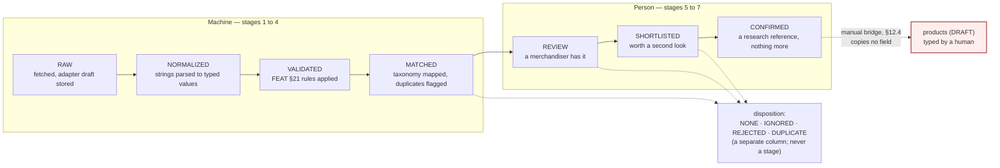
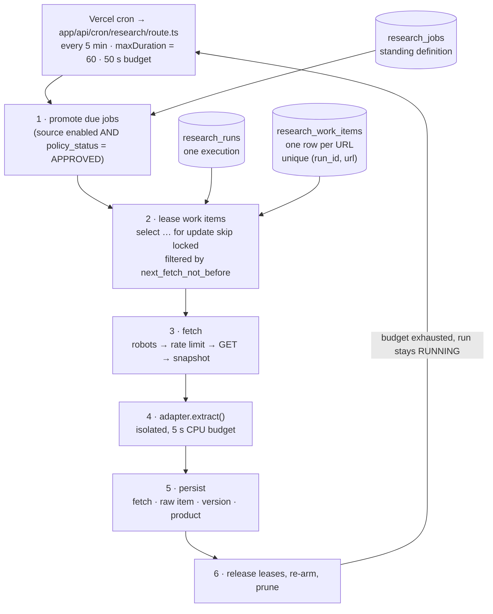

# SCRAPER — the Rivya research subsystem

> Binding parent: `docs/architecture/CANONICAL-DECISIONS.md`. Where this document and the
> canonical decisions differ, the canonical decisions win and this document is wrong.
> Companion documents: `ARCHITECTURE.md` (runtime boundaries), `DATA_MODEL.md` (every column),
> `docs/project/BUSINESS_RULES.md` (the never-auto-import rule), `docs/ops/SECURITY.md`.
> Implemented by Phases 25–30 and extended by Phases 31–36
> (`docs/project/phases/PHASE-23-30.md`, `PHASE-31-38.md`).
> **Owner verification.** Whether any given third-party website may lawfully be read at the
> configured rate is a legal and commercial judgement this repository cannot make. Every source
> ships `policy_status = 'UNREVIEWED'` and every approval control is marked
> `OWNER_VERIFICATION_REQUIRED`. Approval is the owner's assertion, not the engineering team's.

---

## 1. What this subsystem is, and what it is not

**It is** a research instrument. It reads publicly published product pages from third-party
websites that an owner has explicitly approved, stores what it read as evidence, turns strings into
comparable data, notices when something changes, and presents all of it to a merchandiser inside
Studio so that a **person** can form a judgement.

**It is not** an import pipeline. Nothing it produces is a Rivya product, nothing it produces is
publishable, and nothing it produces may ever reach a visitor. There is no threshold, no flag and no
"advanced" mode under which a research row becomes catalogue content. The only bridge between the
two worlds is a person with `catalog.write` typing a slug and a category into an empty product form
(§12.4), and that bridge copies no competitor field of any kind.

Three requirement lines govern everything below and are quoted rather than paraphrased:

- D5 — "Scraped data lives in the `research_` prefix and never joins directly to public product
  tables."
- FEAT §19 — "Do not expose internal scraper data publicly."
- FEAT §25 — "Never automatically import changes into Rivya products."

### Zero seeded sources

No competitor name, domain, region or currency appears anywhere in this repository. The sources list
ships empty with an honest empty state. The two adapter folders the requirement names —
`lib/scraper/adapters/source-a/` and `source-b/` — are **placeholders whose `supports()` returns
false**, and a CI grep fails on any hard-coded external host under `lib/scraper/adapters/**`. A real
source is added by the owner, through Studio, after policy review.

---

## 2. The isolation invariant

Four rules hold for the whole subsystem. A change that breaks any of them is a defect, not a
trade-off. Each is enforced mechanically, in a different place, so that no single mistake can undo
the separation.

| # | Invariant | Enforced by |
|---|---|---|
| **I1** | No `research_*` table has a foreign key to, or is referenced by, any public content table (`products`, `categories`, `collections`, `materials`, `media_assets`, `portfolio_projects`, `journal_articles`, `pages`, `page_sections`, `product_relations`, `content_relations`) — except the two allowlisted taxonomy references in §13.2 | Migration review plus `scripts/research/check-research-isolation.mjs` reading `information_schema.referential_constraints` |
| **I2** | No `research_*` table has an `anon` policy of any kind. Staff `select` requires `research.read` | The Phase 04 policy pattern (research tables never receive the public-select policy) plus `scripts/auth/check-rls.ts` |
| **I3** | No identifier matching `/research_\|researchProduct\|scraper/i` appears anywhere under `app/(site)/**`, `lib/cms/**`, `lib/catalog/**`, `lib/seo/**`, `components/sections/**` or `content/**` | `check-research-isolation.mjs`, wired into `npm run check` |
| **I4** | A row in `research_*` can only ever become a Rivya product by a person typing one. No server action, script, SQL function or trigger writes to `products` from a `research_*` read | `scripts/research/check-no-autoimport.mjs` plus `tests/unit/research-isolation.test.ts` and `tests/unit/confirmation-no-import.test.ts` |

A reviewer verifying the boundary runs exactly four things, all of which are wired into
`npm run check` and none of which is optional:

```
node scripts/research/check-research-isolation.mjs
node scripts/research/check-no-autoimport.mjs
node scripts/search/check-search-scope.mjs
npm run test:unit -- research-isolation search-scope research-no-autoimport
```

**Competitor imagery and text are never re-hosted, and never proxied.** Extracted image URLs are
stored as text. Nothing from a research row is uploaded to Cloudinary, written to `media_assets`,
cached, thumbnailed, transformed, or served from — or fetched by — a Rivya origin. Where the
source's `image_extraction_mode` permits an image to be shown at all, Studio renders it as a plain
external `` whose `src` is the stored URL, sized in CSS, with
`referrerpolicy="no-referrer"` and `loading="lazy"`: the staff member's own browser fetches the
bytes from the source, Rivya's servers see none of them, and no Rivya route exists that would.
The full statement is §13.3; §8.2 forbids the alternatives.

---

## 3. The seven-stage pipeline

FEAT §23 fixes the vocabulary. It is reproduced exactly, with one structural decision: **rejection is
not a stage.** A rejected row keeps the stage it reached, and its judgement is carried by a separate
`disposition` column — so the pipeline vocabulary stays literally the requirement's, and "how far did
this row get" and "what did we decide about it" remain two different questions.



### Stage semantics

| Stage | Reached when | Set by | A row can stop here because |
|---|---|---|---|
| `RAW` | An adapter produced a `RawProductDraft` from a fetched page | `lib/scraper/workflows/extract.ts` | — |
| `NORMALIZED` | Every extracted string has a typed value or an explicit non-value | `workflows/promote.ts` | — |
| `VALIDATED` | The eleven §10.3 rules ran; no `ERROR` blocks promotion | `workflows/promote.ts` | An `ERROR` issue is attached, or its category is unmapped |
| `MATCHED` | Mapped to a Rivya category through the source's map; duplicates flagged | `workflows/match.ts` | — |
| `REVIEW` | A merchandiser acknowledged it | `workflows/review-actions.ts` | It is waiting for a person |
| `SHORTLISTED` | A merchandiser marked it worth a second look | `workflows/review-actions.ts` | — |
| `CONFIRMED` | A merchandiser confirmed it **as a research reference** | `workflows/review-actions.ts` | This is the last stage. It is not a catalogue state |

`research_disposition` is `NONE · IGNORED · REJECTED · DUPLICATE`. Rejecting a row at `SHORTLISTED`
leaves its stage at `SHORTLISTED` and sets `disposition = 'REJECTED'` with a required reason.

### Two rules about the stage column

1. **One writer.** `lib/scraper/core/stage.ts` is the only code that writes
   `research_products.stage`. Every transition appends a `research_pipeline_events` row carrying
   from-stage, to-stage, actor, `actor_kind` (`STAFF` or `SYSTEM`) and reason. A direct
   `update … set stage = …` is rejected by a database trigger.
2. **Change detection never moves a stage.** A row at `SHORTLISTED` whose price moves stays at
   `SHORTLISTED`; the change is attached and appears in the review queue. Only a person moves a row
   between `REVIEW`, `SHORTLISTED` and `CONFIRMED`.

### `CONFIRMED` means one thing

It means *"confirmed as a research reference."* It creates no product, no draft product, no media
row, no CMS content and no obligation. The Studio confirm dialog says so in seeded copy, and
`tests/unit/research-no-autoimport.test.ts` runs a full pipeline pass over a `CONFIRMED` row and
asserts `select count(*) from products` is unchanged and that no `audit_logs` row with
`entity_type = 'product'` was written. The name is kept because FEAT §23 fixes it; the misreading
risk is raised in *Open questions*.

---

## 4. Runtime shape — job, run, work item

Vercel functions are short-lived, so a crawl cannot be a long-running process. It is a queue drained
in bounded slices, and the unit of progress is a **work item**, not a run.



| Record | Is | Lifetime |
|---|---|---|
| `research_jobs` | The standing definition: source, type (`DISCOVERY · DETAIL · REFRESH`), scope, schedule | Until deleted |
| `research_runs` | One execution: `QUEUED · RUNNING · SUCCEEDED · PARTIAL · FAILED · CANCELLED` | Minutes to hours, across many cron ticks |
| `research_work_items` | One URL: `PENDING · LEASED · DONE · FAILED · SKIPPED`, with `attempts`, `not_before_at`, `lease_until` | One run |

Consequences that make this shape worth its complexity:

- A function timeout loses nothing. Leases expire and are re-claimed; the run resumes on the next
  tick and is marked `PARTIAL` rather than `FAILED` if some items never succeeded.
- Two overlapping cron invocations cannot double-fetch: `for update skip locked` plus
  `unique (run_id, url)`, and `workflows/schedule.ts` refuses to create a second run for a job whose
  previous run is still `RUNNING`.
- Cancellation is immediate in effect: the drain loop checks `status` between items.
- A dry run walks the whole path and writes work items and fetch decisions but performs no request
  that would not otherwise have been permitted, and stores no snapshot.

---

## 5. The adapter contract

### 5.1 Why adapters rather than one parser

FEAT §26 requires that a new source be addable without rewriting the engine, and FEAT §27 requires
that a broken source adapter must not break other sources. Both are satisfied by the same shape:
**every behavioural difference between sources is a database column, a child row, or an adapter — and
never a branch inside `lib/scraper/core/**`.** The `AdapterPicker` in Studio reads the registry;
`research_sources.adapter_key` selects one; adding a source is a Studio task.

### 5.2 The contract, deliberately small

```ts
// lib/scraper/adapters/types.ts

export type AdapterCapability = 'DISCOVER' | 'EXTRACT' | 'PAGINATE';

export interface SourceAdapter {
  readonly key: string;                        // 'generic' | a vendor key
  readonly version: string;                    // semver; stamped on every row it produces
  readonly capabilities: AdapterCapability[];

  supports(source: ResearchSource): boolean;   // pure; no I/O
  discover(ctx: AdapterContext, page: FetchedPage): Promise<DiscoveredUrl[]>;
  extract(ctx: AdapterContext, page: FetchedPage): Promise<RawProductDraft>;
}

export interface AdapterContext {
  readonly source: ResearchSourceConfig;       // the row, read-only
  readonly patterns: UrlPatternMatcher;        // match(url) → { kind, pattern, priority } | null
  readonly log: AdapterLogger;                 // level + message + safe context, redacted
  // Deliberately absent: any database handle, any fetch, any file-system access,
  // any Cloudinary client, any environment access, any clock beyond Date.now().
}

export interface FetchedPage {
  readonly url: string;
  readonly finalUrl: string;
  readonly status: number;
  readonly contentType: string | null;
  readonly html: string;                       // already size-capped by the core fetcher
  readonly fetchedAt: string;                  // ISO-8601
  readonly contentHash: string;                // sha256 of the body
}

export interface DiscoveredUrl {
  readonly url: string;
  readonly kind: 'PRODUCT' | 'CATEGORY' | 'PAGINATION';
  readonly depth: number;
}
```

`AdapterContext` grants no side effects, and that is the point: an adapter is a **pure function from
bytes to a draft**. It is therefore safe to accept from anyone, cheap to test against a fixture, and
impossible to misuse. `tests/unit/adapter-contract.test.ts` fails any adapter that imports
`lib/supabase/**`, `node:fs`, `undici`, `axios`, `node-fetch` or any browser-automation package.

### 5.3 `RawProductDraft` is raw on purpose

```ts
// lib/scraper/adapters/draft-schema.ts  (Zod; every field optional, every value a string)

export interface RawProductDraft {
  title?: string;
  priceText?: string;
  currencyText?: string;
  skuText?: string;
  availabilityText?: string;
  leadTimeText?: string;
  descriptionHtml?: string;
  dimensionTexts?: string[];
  materialTexts?: string[];
  variantTexts?: string[];
  customizationTexts?: string[];
  imageUrls?: string[];          // strings. Nothing is downloaded, ever. §13.3
  categoryLabels?: string[];
  externalId?: string;
  canonicalUrl?: string;
  confidence: Record<keyof RawProductDraft, 0 | 1>;   // was it found, or defaulted?
  provenance: Record<string, ExtractionStrategy>;      // which rule produced each field
}
```

**An adapter never parses a number, converts a unit, resolves a currency or maps a category.**
Normalization does all four (§10), and keeping them out of adapters is what makes a vendor adapter
reviewable in ten minutes. A numeric field in a draft fails the Zod schema.

### 5.4 The `generic` adapter

Extraction order, first hit wins per field, with the winning strategy recorded in
`raw.provenance` so a wrong value can be traced to a rule rather than guessed at:

| Order | Strategy | Notes |
|---|---|---|
| 1 | JSON-LD `Product` | Including `@graph` and arrays |
| 2 | Microdata `itemtype="…/Product"` | |
| 3 | RDFa | |
| 4 | OpenGraph | `og:title`, `product:price:amount`, `og:image` |
| 5 | Configured selectors | The source's `price_extraction`, `sku_extraction`, `attribute_extraction` |
| 6 | `<title>` and `<h1>` | Last resort; low confidence |

Parsing uses a real HTML parser, never a regular expression over markup.

### 5.5 Failure isolation, four layers

| Layer | Behaviour |
|---|---|
| Per item | `extract()` runs inside try/catch with a 5-second CPU budget. A throw, a timeout or a Zod failure marks that work item `FAILED` with the error; the drain loop continues |
| Per source, per run | `research_adapter_runs` records one row per (run, source, adapter). Ten consecutive item failures for one source stop **that source's** items for the rest of the run and set `status = 'ABORTED'` |
| Per source, across runs | Three consecutive `ABORTED` adapter runs open the source's `circuit_open_until` and raise a `WARNING` system log naming the adapter and version |
| Cross-source | Every source's items are leased and executed independently. `tests/unit/adapter-isolation.test.ts` runs two sources with adapter A throwing on every item and asserts source B reaches `SUCCEEDED` with its full count, and the overall run is `PARTIAL`, not `FAILED` |

### 5.6 Versioning and provenance

`adapter_key` and `adapter_version` are written on every `research_raw_items` and
`research_product_versions` row. A change to an adapter's output shape is a minor version bump.
Re-extracting stored snapshots under a new version is an explicit `REFRESH` job or the offline
script (§14) — **never automatic** — so a version change cannot silently rewrite history.

### 5.7 How to write an adapter

1. Create `lib/scraper/adapters/<key>/index.ts` exporting a `SourceAdapter`.
2. Implement `supports(source)` as a pure predicate over the source row (usually a host check).
3. Implement `extract()` returning strings only. Set `confidence[field] = 1` only for a field you
   actually found; record the strategy in `provenance`.
4. Add at least three golden fixtures under `tests/fixtures/scraper/<key>/`, one of which is a
   malformed page. `extract()` must not throw on it — it returns a low-confidence draft.
5. Register the adapter in `lib/scraper/adapters/registry.ts`.
6. Run `npm run test:unit -- adapter-contract` and
   `node scripts/research/reextract.ts --source=<slug> --dry-run` to validate against stored
   snapshots with zero network traffic.
7. Update this document, per the documentation update contract.

No step involves editing `lib/scraper/core/**`. If a source appears to require that, the requirement
belongs in a column, not a branch.

---

## 6. Source configuration

The twenty-three FEAT §26 fields, each with a home. This table is the specification: the migration
and the Studio form are both read from it.

| # | FEAT §26 field | Storage | Type / validation |
|---|---|---|---|
| 1 | Name | `research_sources.name` | text, required, unique with `slug` |
| 2 | Website | `research_sources.base_url` | absolute `https://` URL; host must match every URL pattern's host |
| 3 | Region | `research_sources.region` | ISO-3166-1 alpha-2, or `GLOBAL` |
| 4 | Currency | `research_sources.currency` | ISO-4217 alpha-3; the source's *stated* currency, never converted |
| 5 | Source Type | `research_sources.source_type` | `BRAND · RETAILER · MARKETPLACE · GALLERY · ARTISAN · DIRECTORY` |
| 6 | Analytics League | `research_sources.analytics_league` | `PEER · ASPIRATIONAL · ADJACENT · MASS`; grouping only, never a public label |
| 7 | Enabled | `research_sources.is_enabled` | bool; blocked unless `policy_status = 'APPROVED'` (database check constraint) |
| 8 | Collection Mode | `research_sources.collection_mode` | `SITEMAP · CATEGORY_CRAWL · SEED_URLS · FEED`; selects the discovery strategy |
| 9 | Category Mapping | `research_source_category_map` | Child rows: source label/path → Rivya `categories.id` or explicit `IGNORE` |
| 10 | URL Patterns | `research_source_url_patterns` | Child rows: `kind` (`PRODUCT · CATEGORY · EXCLUDE · PAGINATION`), `pattern`, `is_regex`, `priority` |
| 11 | Extraction Adapter | `research_sources.adapter_key` | Must resolve in the registry; validated on save |
| 12 | Image Extraction | `research_sources.image_extraction_mode` | `NONE · URL_ONLY · URL_AND_DIMENSIONS`. **No mode downloads or re-hosts an image** |
| 13 | Price Extraction | `research_sources.price_extraction` | jsonb: selector or JSON-LD path, currency override, decimal and thousands separators |
| 14 | SKU Extraction | `research_sources.sku_extraction` | jsonb: selector/path plus an optional strip pattern |
| 15 | Attribute Extraction | `research_sources.attribute_extraction` | jsonb: ordered `{ key, selector, kind }` for dimensions, materials, availability, lead time, variants, customization |
| 16 | Rate Limit | `research_sources.rate_limit_rpm` | int 1–60; higher values rejected outright |
| 17 | Request Delay | `research_sources.request_delay_ms` | int ≥ 1000; raised silently to the robots `Crawl-delay` floor |
| 18 | Concurrency | `research_sources.concurrency` | int 1–4 |
| 19 | Scheduling | `research_source_schedules` | Child rows: `job_type`, `cron_expression`, `timezone`, `is_enabled`; minimum interval 6 hours |
| 20 | Last Run | `research_source_health_v.last_run_at` | View column, derived from `research_runs` |
| 21 | Health | `research_source_health_v.health` | View column: `HEALTHY · DEGRADED · FAILING · STALE · DISABLED` |
| 22 | Policy Review | `policy_status`, `policy_reviewed_by`, `policy_reviewed_at`, `policy_notes` | §8.3 |
| 23 | Notes | `research_sources.notes` | Free text, staff-only, never rendered outside Studio |

**Health is derived, never stored.** `research_source_health_v` computes, per source: `DISABLED`
when `is_enabled = false`; `FAILING` when the last two runs failed or the circuit is open;
`DEGRADED` when the last run is `PARTIAL` or the seven-day success rate is below 80 %; `STALE` when
the newest successful run is older than twice the configured schedule interval; otherwise `HEALTHY`.
A view cannot go stale the way a cached column can, and the rule is legible in SQL rather than
buried in a worker.

**The URL-pattern tester makes no network request.** `testPatterns`, in
`app/(studio)/studio/research/sources/[id]/actions.ts`, takes pasted candidate URLs and returns, per
URL, the matched pattern, its kind and the robots decision — answered entirely from
`research_robots_cache`. A fixture-server assertion proves it logs zero requests.

**The single-URL probe is the second — and last — outbound path.** `probeUrl`, in the same file,
performs one real fetch of one URL. It is the only request-scoped code in the repository permitted to
contact a third-party host, and it is not a general fetcher: it calls the same
`lib/scraper/core/fetch.ts` entry point as the cron drain and therefore applies the identical gate —
`policy_status = 'APPROVED'` and `is_enabled`, the robots decision (a `Disallow` match refuses before
any request is made), `rate_limit_rpm` / `request_delay_ms` / `concurrency`, the `Crawl-delay` floor,
`circuit_open_until`, the `research.enabled` flag, `SCRAPER_USER_AGENT`, the 2 MB body cap and the
15-second timeout. It requires `research.write`, writes one `audit_logs` row naming actor, source and
URL, and stores no snapshot. `ARCHITECTURE.md` §1 fixes it as one of exactly two outbound paths.

**A category mapping never guesses.** An unmapped source category is `null`, counted on the
dashboard, and leaves the row at `VALIDATED`. It is never defaulted to `furniture` or to the first
category.

---

## 7. Scheduling and rate limiting

| Control | Implementation |
|---|---|
| Trigger | Vercel cron → `app/api/cron/research/route.ts` every five minutes, `maxDuration = 60`, 50-second wall-clock work budget. There is no long-running process |
| Authorisation | **Vercel's `x-vercel-cron` header alone.** The route returns `404` — not `401` — to any request without it, so an unauthenticated prober cannot confirm the route exists. It does **not** reuse `REVALIDATE_SECRET`, deliberately and unlike the other six cron routes (`content-schedule`, `research-analytics`, `research-score`, `sheets-sync`, `analytics-snapshot`, `log-retention`), because that secret guards cache invalidation and this is the one route that contacts third-party hosts. The cost is that the route cannot be exercised outside Vercel; §16 item 4 and `ARCHITECTURE.md` *Open questions* item 3 raise the same `CRON_SECRET` amendment and must be resolved together |
| Per-source schedule | `research_source_schedules` cron expressions, minimum interval **6 hours**, enforced by a check constraint |
| Overlap | `schedule.ts` refuses a second run for a job whose previous run is still `RUNNING` |
| Rate limit | `rate_limit_rpm` (1–60), `request_delay_ms` (≥ 1000), `concurrency` (1–4) — all enforced **in the lease query** through `next_fetch_not_before` and `in_flight_count`, never by hopeful `sleep()` calls in application code |
| `Crawl-delay` | Read from robots.txt and applied as a **floor** on `request_delay_ms`. A source configured faster than robots asks is slowed; never the reverse |
| Backoff | `429` and `503` honour `Retry-After`; otherwise exponential 2⁰…2⁵ minutes with jitter, written to the work item's `not_before_at` |
| Circuit breaker | Five consecutive fetch failures, or three consecutive `ABORTED` adapter runs, set `circuit_open_until` and raise a `WARNING` system log. No further fetch is attempted for that source until it clears |
| Kill switch | Feature flag `research.enabled` (off by default in every environment) **plus** per-source `is_enabled`. Both are checked immediately before every fetch, not once per run |
| Retention | Snapshots pruned at 180 days by the same cron; the prune logs its own summary |

Turning `research.enabled` off stops every source at once, mid-run, at the next item.

---

## 8. Politeness and legal posture

This section is the part of the subsystem that is hardest to retrofit and easiest to erode. It is
written as prohibitions because that is how it must be reviewed.

### 8.1 The controls

| Control | Rule |
|---|---|
| Identification | `SCRAPER_USER_AGENT` (D8) is the only user agent used, and it names Rivya plus a contact URL. **No browser impersonation. No rotating agents** |
| robots.txt | Fetched per host, cached in `research_robots_cache` with a 24-hour TTL, parsed for the Rivya agent then `*`. A `Disallow` match means the URL is **never fetched**; the attempt is recorded with `robots_decision = 'DISALLOWED'` and performs no request |
| Scope | Public product pages only |
| Technique | Plain HTTP `GET`, bounded body (2 MB), 15-second timeout, capped redirects |
| Volume | §7. Delay, rate and concurrency are enforced at lease time |

### 8.2 The prohibitions

Never, under any flag, for any source, for any reason:

- authenticated, paywalled or personalised pages;
- pages behind a CAPTCHA, and no CAPTCHA solving of any kind;
- checkout, cart, account or search-suggestion endpoints;
- personal data of any kind, including reviews, reviewer names, seller names and contact details;
- any page whose robots rules disallow it;
- a headless browser, JavaScript execution, or DOM emulation beyond an HTML parser;
- proxy rotation, IP cycling, or cookie-jar session forgery;
- re-hosting, caching, proxying, thumbnailing or transforming a competitor image, and any Rivya
  route that fetches or re-serves one (§13.3);
- republishing any competitor text, price or image on any Rivya surface.

If a source requires any prohibited technique to be read, the answer is that Rivya does not read it.
`check-research-isolation.mjs` fails the build on an import of any browser-automation package inside
`lib/scraper/**`.

### 8.3 The policy gate — **OWNER_VERIFICATION_REQUIRED**

`research_sources.policy_status` is `UNREVIEWED · APPROVED · RESTRICTED · BLOCKED` and starts at
`UNREVIEWED`. A source cannot be enabled, and no run can be created for it, until an owner or admin
sets `APPROVED`.

```sql
alter table research_sources add constraint research_source_enable_requires_approval
  check (is_enabled = false or policy_status = 'APPROVED');
```

- A researcher prepares a source and marks it *Ready for review* (`readiness`).
- An owner or admin opens the review panel — which renders the site's cached robots.txt, the URL
  patterns, the extraction configuration and a **mandatory** notes field — and sets `APPROVED`,
  `RESTRICTED` (approved but limited to named patterns) or `BLOCKED`.
- Approval requires `research.write` **and** `system.settings.write`, records
  `policy_reviewed_by` / `policy_reviewed_at` / `policy_notes`, and writes an `audit_logs` row.
- The panel carries a standing banner stating that this repository cannot determine what a third
  party's terms permit, and that approval is the owner's assertion.

`RESTRICTED` narrows a source to specific URL patterns; the engine treats every non-matching URL as
excluded, exactly as if an `EXCLUDE` pattern matched it.

---

## 9. Storage model

Every table carries the `research_` prefix. Every table has RLS with `select` requiring
`research.read` and writes requiring `research.write` (or `research.confirm` for dispositions), and
**no `anon` policy of any kind** (I2). Append-only tables additionally `revoke update, delete`.

### 9.1 Table inventory

| Table | Purpose | Phase |
|---|---|---|
| `research_sources` | One row per approved third-party site; the twenty-three §6 fields | 25 · 26 |
| `research_source_url_patterns` | `PRODUCT · CATEGORY · EXCLUDE · PAGINATION` patterns, priority-ordered; `EXCLUDE` always wins | 26 |
| `research_source_category_map` | Source category label → Rivya `categories.id` or `IGNORE`. **Allowlisted FK, §13.2** | 26 |
| `research_source_schedules` | Per-source cron schedules, ≥ 6-hour interval | 26 |
| `research_source_health_v` | View: last run, status, 7-day success rate, queue depth, health | 26 |
| `research_jobs` | Standing job definitions (`DISCOVERY · DETAIL · REFRESH`) and their scope | 25 |
| `research_runs` | One execution, with status, trigger, actor, stats and dry-run flag | 25 |
| `research_work_items` | The URL queue; leased with `for update skip locked`; `unique (run_id, url)` | 25 |
| `research_fetches` | One row per fetch attempt: robots decision, status, hash, bytes, duration, `storage_key` | 25 |
| `research_robots_cache` | Per-host robots.txt with a 24-hour TTL and the parsed `crawl_delay_s` | 25 |
| `research_raw_items` | Exactly what came back, uninterpreted, plus `adapter_key` / `adapter_version` | 25 · 27 |
| `research_products` | One row per discovered product per source; `unique (source_id, source_url)`; carries stage, disposition, normalised values and classification | 25 · 28 · 30 |
| `research_product_versions` | Append-only content-hashed versions; `raw` + `normalized` payloads; the substrate change detection diffs | 27 · 28 |
| `research_adapter_runs` | One row per (run, source, adapter): items seen/extracted/failed, first errors, status. The unit of blast-radius accounting | 27 |
| `research_pipeline_events` | Append-only stage transitions with actor, `actor_kind` and reason | 25 |
| `research_validation_issues` | One row per failed rule, with severity, field and detail; dismissible with a reason | 28 |
| `research_match_candidates` | Sub-threshold duplicate candidates awaiting a human decision | 28 |
| `research_material_lexicon` | Material keyword → token mapping. **Data, not code**; Studio-editable | 28 |
| `research_changes` | One row per changed field per version pair, with both snapshot keys | 29 |
| `research_change_rules` | Per-source (or global) materiality thresholds; Studio-editable | 29 |
| `research_review_actions` | Append-only record of the nine FEAT §25 actions; reversal is a new row | 29 |
| `research_notes` | Never deleted, only superseded | 29 |
| `research_tags` · `research_product_tags` | Controlled vocabulary; free text rejected | 29 |
| `research_change_digests` | One idempotent row per day | 29 |
| `research_large_format_rules` | Ordered, editable scale rules; first match wins | 30 |
| `research_saved_views` | Named, shareable filter sets per surface | 30 |
| `research_analytics_snapshots` | Dated metric snapshots with `n` and denominator | 31 |
| `research_opportunity_scores` · `research_opportunity_components` · `research_scoring_models` | Reproducible scores and the model that produced them | 32 |
| `research_image_hashes` · `research_similarity_runs` · `research_similarity_pairs` · `research_similarity_suppressions` | Perceptual hashes and pair bands (§13.3, and *Open questions* item 3) | 33 |
| `research_direction_briefs` and its revision/evidence tables | Human-written design direction with evidence attached | 34 |
| `research_shortlist_entries` · `research_confirmations` | The two decision records and their history | 35 |
| `research_search_documents` | Studio-only search index; never reachable by `anon` | 23 |

### 9.2 Snapshots — the evidence store

Every fetch stores the response body, gzipped, to a **private object store** (a private Supabase
Storage bucket, not Cloudinary), keyed:

```
research/<source_slug>/<yyyy>/<mm>/<dd>/<sha256>.html.gz
```

`research_fetches` records `content_hash`, byte size and `storage_key`. Snapshots are why a change
record can always be reproduced from evidence, and why an adapter fix can be validated against real
historical pages without touching the network. They are never written to Cloudinary, never routed
through `MediaProvider`, never served from a public route, and are pruned at 180 days.

### 9.3 Versions, not overwrites

`research_product_versions` stores one row per (product, run) **whose content hash differs from the
previous version**, holding the `RawProductDraft` as `raw jsonb`, the normalised payload as
`normalized jsonb`, the snapshot `storage_key`, `content_hash`, `adapter_key`, `adapter_version`,
`normalizer_version` and `observed_at`. `research_products.current_version_id` points at the newest.
An unchanged page produces no new version, only an updated `last_seen_at`.

Diffing a mutable current row against itself is not change detection; this table is what makes §11
reproducible.

---

## 10. Normalization and validation

### 10.1 Normalization is a pure module

`lib/scraper/normalization/` takes a `RawProductDraft` plus its source configuration and returns a
`NormalizedProduct` with a per-field `parse_state`:

| `parse_state` | Meaning |
|---|---|
| `PARSED` | A confident, typed value |
| `AMBIGUOUS` | A value was present but could mean more than one thing. **Never resolved by guessing** |
| `UNPARSED` | A value was present and could not be interpreted. The original string is retained |
| `ABSENT` | The source did not publish it |

The module performs no I/O and no database access, so every rule is unit-testable against a fixture
table.

### 10.2 The rules that matter

**Currency.** The source's declared ISO-4217 currency is the default. A symbol or code in
`priceText` overrides it only when unambiguous (`€`, `£`, `USD`); **`$` alone is `AMBIGUOUS`** and is
recorded as such rather than assuming a country. Amounts parse to integer **minor units** using the
source's configured separators, so `1.234,56` and `1,234.56` both become `123456`.

**No foreign-exchange conversion is ever performed, anywhere in `lib/scraper/**`.** Comparing prices
across currencies needs a dated rate Rivya does not hold; Phase 31 compares within a currency and
says so. `grep -rn "exchangeRate\|convertCurrency\|fx_rate" lib/scraper` returns nothing, and a unit
test keeps it that way.

**Price state** mirrors the first-party vocabulary: `FIXED · STARTING_FROM · REQUEST_QUOTE ·
PRICE_ON_REQUEST · UNKNOWN`. Text such as "price on request", "enquire" or "POA" maps to a quote
state. **A quote-only row is never stored as `0`** — the same FEAT §21 rule that governs Rivya's own
products, enforced here by the database:

```sql
alter table research_products add constraint research_price_state_coherent check (
  (price_state = 'FIXED'          and price_min_minor is not null and price_min_minor > 0
                                  and currency is not null)
  or (price_state = 'STARTING_FROM' and price_min_minor is not null and price_min_minor > 0
                                  and currency is not null)
  or (price_state in ('REQUEST_QUOTE','PRICE_ON_REQUEST','UNKNOWN')
      and price_min_minor is null and price_max_minor is null)
);
```

**Dimensions** canonicalise to millimetres (mass to grams), keeping the original string:

| Input shape | Example | Result |
|---|---|---|
| Triple with unit | `120 x 60 x 45 cm` | `{ length_mm: 1200, width_mm: 600, height_mm: 450 }` |
| Labelled | `W 120cm · D 60cm · H 45cm` | Labels win over position |
| Imperial | `47" x 24" x 18"` | 25.4 mm/in, rounded to the nearest mm |
| Feet + inches | `4' 6"` | `1372` |
| Diameter | `Ø 90 cm`, `dia. 90cm` | `{ diameter_mm: 900 }` |
| Range | `120–140 cm` | `{ length_mm: 1200, length_mm_max: 1400 }`, `PARSED` |
| Unitless | `120 x 60` | `AMBIGUOUS` — **no unit is inferred from magnitude** |
| Prose | `seats six comfortably` | `UNPARSED`; the original string is retained |

Positional order is never assumed when labels are absent and the source declares no order.

**Materials, availability, lead time, variants, customization** each normalise to a controlled token
set plus the retained original text. Materials run against `research_material_lexicon` — a table with
a Studio editor, not a hard-coded list — producing tokens such as `oak`, `walnut`, `epoxy_resin`,
`brass`. Availability maps to `IN_STOCK · MADE_TO_ORDER · PREORDER · SOLD_OUT · UNKNOWN`. Lead time
becomes a day range only when a number and a unit are both present.

### 10.3 Validation — FEAT §21 applied to scraped rows

Every check writes a `research_validation_issues` row with `rule`, `severity`, `field` and `detail`.
The predicates are shared with `lib/catalog/validation.ts` so first-party and research validation
cannot drift apart.

| Rule | Severity | Effect |
|---|---|---|
| `missing_title` | ERROR | Blocks promotion past `VALIDATED` |
| `malformed_source_url` / `non_https_url` | ERROR | Blocks; the row is quarantined |
| `price_quote_with_amount` | ERROR | Blocks — the mirror of the Rivya constraint |
| `price_zero_or_negative` | ERROR | Blocks |
| `impossible_dimension` (any axis < 10 mm or > 10 000 mm) | ERROR | Blocks |
| `dimension_ambiguous` | WARNING | Promotes, flagged; excluded from scale bands |
| `currency_ambiguous` | WARNING | Promotes, flagged; excluded from price comparisons |
| `duplicate_source_url_within_source` | ERROR | Blocks; the older row wins |
| `missing_category_mapping` | WARNING | Promotes to `VALIDATED`, but never to `MATCHED` |
| `image_url_unreachable_shape` | INFO | Informational only; **no request is made to check** |
| `low_confidence_extraction` (fewer than 3 fields at confidence 1) | WARNING | Promotes, flagged for review |

A blocked row **keeps its stage and its issues**. It is never silently dropped, never deleted, and
never quietly promoted on a later run unless the issue clears. Blocked rows appear in the explorer's
Issues view and are counted on the dashboard, so the gap is visible.

### 10.4 Matching produces candidates, not verdicts

- **Duplicates within a source** — exact `source_external_id`, then exact normalised title + price,
  then trigram similarity above 0.85 on the normalised title combined with a dimension match within
  5 %. `disposition = 'DUPLICATE'` is set automatically **only at confidence ≥ 0.95 requiring title
  *and* dimension agreement**; anything lower becomes a `research_match_candidates` row for a human.
  A duplicate flag is always reversible and its reversal is audited.
- **Taxonomy** — `research_source_category_map` first (deterministic, human-authored), then a keyword
  rule against the label. `match_method` is `MAP · KEYWORD · MANUAL`. **No mapping means no match**:
  the row stops at `VALIDATED`.
- **Cross-source duplicate detection is deliberately out of scope.** Two sources listing similar
  objects is a comparison question, not a deduplication one.

### 10.5 Overrides are permanent

A researcher may set a category, clear or set a duplicate flag, edit any normalised value, or dismiss
an issue with a reason. Each writes `override_by`, `override_at` and a `research_pipeline_events`
row, and the overridden keys are frozen in `normalized_overrides jsonb`. **An overridden field is
never recomputed by a later run or by the offline re-normalizer.**

---

## 11. Change detection

FEAT §24 asks for material changes on previously discovered products. Diffing is **version-to-version
and field-by-field**: `lib/scraper/workflows/detect-changes.ts` compares a new version's `normalized`
payload with the previous version's and emits one `research_changes` row per changed field, carrying
`before`, `after`, both version ids, the run id, **both snapshot storage keys** and `detected_at`.
Nothing is diffed against a mutable current row, so a change record can always be reproduced from
evidence.

### Materiality is a stated rule, not a feeling

Three levels — `MATERIAL · MINOR · NOISE`. `NOISE` is recorded but hidden by default and never
counted in the dashboard's "changed" figure. Thresholds live in `research_change_rules`, per source
with a global default row, and are editable in Studio — so a source with noisy prices is tuned
without a deploy.

| Field | MATERIAL when | MINOR when | NOISE |
|---|---|---|---|
| `price` | ≥ 5 % change in minor units, or any change of price **state** | < 5 % change | Formatting-only change with equal minor units |
| `title` | Trigram similarity < 0.90 | 0.90–0.99 | Whitespace or case only |
| `availability` | Any transition between the five tokens | — | Text change with the same token |
| `dimensions_mm` | Any axis changes by ≥ 2 %, or an axis appears or disappears | < 2 % | Parse-state change with equal values |
| `variant_count` | Any change | — | — |
| `material_tokens` | Any token added or removed | — | Reordering |
| `image_urls` | Set membership changes | — | Query-string or CDN-host-only change |
| `lead_time_days_*` | Any change in the parsed range | — | Text change with the same range |
| `description` | Trigram similarity < 0.80 | 0.80–0.95 | > 0.95 |
| `customization` | Any change in the parsed token set | — | Text-only change |
| `sku` | Any change | — | — |

### The daily digest

`research_change_digests` holds one idempotent row per day, surfaced on
`/studio/research/dashboard`: material changes by source and field, new products discovered,
products that disappeared (`last_seen_at` older than two successful runs), and **the oldest undecided
change** — because a queue nobody is working through should be visible, not silent. The digest is a
Studio surface, not an email.

---

## 12. Review workflow

### 12.1 The nine FEAT §25 actions

Each writes a `research_review_actions` row (append-only — a reversal is a new row, never an edit),
an `audit_logs` row, and a `research_pipeline_events` row where a stage moves. All nine require
`research.confirm`.

| Action | Effect | Reversible |
|---|---|---|
| **Review** | Acknowledges the change; stage moves `MATCHED → REVIEW` if it was lower | Yes |
| **Ignore** | `disposition = 'IGNORED'`; the change closes and leaves the queue. Future changes on the same field are still detected but collapse under the ignore reason | Yes |
| **Shortlist** | Stage → `SHORTLISTED`; the row joins the shortlist with the score captured at that moment | Yes |
| **Reject** | `disposition = 'REJECTED'`; stage retained; **reason required** | Yes |
| **Mark Duplicate** | Sets `duplicate_of_id` and `disposition = 'DUPLICATE'`; requires choosing the surviving row | Yes |
| **Confirm** | Stage → `CONFIRMED`. **A research reference, nothing more.** Creates no product, no draft product, no media row, no CMS content | Yes |
| **Add Note** | A `research_notes` row: author, body, timestamp. Never deleted, only superseded | Append-only |
| **Add Tag** | A `research_product_tags` row from the `research_tags` vocabulary; free text is rejected | Yes |
| **Compare** | Opens the row beside up to three others in a read-only drawer. **Records nothing except an activity event** | n/a |

### 12.2 The queue

`/studio/research/changes` lists changes filtered by source, field, materiality, age, disposition and
tag, defaulting to `MATERIAL` and undecided. A row opens a diff drawer: before and after side by
side, both snapshot timestamps, a link to each stored snapshot, and the nine actions. Keyboard
shortcuts (`j`/`k` to move, `s` shortlist, `i` ignore, `r` reject, `n` note) exist because this is a
surface someone works through a hundred rows at a time.

`/studio/research/explorer` is the same machinery over the whole corpus, with a per-row drawer
showing **raw text beside normalised value beside provenance strategy**, and inline override
controls.

### 12.3 Bulk review

Bulk shortlist, reject, mark duplicate, assign tags and confirm run on the **same** `lib/bulk/`
engine as every other bulk operation: preview, typed row-count confirmation for destructive actions,
per-item snapshots, a 200-row cap per invocation, one `audit_logs` row per row changed, and a 24-hour
undo. There is no second bulk implementation. Bulk reject additionally requires `bulk.execute` **and**
`destructive.execute` plus a reason applied to every item.

### 12.4 The gate — the only bridge to the catalogue

One server action, `startProductFromConfirmation`, and it will not run unless **all** of the
following hold:

1. the research row is `CONFIRMED`;
2. the actor holds `catalog.write`;
3. the actor types a slug and picks a category;
4. the actor ticks an explicit acknowledgement whose label is seeded copy stating that no competitor
   data is being imported.

It then inserts a `products` row with exactly: `slug`, `category_id`, `status = 'DRAFT'`,
`price_state = 'PRICE_ON_REQUEST'`, and `title` set to the slug's title case — a placeholder the
owner must replace. **It writes nothing else.** No competitor title, description, price, currency,
dimension, material, availability, lead time or image crosses that line, in any code path, ever.
There is no "import fields" option to disable. The created product is `DRAFT` and must pass the
publication-readiness checklist and a human publish action like any other product.

`tests/unit/confirmation-no-import.test.ts` is the phase's load-bearing test: it builds a research
row whose every text field is a unique sentinel string, runs the bridge, and asserts no sentinel
appears in any column of the created `products` row, or in `product_media`, `product_materials` or
`product_collections`.

`research_confirmations.created_product_id` records which product a confirmation started. It is a
**nullable uuid with no foreign key**, read only by Studio research screens and never joined into a
public read path — the isolation rule is honoured by keeping the reference on the research side and
forbidding the join, rather than by pretending the link does not exist.

---

## 13. Absolute separation from first-party product data

### 13.1 The four guarantees against auto-import

1. **No write path exists.** No server action, script, SQL function or trigger writes to `products`,
   `product_media`, `product_specs`, `product_materials`, `product_collections` or `media_assets`
   from a `research_*` read. `check-no-autoimport.mjs` proves it and fails on an added import.
2. **The rule is written where a person will read it.** `docs/project/BUSINESS_RULES.md` states in
   one quotable sentence that a Rivya product is created only by an owner typing one or by the
   approved-import path, and that neither reads a research table.
3. **The interface says what it does.** The Studio confirm dialog states, from seeded copy, exactly
   what confirming does and does not do.
4. **A test asserts the outcome, not the intention.** A full pipeline pass with changes on a
   `CONFIRMED` row leaves `select count(*) from products` unchanged and writes no `audit_logs` row
   with `entity_type = 'product'`.

### 13.2 The two allowlisted foreign keys

D5 says scraped data never joins directly to public product tables. Two references to **taxonomy**
exist, both written or configured by staff rather than scraped, and both allowlisted **by name** in
`check-research-isolation.mjs`, which fails on any third:

| Column | References | Why it is permitted |
|---|---|---|
| `research_source_category_map.category_id` | `categories (on delete set null)` | A category mapping is configuration typed by a member of staff. It points at taxonomy, not at `products` |
| `research_products.matched_category_id` | `categories (on delete set null)` | The result of applying that human-authored map |

Neither is a join into product data, and neither is readable by `anon`. The narrowness is deliberate
and is raised for confirmation in *Open questions*.

### 13.3 Images

`imageUrls` are **strings**. No mode of `image_extraction_mode` downloads an image; the most
permissive value, `URL_AND_DIMENSIONS`, stores a URL and two integers taken from the page's own
markup. Nothing from a source is downloaded, uploaded to Cloudinary, written to `media_assets`,
cached, proxied, thumbnailed, transformed or served from a Rivya origin. Constraining the rendered
size in CSS is not thumbnailing: no derived image is produced, stored or served by anything Rivya
runs. Studio shows a source image, where `image_extraction_mode` permits it at all, as a plain external
`" referrerpolicy="no-referrer" loading="lazy">` sized in CSS to at most
240 px on its longest side. **There is no image proxy route, and adding one is a defect** — the
bytes travel from the source directly to the staff member's browser, Rivya's servers never hold
them, and `ARCHITECTURE.md` §1 lists the only two server-side paths that may contact a third-party
host at all (neither is an image path). Consequences, accepted deliberately: an image that the
source removes or hotlink-blocks renders as a broken thumbnail, and the source's server sees the
request without a referrer. Both are preferable to holding someone else's photograph.
An image *change* is detected as a change to the URL **set**, never by comparing pixels.

The reverse direction is guarded too: `lib/media/duplicate-guard.ts` runs
`checkMediaAgainstResearch()` on every user upload and **blocks** the upload when it near-duplicates
an image seen in research. It is the subsystem's only automatic consequence, and it only ever
prevents something. Note what it needs: comparing an upload against a research image requires a
stored perceptual hash of that research image, which is exactly the Phase 33 capability *Open
questions* item 3 has not yet settled. Until that is settled the guard has nothing to compare
against, and it must fail **open with a logged `WARNING`** — never silently, and never by inventing
a comparison it cannot make.

Perceptual similarity (Phase 33) needs pixels, which this posture does not supply. That tension is
unresolved and is raised as *Open questions* item 3 rather than settled here.

### 13.4 Nothing is public

No `(site)` route, sitemap entry, feed, JSON-LD block, OpenGraph image or public search result
references a research table (I3). `research_search_documents` is Studio-only and unreadable by
`anon`. Scale bands, analytics leagues, opportunity scores and similarity bands exist only inside
`research_*` columns and `components/studio/research/**`; the isolation guard fails on any of those
tokens appearing under `app/(site)/**` or `content/**`.

**One authorised egress exists and it is not public**: the Google Sheets export of §13.5. It leaves
the system to a spreadsheet the owner controls, never to a visitor, and it is enumerated here so
that "nothing is public" is not read as "nothing ever leaves".

### 13.5 Export to Google Sheets — the one authorised egress

Phase 36 (`PHASE-31-38.md`) owns the integration; this section fixes only what it may carry out of
the research subsystem. D4 fixes the surface at `/studio/research/sheets`, D8 names the credentials
(`GOOGLE_SERVICE_ACCOUNT_JSON`, `GOOGLE_SHEETS_SPREADSHEET_ID`), FEAT §2 item 19 and FEAT §51 require
the capability, and FEAT §32 names the flag.

| Property | Rule |
|---|---|
| Direction | **One-way. Rivya writes, the Sheet reads.** `lib/sheets/` contains no read method, and a CI grep for a Sheets read call inside it fails the build. Nothing typed into a cell can change a stage, a disposition, a product, a price or any content. Changing this needs an amendment, not a ticket |
| Where the code lives | `lib/sheets/` — `client.ts` (service-account JWT, `import 'server-only'` first line, `spreadsheets` scope only, no Drive scope), `definitions.ts` (entity → column allowlist → row builder), `write.ts`, `retry.ts`, `errors.ts`. A pending D2 amendment covers the domain (`ARCHITECTURE.md` §3) |
| Who may run it | A Studio action on `/studio/research/sheets` requiring `integrations.sheets.run` **plus** `research.read`. Creating or editing a definition requires `integrations.sheets.manage`. The scheduled path is `app/api/cron/sheets-sync` (`REVALIDATE_SECRET`), which skips paused definitions |
| Flag | `google_sheets`, default `false` in every environment. With it off the page is read-only and every run action is refused with a stated reason and no network call |
| What is written | Values and a header row into a staging tab, swapped atomically into place. No formulas, charts or formatting |
| Audit | Every run writes a `sheets_sync_runs` row (status, row count, cell count, attempts, duration, sanitised `error_code` — **never** the upstream response body) **and** an `audit_logs` row naming the actor, the definition, the row count and the destination spreadsheet id |
| Where it goes | A spreadsheet an admin has shared with the service-account email. **It is a staff artefact.** Publishing it to the web, or sharing it with "anyone with the link", defeats I3 by hand; `STUDIO_GUIDE.md` says so beside the destination banner, and the destination id is displayed so the owner can check it |

**The column allowlist.** A definition's `columns` may only be chosen from the per-entity allowlist in
`lib/sheets/definitions.ts`; a column not on the list is unrepresentable rather than merely refused,
and `tests/unit/sheets-definitions.test.ts` asserts it. Six of Phase 36's seven entities are
research-side; these four carry the columns most worth pinning here:

| Entity | Columns that may be exported |
|---|---|
| `RESEARCH_PRODUCTS` | source, `title_normalized`, mapped category, `price_state`, `price_min_minor`, `price_max_minor`, currency, `dimensions_mm`, `dimension_parse_state`, `stage`, `disposition`, `first_seen_at`, `last_seen_at`, `source_url` |
| `OPPORTUNITY_SCORES` | research product, score, confidence, state, model version, one column per signal contribution |
| `SHORTLIST` | research product, reason, tags, score at entry, opened, opened by |
| `CONFIRMED` | research product, decision note, confirmed by, confirmed at, product started |

`COMPARISON_SET` (member, source, category, price band, longest axis, coverage) and
`DIRECTION_BRIEFS` (title, status, `target_category_slug`, evidence count, approver, updated) are the
remaining two and follow the same rule. The seventh, `INQUIRIES`, is first-party, sits outside this
subsystem, and additionally requires `inquiries.export`.

**What may never be exported, by any definition, at any permission level.** These are absent from
every allowlist, so no column picker can offer them:

- competitor `description` or `description_html`, in raw or normalised form, and any other
  free-text body captured from a source page;
- `image_urls`, any image URL, any perceptual hash, and any image bytes;
- raw HTML, any snapshot `storage_key`, any `research_fetches` row, or anything else in the evidence
  store (§9.2);
- `research_notes` bodies, `policy_notes`, and `research_sources.notes` — staff commentary about a
  third party is the material most likely to be read out of context;
- any credential, environment value, media asset id or Cloudinary URL;
- anything from `audit_logs`, `system_logs` or `staff_profiles`.

`source_url` **is** exportable — it is the public address of a public page and the only way an owner
can check a row against its source — and it is the single most important reason the sheet must not be
made public: a list of competitor URLs curated by Rivya reads as Rivya's research, because it is.

---

## 14. Offline recomputation — one pattern, three scripts

Every derived layer can be recomputed from stored evidence, with **zero network traffic**, honouring
human overrides, and reporting what moved.

| Script | Re-derives | Honours | Reports |
|---|---|---|---|
| `scripts/research/reextract.ts --source=<slug> --since=<date>` | Adapter drafts, from stored snapshots | Version content hashes — an unchanged result writes no version | Versions it would create (`--dry-run`) |
| `scripts/research/renormalize.ts --source=<slug>` | Normalised values, from stored versions | Frozen `normalized_overrides` keys | Fields changed and fields skipped as frozen |
| `scripts/research/reclassify-scale.ts` | Scale band and `is_large_format` | `large_format_source = 'EDITOR'` rows | Rows moving band; overridden rows skipped |

This is how a parser fix, a lexicon change or a rule change is validated against real historical
pages before it is enabled. `reextract.ts` runs with the fetcher module injected as null, and a unit
test asserts that a network attempt throws.

**Any future derived value in this subsystem follows the same pattern: derive from stored evidence,
never from a re-fetch, and never over a human's correction.**

---

## 15. Observability and failure modes

Research code logs to `system_logs` on channel `SCRAPER`, through `lib/logging/system-log.ts`, which
redacts before inserting. Source names and URLs are staff-only data and appear only in staff-readable
rows; no credential, no cookie and no page body is ever logged.

| Failure | Blast radius | Signal | Recovery |
|---|---|---|---|
| One malformed page | One work item | `research_work_items.last_error`; run detail drawer | Retry with backoff, then `FAILED` |
| One broken adapter | That source's items, then that source's run | `research_adapter_runs.status = 'ABORTED'` with the first five errors | Fix the adapter, `reextract.ts --dry-run`, then a `REFRESH` job |
| A source starts returning `429` | That source only | `not_before_at` advances by `Retry-After`; `attempts` increments | Automatic; then the circuit breaker |
| A source fails five times consecutively | That source only | `circuit_open_until` set; `WARNING` log | Operator review; the source's health view shows `FAILING` |
| A source's schedule is misconfigured | That source only | `research_source_health_v.health = 'STALE'` | Edit the schedule in Studio |
| A cron invocation times out | Nothing lost | Run stays `RUNNING`; work items retain their state | Next tick |
| robots.txt becomes unreachable | That host | `robots_decision = 'ERROR'`; **the fetch does not proceed** | Automatic on the next cache miss |
| The whole subsystem misbehaves | Everything research | — | Turn off `research.enabled`. Every source stops at the next item |

Coverage honesty is a standing requirement, not a Phase 30 nicety: every research figure Studio
renders carries `n`, its denominator and an `as of` timestamp, the `UNKNOWN` bucket is always drawn
rather than dropped to tidy a chart, price panels group by currency and never aggregate across
currencies, and a metric with no data renders `UNAVAILABLE` with a named reason. Nothing is
estimated, interpolated or filled (FEAT §28).

---

## 16. Open questions for the canonical decisions

Raised, not acted on. **One known divergence is inherited rather than introduced here**: §10.3,
§12.3 and §13.5 name `lib/catalog/`, `lib/bulk/` and `lib/sheets/`, three of the eight `lib/` domains
D2 does not enumerate. `ARCHITECTURE.md` §3 records that divergence and the amendment (A3) that would
settle it; this document does not add a ninth. Nothing else above diverges from
`CANONICAL-DECISIONS.md`.

1. **Stage naming across the phase documents.** `PHASE-23-30.md` — authoritative for these table and
   column names — models the pipeline as `research_products.stage` (the seven FEAT §23 values) plus a
   separate `disposition` column. `PHASE-31-38.md` assumes a single `research_pipeline_state` enum
   that folds `REJECTED`, `DUPLICATE` and `IGNORED` in as states and adds `ARCHIVED_DECISION`. This
   document follows `PHASE-23-30.md`. The two must be reconciled before Phase 31 is implemented, and
   `ARCHIVED_DECISION` needs a home — most naturally as a fifth `disposition` value.
2. **Version table naming.** `PHASE-23-30.md` creates `research_product_versions`;
   `PHASE-31-38.md` assumes `research_product_snapshots`. They are the same concept. The former name
   is used throughout this document; the latter should be corrected by amendment, not by creating a
   second table.
3. **Images and perceptual similarity.** §13.3 forbids downloading, caching, proxying or re-hosting
   any competitor image, and `PHASE-23-30.md` states `imageUrls` remain strings permanently. No Rivya
   server fetches an image byte today: display is browser-direct, and the two outbound server paths
   (`ARCHITECTURE.md` §1) fetch HTML for a research work item or a probe, never an image. Phase 33
   nevertheless requires pixels to compute a perceptual hash and assumes a
   `research_product_images.stored_object_key`. These cannot both be true. The narrowest
   reconciliation — **fetch the image transiently under the same robots, rate-limit and
   circuit-breaker controls as any other fetch, hash it in memory, persist only the 64-bit hash and a
   checksum, and never write the bytes anywhere** — is proposed here but **not adopted**, because it
   opens a third outbound path and changes the "no image byte is ever fetched by a Rivya server"
   posture that Phases 25–30 state absolutely. This needs an owner and an amendment before Phase 33
   begins; `stored_object_key` should be dropped from the Phase 33 table in the same change, since
   the proposal persists no bytes to key.

   **A phase-document correction belongs with it.** `PHASE-23-30.md` (its isolation preamble, and
   again in the Phase 30 media note) refers to "the authenticated, non-caching proxy defined in
   Phase 27". Phase 27 defines no such route — its own out-of-scope list forbids "downloading,
   caching, re-hosting or transforming any competitor image" — and `PHASE-31-38.md` states the
   opposite and correct posture for Phase 33: thumbnails "rendered by the browser straight from the
   source URL at ≤ 240 px with `referrerpolicy="no-referrer"`; Rivya's servers proxy nothing and
   persist nothing." This document follows the latter (§2, §13.3). The two dangling references in
   `PHASE-23-30.md` are wrong and should be struck by that document's owner; they are the origin of
   the contradiction, not a second design.
4. **No cron secret in D8, and two schemes in one deployment.** D8 lists `REVALIDATE_SECRET` but
   nothing for scheduled invocation. Six of the seven cron routes reuse `REVALIDATE_SECRET`;
   `app/api/cron/research` does not, and authenticates on Vercel's `x-vercel-cron` header alone,
   returning 404 otherwise (§7). Reusing `REVALIDATE_SECRET` here was rejected as widening one
   secret's blast radius across two unrelated systems — but the consequence is that the one route
   which contacts third-party hosts is on the weaker, untestable-outside-Vercel scheme. Suggested
   amendment: add `CRON_SECRET` to D8's server-only list and move all seven onto it.
   `ARCHITECTURE.md` *Open questions* item 3 states the same thing from the other side; the two are
   one decision and must be answered once.
5. **`research.confirm` versus `research.write`.** FEAT §25 assigns the nine review actions to the
   merchandiser, who holds `research.confirm` but not `research.write`. Gating all nine on
   `research.confirm` therefore means **a researcher can run the pipeline but cannot shortlist or
   reject a row**, which may not be intended. Suggested amendment: either grant `researcher` the
   `research.confirm` permission, or state in D5 that disposition is deliberately a merchandising act.
6. **The two allowlisted research→public foreign keys** (§13.2). D5 says scraped data never joins
   directly to public product tables; both references point at `categories` and both are staff-authored
   configuration. Confirm the narrow exception, or direct that the category **slug** be stored as text
   instead, accepting the loss of referential integrity.
7. **`created_product_id` with no foreign key** (§12.4). Recording which product a confirmation
   started is an audit requirement; a real FK would violate D5. Suggested amendment: state explicitly
   in D5 that an unconstrained identifier recorded on the research side, with no query path into
   public reads, is permitted.
8. **`CONFIRMED` as the final stage name.** To a newcomer it reads as "approved for the catalogue"
   when it means "confirmed as a research reference". The name is kept because FEAT §23 fixes it, but
   a note in D5 defining the seven stage values — and stating that none of them creates a Rivya
   product — would remove a standing misreading risk.
9. **Snapshot storage location.** D1 fixes Cloudinary behind `MediaProvider`, but research HTML
   snapshots are evidence, not media, and must never be publicly deliverable. §9.2 places them in a
   private Supabase Storage bucket outside the media seam. Confirm that store and record it in D6.
10. **Retention.** Snapshots are pruned at 180 days and `system_logs` has stated windows, but no
    canonical section fixes retention for `research_fetches`, `research_product_versions`,
    `research_pipeline_events` or `research_review_actions`. Suggested amendment: a retention table in
    D5 or `docs/ops/SECURITY.md`.
11. **Similarity precision must be measured before it is claimed.** The Phase 33 band thresholds are
    thresholds, not accuracy figures. Until a stratified sample of 200 pairs has been labelled on this
    corpus and the measured precision recorded here with its sample date and size, the Studio renders
    `PRECISION NOT YET MEASURED`. No precision figure may ever be written into this document that was
    not measured on this corpus — this line is itself **OWNER_VERIFICATION_REQUIRED**.
